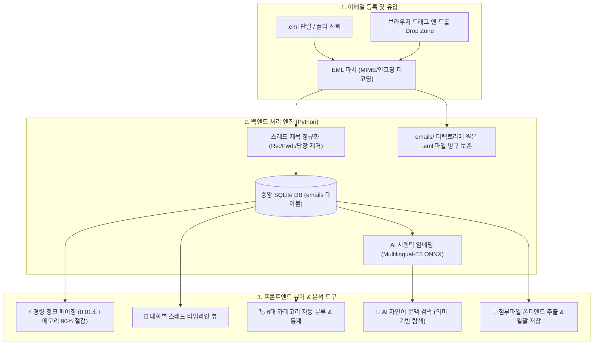
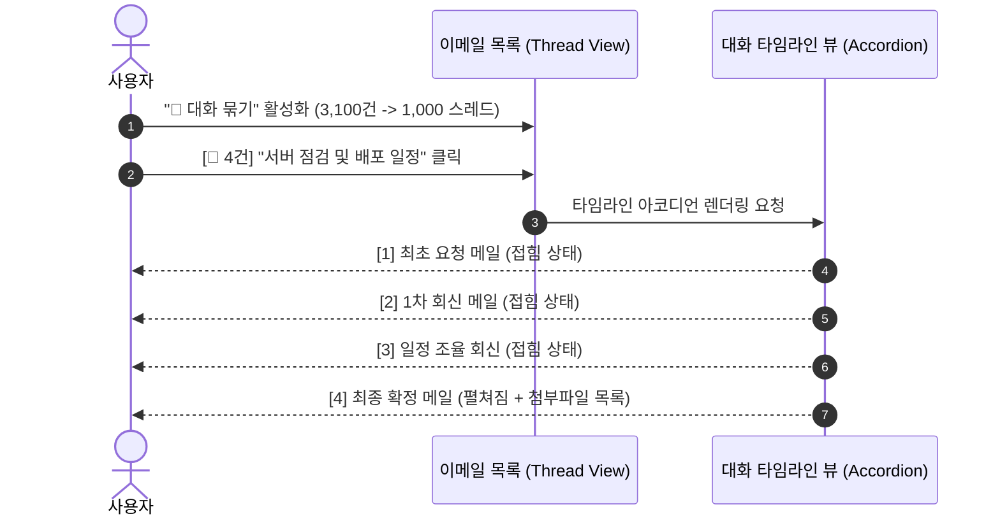
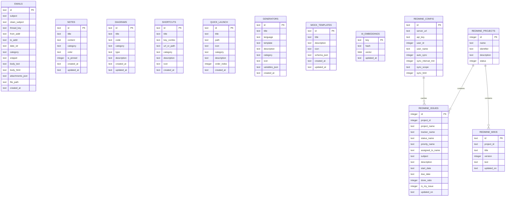

# 🛠️ Utility Toolkit (유틸리티 도구 모음)

Python **Eel**과 **HTML5/CSS/JavaScript** 기반의 모던 다크 테마 데스크톱 유틸리티 도구 모음입니다.  
중앙 **SQLite DB(`data/app.db`)** 기반 초고속 데이터 영속화와 경량 **로컬 AI 시맨틱 검색 엔진(Multilingual-E5 ONNX)**을 내장하고 있으며, 검은색 CMD 콘솔 창 없이 백그라운드 시스템 트레이에 상주하여 다양한 개발 및 업무 도구를 0.1초 만에 실행할 수 있습니다.

---

## 🌟 주요 기능 (Key Features)

| 카테고리 | 주요 제공 기능 |
| **🦊 Redmine 연동** | • **내 일감(Issues) 실시간 대시보드 & 프로젝트 위키(Wiki) 뷰어/에디터**<br>• 상태/진척도(%) 원클릭 변경, 코멘트(Notes) 등록, 새 일감 생성<br>• 프로젝트 위키 실시간 목차 조회, 마크다운 렌더링 & 직접 편집/저장<br>• SQLite 0.01초 오프라인 캐싱, **백그라운드 일감 업데이트 트레이 알림** 및 AI 시맨틱 검색 통합 |
| **📧 이메일 아카이브** | • **3,100+건 .eml / .msg 대용량 이메일 로컬 보관소 & 실시간 타임라인 뷰어**<br>• **비파괴적 대화별 스레드 묶기 (Thread View)**: Re:/Fwd: 정규화 및 시간순 아코디언 타임라인<br>• **초경량 청크 페이징 & 온디맨드 지연 로딩**: 메모리 점유율 90% 절감 (40MB 수준 유지)<br>• **AI 시맨틱 검색(`Ctrl+K`) 연동**, 6대 카테고리 자동 분류, 첨부파일 추출/일괄 저장 및 Outlook 원본 연동 |
| **🧠 AI 시맨틱 검색** | • **로컬 딥러닝 신경망(`intfloat/multilingual-e5-small` ONNX)** 기반 의미론적 문맥 검색<br>• 키워드가 정확히 일치하지 않아도 의미와 문맥으로 전체 데이터(이메일, 메모, 다이어그램 등)를 0.05초 만에 탐색<br>• 문장 간 유사도 정밀 비교 및 스마트 증분 벡터 캐싱 지원 |
| **🎲 모의 데이터 스튜디오** | • **3-Pass 복합 가상 데이터 생성기 & 엑셀(.xlsx) / CSV 내보내기 엔진**<br>• 순번(Sequence), 한국인 이름/이메일 지능형 영문 로마자 변환, 선택(Choice) 및 키-값(Key-Value) 연계 매핑<br>• 커스텀 컬럼 양식 생성, 수정, 삭제 및 SQLite 영구 동기화 |
| **📋 CSV / TSV 뷰어** | • **대용량 CSV / TSV 테이블 데이터 초고속 렌더링 & 스마트 변환기**<br>• 인코딩(UTF-8, CP949/EUC-KR) 및 구분자(쉼표, 탭, 세미콜론, 파이프) 자동 감지<br>• 드래그 앤 드롭 파일 로드, 클립보드 표 데이터 즉시 붙여넣기, 전역 실시간 검색 & 정렬<br>• **Markdown 표, JSON 배열, SQL INSERT 문, 필터된 CSV** 원클릭 변환/다운로드 |
| **📝 Markdown 뷰어** | • **GFM(GitHub Flavored Markdown) 실시간 뷰어 & 에디터 (Markdown Studio)**<br>• **GitHub Alert 콜아웃**(`[!NOTE]`, `[!TIP]`, `[!WARNING]` 등 5종) 및 **Mermaid 다이어그램** 자동 시각화<br>• GFM 표, **인터랙티브 태스크 체크박스(클릭 시 소스 동기화)**, 코드 블록 구문 강조 및 복사<br>• Split(반반) / Editor / Preview 모드, 동기화 스크롤, **목차(TOC) 생성**, 실시간 통계 지원 |
| **📊 다이어그램 스튜디오** | • **Mermaid 다이어그램 비주얼 스튜디오** (Flowchart, Sequence, Mindmap 등 16종 프리셋)<br>• 마우스 휠 줌 & 드래그 패닝, SVG/PNG 고해상도 이미지 다운로드 및 클립보드 복사 |
| **⚡ 빠른 실행** | • 자주 쓰는 앱/실행 파일(`.exe`, `.bat`), **SSH 터미널 접속**, **웹 URL**, **PowerShell 명령** 원클릭 실행<br>• **[⚙️ 편집]** 팝업을 통한 항목 추가, 인라인 수정(`✏️`), 삭제, 탐색기 파일 선택 및 드래그 앤 드롭 순서 변경 |
| **📁 파일 / 폴더** | • 프로젝트 작업 디렉토리 바로가기 카드 목록<br>• 상단 우측 인라인 드롭다운을 통해 **원하는 폴더 위치에서 PowerShell / CMD 즉시 실행** |
| **🔢 커스텀 생성기** | • 사용자가 직접 JavaScript 스크립트로 **새로운 생성기 추가/수정/순서 변경** 가능<br>• 기본 내장: 국세청 사업자번호, UUID v4, 16자리 강력 비밀번호, 한국인 가상 더미, 타임스탬프 등 |
| **🧪 JS 실행기** | • JSFiddle / RunJS 스타일의 **JavaScript 코드 샌드박스** (비동기 `async/await` 완벽 지원)<br>• `console.log/warn/error` 출력 캡처, 실행 시간 측정, `Ctrl + Enter` 실행, 코드 자동 영구 보존 |
| **📝 빠른 메모** | • 자원 소모가 전혀 없는 **초경량 스크래치패드 / 메모장**<br>• 다중 메모 생성, 실시간 자동 저장(Autosave), 고정(Pin) 기능, 마우스 드래그블 스플리터 제공 |
| **📅 달력 & 일정** | • **구글 캘린더(Google Calendar) 및 iCal(ICS) 비공개 주소 실시간 구독 및 동기화**<br>• 다크 테마 월간 캘린더, 날짜별 일정 뱃지, 오늘의 일정(Today's Agenda) 상세 뷰 |
| **✂️ 이미지 슬라이서** | • **경계선 분할 & 다중 절단선 일괄 분할 스튜디오 (Pillow 고속 엔진)**<br>• 클립보드 붙여넣기(`Ctrl+V`), **고정 px 간격 일괄 생성**, **균등 N등분**, **스마트 여백 자동 감지** 및 **ZIP 일괄 다운로드 / 폴더 저장** |
| **💾 통합 백업 / 복원** | • **Zero-Memory Python 백엔드 스트리밍 아키텍처** (브라우저 메모리 0MB 소모)<br>• 중앙 SQLite DB 및 설정을 **단일 JSON 및 90% 압축 ZIP 포맷으로 초고속(2.5초) 일괄/선택적 내보내기 & 복원(Merge/Replace)** |
| **🛠️ 시스템 트레이** | • 검은색 콘솔 창 없는 순수 GUI 구동 및 Windows 시스템 트레이 상주 (`utiltools.ico` 연동)<br>• V8 힙 128MB 제한 및 Windows WorkingSet 유휴 RAM 자동 회수 엔진 탑재 |

---

## 📧 이메일 아카이브 시스템 (Email Archive System)

Util-Tools는 수천 통의 `.eml` 및 `.msg` 이메일을 로컬에서 안전하게 보관하고, 대화 스레드 분석 및 AI 시맨틱 검색을 제공하는 강력한 이메일 관리 엔진을 내장하고 있습니다.

### 1. 🏛️ 시스템 아키텍처 및 데이터 흐름



---

### 2. 💬 대화별 스레드 묶기 (Thread View) & 타임라인 라이프사이클

이메일 제목에서 `Re:`, `Fwd:`, `[회수]`, `답장:`, `전달:` 등 모든 불필요한 접두사를 제거하여 고유의 `thread_key`로 대화를 그룹화합니다. `[💬 대화 묶기]` 토글을 활성화하면 3,100여 건의 개별 메일이 약 1,000개의 대화 스레드로 압축되어 메일함 피로도를 대폭 낮춥니다.



---

### 3. 🌟 이메일 핵심 기능 6대 특징

1. **💬 비파괴적 대화별 스레드 묶기 (Thread View)**:
   * 동일한 주제로 오고 간 메일들을 시간순(과거 ➔ 최신) 아코디언 카드 뷰로 렌더링.
   * 각 카드별 HTML/Text 뷰 모드 전환, 개별 본문 복사, 원본 열기 지원.
2. **⚡ 초경량 청크 페이징 & 지연 로딩 (Lazy Loading)**:
   * 140MB+ 대용량 이메일도 50~300개 단위의 경량 메타데이터 청크로 로드하여 브라우저 메모리를 40MB 수준으로 유지.
   * 사용자가 클릭한 메일만 SQLite에서 0.001초 만에 온디맨드로 상세 본문 조회.
3. **🧠 로컬 딥러닝 AI 시맨틱 문맥 검색 (`Ctrl+K`)**:
   * "서버 응답 지연", "비용 견적 요청" 등 자연어로 질문 시 AI가 의미적 유사도를 판단하여 관련 메일을 0.05초 만에 검색.
   * 검색 결과 클릭 시 해당 메일이 속한 대화 스레드로 자동 스크롤 및 선택.
4. **🏷️ 6대 카테고리 자동 분류 및 통계 칩**:
   * 업무/프로젝트, 회의록, 견적/계약, 인사/총무, 시스템/알림, 기타 카테고리 자동 분류 및 실시간 건수 통계.
5. **📎 첨부파일 온디맨드 추출 & 일괄 저장**:
   * 메일 내 첨부파일(PDF, 엑셀, 이미지 등)을 온디맨드로 임시 추출하여 OS 기본 프로그램으로 즉시 실행.
   * `[📦 전체 첨부파일 일괄 저장]`을 통해 원하는 디렉토리에 원클릭 다운로드.
6. **📥 간편한 대량 EML 등록 & 드래그 앤 드롭**:
   * 탐색기에서 `.eml` 파일들을 브라우저 위로 드래그 앤 드롭하면 백그라운드에서 고속 파싱 후 SQLite에 영구 보관.

---

### 4. 📦 이메일 백업(Export) 및 원본 파일 저장 구조

| 구분 | **통합 백업 JSON (Export 시)** | **로컬 하드디스크 (`emails/` 폴더)** |
| :--- | :--- | :--- |
| **저장 형태** | 단일 `.json` 백업 파일 내 `data.emails` 배열 | 실제 원본 파일 (`emails/*.eml`) |
| **포함 내용** | 발신/수신자, 정규화 제목, 날짜, 카테고리, **전체 텍스트/HTML 본문**, 스레드 키, 첨부파일 메타데이터 | 이메일 원본 전체 (바이너리 MIME 스트림 포함) |
| **주요 용도** | **타 PC 마이그레이션 / 스키마 독립 백업 & 복원** | Outlook 등 **OS 기본 메일 프로그램으로 원본 열기** |

---

## 🗄️ 중앙 SQLite 데이터베이스 구조 (`data/app.db`)

Util-Tools는 모든 사용자 데이터와 로컬 캐시를 단일 중앙 SQLite 데이터베이스([`data/app.db`](file:///D:/python/data/app.db))에서 관리합니다.

### 1. ⚙️ 데이터베이스 엔진 및 성능 PRAGMA 설정
- **파일 경로**: `D:\python\data\app.db` (Git 추적 제외)
- **커넥션 매니저**: [`services/db_service.py`](file:///D:/python/services/db_service.py)
- **핵심 PRAGMA 최적화**:
  - `PRAGMA journal_mode=WAL;`: 동시 다중 읽기/쓰기를 지원하여 UI 멈춤 방지
  - `PRAGMA synchronous=NORMAL;`: 디스크 쓰기 I/O를 최적화하면서 크래시 안전성 보장
  - `PRAGMA busy_timeout=5000;`: 동시성 락 충돌 시 최대 5초간 자동 대기
  - `PRAGMA wal_checkpoint(TRUNCATE);`: 앱 종료 시 WAL 로그를 본 DB로 자동 병합 및 용량 최소화

---

### 2. 🏛️ 테이블 관계 및 도메인 다이어그램 (ERD)



---

### 3. 📋 테이블별 상세 스키마 명세 (Schema Specifications)

#### ① `emails` (대용량 이메일 아카이브)
| 컬럼명 | 데이터 타입 | 기본값 / 제약조건 | 설명 |
| :--- | :--- | :--- | :--- |
| `id` | `TEXT` | `PRIMARY KEY` | 이메일 고유 해시 식별자 |
| `subject` | `TEXT` | - | 원본 이메일 제목 |
| `clean_subject` | `TEXT` | - | Re:/Fwd: 접두사가 제거된 정규화된 스레드 제목 |
| `thread_key` | `TEXT` | - | 대화 스레드 그룹핑 키 (인덱스 생성) |
| `from_addr` | `TEXT` | - | 발신자 이름 및 이메일 주소 |
| `to_addr` | `TEXT` | - | 수신자 목록 |
| `date_str` | `TEXT` | - | 작성 일시 (RFC2822 / ISO8601) |
| `category` | `TEXT` | `'기타'` | 6대 자동 분류 카테고리 (인덱스 생성) |
| `snippet` | `TEXT` | - | 본문 150자 미리보기 요약문 |
| `body_text` | `TEXT` | - | 일반 텍스트 본문 |
| `body_html` | `TEXT` | - | HTML 서식 본문 |
| `attachments_json`| `TEXT` | `'[]'` | 첨부파일 메타데이터 JSON 배열 |
| `message_id` | `TEXT` | - | 이메일 헤더 `Message-ID` |
| `in_reply_to` | `TEXT` | - | 회신 대상 `In-Reply-To` 헤더 |
| `references_header`| `TEXT`| - | 참조 체인 `References` 헤더 |
| `file_path` | `TEXT` | - | 로컬 `emails/*.eml` 물리 파일 경로 |
| `created_at` | `TEXT` | - | DB 등록 일시 |

> **인덱스**: `idx_emails_category`, `idx_emails_thread_key`, `idx_emails_date`, `idx_emails_created_at`, `idx_emails_sort (created_at DESC, date_str DESC)`

---

#### ② `notes` (빠른 메모 / 스크래치패드)
| 컬럼명 | 데이터 타입 | 기본값 / 제약조건 | 설명 |
| :--- | :--- | :--- | :--- |
| `id` | `TEXT` | `PRIMARY KEY` | 메모 고유 식별자 |
| `title` | `TEXT` | - | 메모 제목 |
| `content` | `TEXT` | - | 메모 내용 (텍스트/마크다운) |
| `category` | `TEXT` | `''` | 카테고리 태그 |
| `color` | `TEXT` | `''` | 메모 카드 테마 색상 코드 |
| `is_pinned` | `INTEGER` | `0` | 상단 고정 여부 (1: 고정, 0: 일반) |
| `created_at` | `TEXT` | - | 생성 일시 |
| `updated_at` | `TEXT` | - | 최종 수정 일시 (자동 갱신) |

> **인덱스**: `idx_notes_pinned`, `idx_notes_updated_at`, `idx_notes_created_at`, `idx_notes_sort (is_pinned DESC, updated_at DESC, created_at DESC)`

---

#### ③ `diagrams` (Mermaid 다이어그램)
| 컬럼명 | 데이터 타입 | 기본값 / 제약조건 | 설명 |
| :--- | :--- | :--- | :--- |
| `id` | `TEXT` | `PRIMARY KEY` | 다이어그램 고유 식별자 |
| `title` | `TEXT` | - | 다이어그램 제목 |
| `code` | `TEXT` | - | Mermaid 다이어그램 소스 코드 |
| `category` | `TEXT` | - | 분류 카테고리 |
| `type` | `TEXT` | `''` | 다이어그램 종류 (flowchart, sequence, mindmap 등) |
| `description` | `TEXT` | - | 상세 설명 |
| `created_at` | `TEXT` | - | 생성 일시 |
| `updated_at` | `TEXT` | - | 수정 일시 |

> **인덱스**: `idx_diagrams_category`, `idx_diagrams_updated_at`

---

#### ④ `shortcuts` (폴더 바로가기)
| 컬럼명 | 데이터 타입 | 기본값 / 제약조건 | 설명 |
| :--- | :--- | :--- | :--- |
| `id` | `TEXT` | `PRIMARY KEY` | 바로가기 ID |
| `title` | `TEXT` | - | 표시 명칭 |
| `key_combo` | `TEXT` | `''` | 단축키 조합 (선택 사항) |
| `url_or_path` | `TEXT` | - | 대상 폴더 경로 또는 URL |
| `category` | `TEXT` | `'folder'` | 카테고리 |
| `description` | `TEXT` | `''` | 툴팁 설명문 |
| `icon` | `TEXT` | `'📁'` | 이모지/아이콘 |
| `created_at` | `TEXT` | - | 생성 일시 |

> **인덱스**: `idx_shortcuts_category`

---

#### ⑤ `quick_launch` (빠른 실행)
| 컬럼명 | 데이터 타입 | 기본값 / 제약조건 | 설명 |
| :--- | :--- | :--- | :--- |
| `id` | `TEXT` | `PRIMARY KEY` | 빠른 실행 ID |
| `title` | `TEXT` | - | 실행 항목 이름 |
| `path` | `TEXT` | - | 실행 파일 경로, URL, 또는 CLI 명령어 |
| `icon` | `TEXT` | `'⚡'` | 표시 아이콘 |
| `category` | `TEXT` | `'cmd'` | 실행 타입 (`cmd`, `exe`, `url`, `ssh`) |
| `description` | `TEXT` | `''` | 설명 |
| `order_index` | `INTEGER` | `0` | 드래그 앤 드롭 정렬 순서 인덱스 |
| `created_at` | `TEXT` | - | 생성 일시 |

> **인덱스**: `idx_quick_launch_order`

---

#### ⑥ `generators` (커스텀 데이터 생성기)
| 컬럼명 | 데이터 타입 | 기본값 / 제약조건 | 설명 |
| :--- | :--- | :--- | :--- |
| `id` | `TEXT` | `PRIMARY KEY` | 생성기 ID |
| `title` | `TEXT` | - | 생성기 이름 |
| `language` | `TEXT` | `'javascript'` | 스크립트 엔진 |
| `template` | `TEXT` | - | 실행 JavaScript 코드 본문 |
| `description` | `TEXT` | - | 생성기 설명 |
| `category` | `TEXT` | - | 카테고리 |
| `icon` | `TEXT` | `'🔢'` | 아이콘 |
| `variables_json`| `TEXT` | `'[]'` | 사용자 입력 파라미터 정의 JSON |
| `created_at` | `TEXT` | - | 생성 일시 |

> **인덱스**: `idx_generators_category`

---

#### ⑦ `mock_templates` (모의 데이터 서식 양식)
| 컬럼명 | 데이터 타입 | 기본값 / 제약조건 | 설명 |
| :--- | :--- | :--- | :--- |
| `id` | `TEXT` | `PRIMARY KEY` | 양식 ID |
| `title` | `TEXT` | `NOT NULL` | 양식 이름 (예: 회원 목록 양식) |
| `description` | `TEXT` | `''` | 양식 설명 |
| `icon` | `TEXT` | `'📋'` | 아이콘 |
| `schema_json` | `TEXT` | `NOT NULL` | 컬럼 정의(컬럼명, 데이터타입, 생성규칙) JSON |
| `created_at` | `TEXT` | - | 생성 일시 |
| `updated_at` | `TEXT` | - | 수정 일시 |

> **인덱스**: `idx_mock_templates_updated`

---

#### ⑧ `ai_embeddings` (AI 시맨틱 임베딩 벡터 캐시)
| 컬럼명 | 데이터 타입 | 기본값 / 제약조건 | 설명 |
| :--- | :--- | :--- | :--- |
| `key` | `TEXT` | `PRIMARY KEY` | 데이터 고유 식별 키 (예: `emails:em_102`) |
| `hash` | `TEXT` | `NOT NULL` | 텍스트 변경 감지용 MD5/SHA256 해시 |
| `vector` | `BLOB` | `NOT NULL` | 384차원 float32 임베딩 바이너리 배열 |
| `updated_at` | `TEXT` | - | 임베딩 생성/갱신 일시 |

> **인덱스**: `idx_ai_embeddings_hash`

---

#### ⑨ `redmine_config` (Redmine 연결 및 동기화 설정)
| 컬럼명 | 데이터 타입 | 기본값 / 제약조건 | 설명 |
| :--- | :--- | :--- | :--- |
| `id` | `TEXT` | `PRIMARY KEY` | 설정 프로필 ID (`'default'`) |
| `server_url` | `TEXT` | - | Redmine 서버 URL (`https://...`) |
| `api_key` | `TEXT` | - | 사용자 REST API 접근 키 |
| `user_id` | `INTEGER` | - | 로그인된 Redmine 사용자 ID |
| `user_name` | `TEXT` | - | 사용자 실명 |
| `user_login` | `TEXT` | - | 사용자 로그인 계정명 |
| `auto_sync` | `INTEGER` | `1` | 백그라운드 자동 동기화 활성화 여부 |
| `sync_interval_min`| `INTEGER`| `5` | 동기화 주기 (분 단위) |
| `sync_scope` | `TEXT` | `'all_open'` | 동기화 범위 (`my_issues`, `all_open`, `project`) |
| `sync_limit` | `INTEGER` | `300` | 일괄 동기화 최대 일감 수 |
| `sync_project_id` | `INTEGER`| `0` | 특정 프로젝트 ID 지정 동기화 시 사용 |
| `updated_at` | `TEXT` | - | 설정 수정 일시 |

---

#### ⑩ `redmine_issues` (Redmine 일감 로컬 오프라인 캐시)
| 컬럼명 | 데이터 타입 | 기본값 / 제약조건 | 설명 |
| :--- | :--- | :--- | :--- |
| `id` | `INTEGER` | `PRIMARY KEY` | Redmine 일감 번호 (#Issue ID) |
| `project_id` | `INTEGER` | - | 소속 프로젝트 ID |
| `project_name` | `TEXT` | - | 소속 프로젝트 명칭 |
| `tracker_name` | `TEXT` | - | 트래커 (결함, 기능, 지원 등) |
| `status_name` | `TEXT` | - | 상태 (신규, 진행, 해결, 완료 등) |
| `priority_name`| `TEXT` | - | 우선순위 (낮음, 보통, 높음, 긴급 등) |
| `author_name` | `TEXT` | - | 등록자 이름 |
| `assigned_to_name`| `TEXT` | - | 담당자 이름 |
| `subject` | `TEXT` | - | 일감 제목 |
| `description` | `TEXT` | - | 일감 설명 본문 |
| `start_date` | `TEXT` | - | 시작일 |
| `due_date` | `TEXT` | - | 완료 기한일 |
| `done_ratio` | `INTEGER` | `0` | 진척도 (0 ~ 100%) |
| `estimated_hours`| `REAL` | - | 추정 시간 |
| `updated_on` | `TEXT` | - | Redmine 서버 기준 최종 수정 일시 |
| `created_on` | `TEXT` | - | 등록 일시 |
| `is_my_issue` | `INTEGER` | `0` | 내 담당 일감 여부 플래그 (1: 내 일감) |
| `raw_json` | `TEXT` | - | Redmine API 원본 전체 응답 JSON |

> **인덱스**: `idx_redmine_issues_project`, `idx_redmine_issues_status`, `idx_redmine_issues_assigned`, `idx_redmine_issues_my`, `idx_redmine_issues_due`, `idx_redmine_issues_updated`, `idx_redmine_issues_sort (updated_on DESC, id DESC)`

---

#### ⑪ `redmine_wikis` (Redmine 프로젝트 위키 문서 캐시)
| 컬럼명 | 데이터 타입 | 기본값 / 제약조건 | 설명 |
| :--- | :--- | :--- | :--- |
| `id` | `TEXT` | `PRIMARY KEY` | 위키 복합 키 (`{project_id}:{title}`) |
| `project_id` | `TEXT` | - | 프로젝트 식별자 |
| `project_name` | `TEXT` | - | 프로젝트 명칭 |
| `title` | `TEXT` | - | 위키 페이지 제목 |
| `version` | `INTEGER` | `1` | 위키 문서 버전 |
| `author_name` | `TEXT` | - | 작성자 |
| `comments` | `TEXT` | - | 버전 코멘트 |
| `text` | `TEXT` | - | 위키 본문 (Textile / Markdown) |
| `updated_on` | `TEXT` | - | 최종 수정 일시 |
| `created_on` | `TEXT` | - | 최초 작성 일시 |

> **인덱스**: `idx_redmine_wikis_project`, `idx_redmine_wikis_title`

---

#### ⑫ `redmine_projects` & ⑬ `redmine_meta` (프로젝트 및 메타데이터 캐시)
- **`redmine_projects`**: `id` (PK), `name`, `identifier`, `description`, `status`
- **`redmine_meta`**: `key` (PK, 예: `'statuses'`, `'trackers'`), `data_json`, `updated_at`

---

### 4. 📁 파일 기반 설정 파일 (File-based JSON Configurations)
데이터베이스 외에 다음 설정 파일들은 독립된 JSON 파일로 관리되어 외부 연동 및 설정을 지원합니다:
- **`calendar_config.json`**: 구글 캘린더 비공개 주소 및 iCal(ICS) 웹 구독 목록
- **`app_settings.json`**: 윈도우 창 크기, 콘솔 높이, 분할창 크기 등 사용자 인터페이스 영구 설정

---

## 📂 프로젝트 모듈 아키텍처 (Project Structure)

```text
D:\python
│
├── main.py                     # [진입점] Eel 초기화 및 서비스 모듈 바인딩
├── run.pyw                     # [런처] Windows 무창(Windowless) 백그라운드 실행기
├── UtilTools.spec              # [패키징] PyInstaller 독립 폴더(--onedir) 빌드 정의서
├── build.bat                   # [빌드] 원클릭 데스크톱 배포본 빌드 자동화 스크립트
├── requirements.txt            # 필수 Python 패키지 목록
├── utiltools.ico               # 애플리케이션 & 시스템 트레이 아이콘
│
├── data/                       # [사용자 데이터] SQLite 중앙 데이터베이스 (Git 제외)
│   └── app.db                  # emails, notes, diagrams, generators, mock_templates 등 8개 테이블
│
├── emails/                     # [개인 데이터] 로컬 저장된 원본 .eml 파일 보관소 (Git 제외)
│
├── models/                     # [AI 모델] 로컬 신경망 임베딩 모델 (Git 제외)
│   └── multilingual-e5-small/  # ONNX 양자화 모델 (model_quantized.onnx) 및 토크나이저
│
├── core/                       # [코어 시스템]
│   ├── __init__.py
│   ├── paths.py                # 개발 모드 & 배포본(.exe) 스마트 경로 분기 헬퍼
│   └── tray.py                 # pystray 트레이 아이콘 및 윈도우 생명주기 관리자
│
├── services/                   # [백엔드 서비스 모듈 (Python)]
│   ├── __init__.py
│   ├── db_service.py           # 중앙 SQLite WAL 모드 커넥션 풀 & 스키마 관리자
│   ├── ai_search_service.py    # ONNX AI 시맨틱 검색 & 벡터 캐시 엔진
│   ├── email_service.py        # EML 파서, 스레드 정규화, 카테고리 분류 & 첨부파일 추출
│   ├── redmine_service.py      # Redmine REST API 연동 (일감, 위키, 메타데이터, SQLite 캐시)
│   ├── mock_data_service.py    # 3-Pass 모의 데이터 생성, 로마자 변환 & 엑셀/CSV 빌더
│   ├── csv_service.py          # CSV/TSV 파서, 인코딩/구분자 자동 감지 및 저장
│   ├── markdown_service.py     # Markdown 파일 열기/저장 및 인코딩 감지 백엔드
│   ├── notes_service.py        # 빠른 메모/스크래치패드 SQLite CRUD
│   ├── diagram_service.py      # Mermaid 다이어그램 SQLite CRUD
│   ├── generator_service.py    # 커스텀 데이터 생성기 SQLite CRUD
│   ├── quick_launch_service.py # 빠른 실행/SSH/URL SQLite CRUD
│   ├── shortcuts_service.py    # 폴더 바로가기 SQLite CRUD 및 터미널 런처
│   ├── calendar_service.py     # 구글 캘린더 / iCal(ICS) 파싱 및 일정 동기화
│   ├── settings_service.py     # 창 크기/테마 영구 설정 관리
│   ├── backup_service.py       # 전체 데이터 통합 JSON 백업/복원 레지스트리
│   └── dialog_service.py       # Tkinter 기반 파일/폴더 선택 대화상자
│
└── web/                        # [프론트엔드 리소스]
    ├── index.html              # 메인 UI 마크업 (반응형 햄버거 메뉴 포함)
    ├── style.css               # 모던 다크 테마 CSS & 스플리터/모달/타임라인 스타일
    ├── utiltools.ico           # 브라우저 창 Favicon
    └── js/                     # [프론트엔드 모듈 (JavaScript)]
        ├── app.js              # 탭 전환 네비게이션, 반응형 햄버거 제어 및 초기화
        ├── console.js          # 하단 로그창, 스플리터 조절기 & 고도화된 토스트(Toast) 알림
        ├── drag_drop.js        # 공통 마우스 드래그 앤 드롭 핸들러
        ├── email_viewer.js     # EML 아카이브, 대화 스레드 타임라인 & 온디맨드 뷰어
        ├── redmine.js          # Redmine 일감 대시보드, 타임라인, 상태변경 & 위키 에디터
        ├── ai_search.js        # AI 문맥 검색 & 문장 의미 비교 모달 UI (Ctrl+K)
        ├── mock_data_studio.js # 3-Pass 모의 데이터 스튜디오 & 서식 엑셀/CSV 생성 UI
        ├── csv_viewer.js       # CSV/TSV 데이터 뷰어, 정렬, 검색, 변환/내보내기
        ├── markdown_viewer.js  # Markdown 실시간 뷰어/에디터, GFM/Mermaid 렌더러
        ├── notes.js            # 빠른 메모 / 스크래치패드 실시간 에디터 및 자동 저장
        ├── calendar.js         # 월간 캘린더, 일정 동기화, Agenda 및 구독 관리
        ├── mermaid_diagram.js  # Mermaid 렌더러, 줌/팬 인터랙션 및 SVG/PNG 내보내기
        ├── mermaid_templates.js # 다이어그램 템플릿 프리셋 모듈
        ├── generator.js        # 커스텀 데이터 생성기 스튜디오 UI
        ├── js_runner.js        # JS 플레이그라운드 (AsyncFunction 샌드박스 엔진)
        ├── quick_launch.js     # 빠른 실행 렌더링, 인라인 편집 & 파일 선택 연동
        ├── shortcuts.js        # 폴더 바로가기 렌더링, 인라인 편집 & 터미널 런처
        ├── backup.js           # 통합 백업/복원 모달 제어 (JSON Export/Import)
        └── system.js           # 시스템 사양 & 타임스탬프 & Ping UI 연동
```

---

## 🚀 설치 및 실행 방법 (Getting Started)

### 1. 필수 패키지 설치

Python 3.10 이상 환경에서 아래 명령어를 실행하여 필수 의존성을 설치합니다:

```powershell
pip install -r requirements.txt
```

*(설치 패키지: `eel`, `pystray`, `pillow`, `openpyxl`, `numpy`, `onnxruntime`, `tokenizers`)*

---

### 2. 실행 방법

#### 방법 A: 더블클릭으로 바로 실행 (권장 🌟)
탐색기에서 **`run.pyw`** 파일을 더블클릭하면 검은색 CMD 콘솔 창 없이 백그라운드 트레이로 즉시 실행됩니다.

#### 방법 B: 터미널 명령어로 실행
```powershell
# 콘솔 창 없이 백그라운드 실행
pythonw run.pyw

# 또는 개발/디버깅용 콘솔 모드로 실행
python main.py
```

---

## 📦 데스크톱 독립 실행 파일 빌드 (Packaging)

별도의 파이썬 설치 없이 어디서든 즉시 실행할 수 있는 독립 포터블 패키지(`dist/UtilTools/UtilTools.exe`)를 생성하려면:

1. 프로젝트 루트의 **`build.bat`** 파일을 더블 클릭하여 실행합니다.
2. 빌드가 완료되면 **`dist\UtilTools\`** 폴더가 생성됩니다.
3. 해당 폴더를 그대로 압축하여 배포하거나, `UtilTools.exe`의 바로가기를 바탕화면에 생성하여 사용합니다.

---

## ⌨️ 주요 단축키 및 사용 가이드

* **AI 시맨틱 문맥 검색**:
  * `Ctrl + K`: 언제 어디서나 AI 시맨틱 검색 모달 즉시 호출
* **JS 실행기 단축키**:
  * `Ctrl + Enter` (또는 `Cmd + Enter`): 작성한 자바스크립트 코드 즉시 실행
  * `Tab` 키: 4칸 들여쓰기(`    `) 삽입
* **목록 순서 변경**:
  * `[⚙️ 편집]` 팝업에서 각 항목의 `⋮⋮` 핸들을 마우스로 끌어서 원하는 위치에 드롭
* **시스템 트레이**:
  * 작업표시줄 트레이 아이콘 **더블클릭** 또는 **우클릭 -> `[🛠️ 도구 모음 열기]`**: 프로그램 창 표시
  * 트레이 우클릭 -> **`[🚪 완전히 종료]`**: 백그라운드 프로세스 완전 종료

---

## 📄 라이선스 (License)

이 프로젝트는 자유롭게 수정하고 사용할 수 있는 개인 유틸리티 툴킷입니다.
