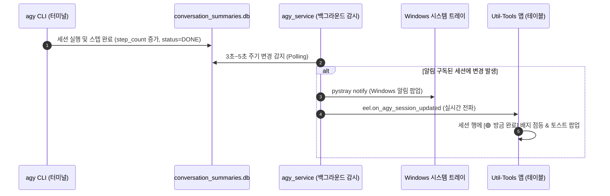

# 🔔 Antigravity CLI(agy) 세션별 실시간 알림 시스템 아키텍처 및 구현 계획서

본 문서는 사용자의 질문(세션별 작업 완료/상태 알림 수신 가능 여부)에 대해, **실시간 세션 상태 감지 메커니즘** 및 **Windows 시스템 트레이/앱 토스트 알림 연동 방안**을 정리한 기술 분석 및 구현 계획서입니다.

---

## 1. 가능 여부 및 기술적 타당성 분석

**결론: 충분히 가능하며, 장시간 실행되는 AI 작업 특성상 매우 유용한 기능입니다.**

### 1-1. 감지 원리 (Detection Principle)
`agy` CLI는 사용자와 대화를 나누거나 백그라운드 태스크/도구를 실행할 때마다 다음 정보를 로컬에 실시간으로 갱신합니다:

1. **`conversation_summaries.db`**:
   - `step_count`: 스텝(턴) 수가 실시간으로 1씩 증가 (`399` ➔ `400` ➔ `401`)
   - `last_modified_time`: 세션의 마지막 수정 타임스탬프가 초 단위로 갱신됨
   - `preview`: 세션의 최근 작업 요약 문구가 자동으로 업데이트됨
2. **`brain/<session-id>/.system_generated/logs/transcript.jsonl`**:
   - 마지막 라인의 `type`이 `PLANNER_RESPONSE`이고 `status`가 `DONE`인 순간 ➔ **"에이전트 턴 완료(대기 상태 진입)"**를 100% 정확하게 감지 가능.

---

## 2. 알림 제공 방식 (2단계 알림)



### 2-1. Windows OS 시스템 트레이 알림
- 사용자가 브라우저를 보거나 다른 코딩 작업을 하고 있어도, 우측 하단 Windows 알림 팝업으로 즉시 전달:
  ```text
  [🤖 Antigravity CLI 작업 완료]
  세션: Current Project Status Recap (#cfb67627)
  에이전트 응답이 완료되었습니다. 터미널을 확인하세요.
  ```
- 알림 클릭 시 해당 세션 터미널 창을 활성화하거나 창을 띄울 수 있음.

### 2-2. 앱 내부 실시간 토스트(Toast) & 테이블 배지
- Util-Tools 앱이 열려 있을 때:
  - 우측 상단 토스트 알림 표시: `🔔 agy 세션 완료: #cfb67627`
  - 세션 테이블 행의 상태 뱃지에 **`🟢 방금 완료`** 또는 **`⚡ 대기 중`** 실시간 하이라이트.

---

## 3. 사용자 경험(UX)을 고려한 세션별 알림 구독 (Watchlist)

모든 과거 세션에 대해 무차별적으로 알림이 울리면 방해가 될 수 있으므로, **사용자가 원하는 세션만 선택하여 알림을 받는 스마트 구독 방식**을 제안합니다:

### 3-1. 테이블 행의 `🔔 알림 구독` 토글 버튼
- 세션 테이블의 각 행에 **`🔔 알림 받기`** 아이콘 버튼 제공:
  - 회색 `🔕`: 알림 꺼짐 (기본값)
  - 파란색/노란색 `🔔`: **알림 감시 중 (Watchlist 등록)**
- **사용 시나리오**:
  1. 사용자가 agy 터미널에 복잡한 리팩토링이나 빌드/테스트 등 오래 걸리는 프롬프트를 던짐.
  2. Util-Tools 앱 세션 테이블에서 해당 세션의 `🔔` 버튼을 켬.
  3. 다른 창(VS Code, 웹 브라우저)에서 본인 작업을 편하게 진행.
  4. agy가 생각을 마치고 응답을 완료하면 **Windows 트레이 알림 팝업 + 딩동 알림음**으로 알려줌!
  5. 1회 완료 후 자동으로 구독 해제되거나 계속 감시 유지 선택 가능.

---

## 4. 시스템 & 네트워크 활성화 토글 종속성 및 완전 차단 보장 (Strict Gating)

**"시스템 & 네트워크 탭의 agy 활성화 토글에 100% 종속되며, 토글이 꺼지면 백그라운드 동작이 즉시 완전 중단됩니다."**

```text
[시스템 탭의 토글 상태]
        │
        ├── ❌ OFF (비활성화 상태)
        │     ├─ 백그라운드 감시 스레드 즉시 STOP 및 소멸
        │     ├─ 세션 구독 목록(Watchlist) 메모리 완전 초기화 (Clear)
        │     ├─ conversation_summaries.db 조회 쿼리 0건 (DB I/O 0%)
        │     ├─ CPU 점유율 0%, 백그라운드 타이머 0개
        │     ├─ Windows 트레이 및 앱 내부 알림 전송 완전 차단
        │     └─ [빠른 실행] 탭의 세션 테이블 UI 완전 숨김 (display: none)
        │
        └── 🟢 ON (활성화 상태)
              ├─ 감시 스레드 대기 시작 (구독된 세션이 있을 때만 3~5초 주기 체크)
              ├─ [빠른 실행] 탭의 세션 테이블 및 🔔 구독 버튼 활성화
              └─ 완료 시 트레이 및 토스트 알림 정상 전송
```

### 4-1. 백엔드 생명주기 제어 (`services/agy_service.py`)
```python
# 토글 OFF 시 즉각 호출
def on_settings_changed(new_settings):
    if not new_settings.get("enable_agy_integration", False):
        stop_agy_watcher()   # 스레드 종료 플래그 설정 및 즉시 join/해제
        clear_watch_list()   # 구독 목록 메모리 삭제
    else:
        start_agy_watcher()  # 활성화 시에만 가동
```

### 4-2. 시작 시점 보호 (Cold Start Protection)
- 앱이 부팅될 때 `app_settings.json`의 `enable_agy_integration`이 `false`이면:
  - 감시 스레드를 생성조차 하지 않습니다.
  - 사용자가 시스템 탭에서 스위치를 켤 때까지 단 한 줄의 백그라운드 코드도 실행되지 않습니다.

---

## 5. 백엔드 및 프론트엔드 상세 구현 설계

### 5-1. 백엔드 (`services/agy_service.py`)
- **감시 워커 스레드 (`AgyWatcherThread`)**:
  - `_watched_sessions = { "<session_id>": { "last_step": 399, "last_time": "..." } }`
  - `_is_running` 플래그 기반 안전 종료.
  - `step_count` 증가 및 응답 완료 감지 시 `core.tray.TrayManager`를 통해 `tray_icon.notify()` 호출 및 `eel.on_agy_session_completed(session_info)` 전송.
- **Eel 노출 API**:
  - `toggle_agy_watch_session(conversation_id, enabled)`
  - `get_watched_agy_sessions()`

### 5-2. 프론트엔드 (`web/js/agy_sessions.js`)
- 테이블 컬럼에 `🔔 알림` 컬럼 추가 (토글 아이콘).
- `onToggleAgyIntegration(isChecked)` 함수 내에서 토글이 꺼지면 백엔드에 즉시 감시 중단 요청 및 로컬 구독 상태 비우기.
- `eel.on_agy_session_completed` 리스너 등록하여 화면 자동 갱신 및 토스트 팝업 표시.

---

## 6. 검증 계획

1. **토글 OFF 시 무동작 검증**:
   - 토글을 껐을 때 백그라운드 스레드가 종료되는지 확인.
   - DB 읽기 쿼리가 0건인지 확인.
   - agy 터미널에서 작업이 완료되어도 알림이 일체 발생하지 않는지 확인.
2. **토글 ON 시 알림 동작 검증**:
   - 토글을 켜고 특정 세션의 `🔔`을 켰을 때만 5초 이내에 Windows 트레이 알림 팝업 및 앱 토스트가 정상 도착하는지 확인.
3. **코드 무결성 파이프라인**:
   - `python -m py_compile`, `node -c`, CSS 검사, 백엔드 회귀 테스트 전수 통과.
