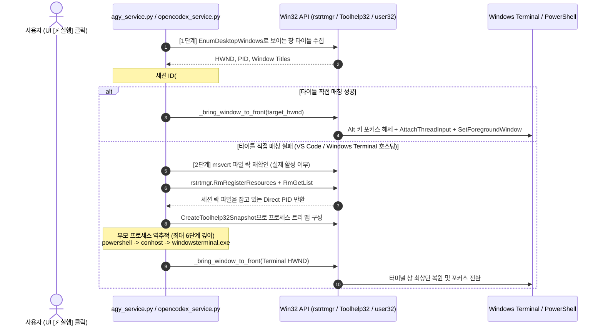

# 🤖 통합 AI 코딩 세션 허브 아키텍처 (Unified AI Coding Sessions Hub)

Util-Tools는 로컬 머신에서 실행되는 다양한 AI 코딩 에이전트 CLI 인스턴스를 중앙에서 탐색, 모니터링, 제어할 수 있는 **통합 AI 코딩 세션 허브(Unified AI Coding Sessions Hub)**를 제공합니다.

본 허브는 **Google Antigravity CLI (`agy`)** 및 **OpenCodex / Codex CLI (`ocx`)** 듀얼 엔진을 단일 통합 대시보드로 집약하여, 터미널 세션의 작업 이력 조회, 실시간 활성 락 감지, 프로세스 호스트 역추적 기반 창 전환, 실시간 스트리밍 인스펙터, 그리고 백그라운드 턴 완료/권한 승인 감시 파이프라인을 지원합니다.

---

## 1. 🏛️ 개요 및 통합 아키텍처 (Overview & Unified Architecture)

### 1-1. 통합 배경 및 설계 목표
개발 환경에서 다수의 AI 코딩 세션(예: 서로 다른 브랜치나 워크스페이스에서 백그라운드로 실행되는 에이전트)이 동시에 동작할 때 다음과 같은 엔지니어링 문제가 발생합니다:
1. **세션 파편화**: Antigravity CLI와 OpenCodex CLI가 각각 서로 다른 위치(`~/.gemini/antigravity-cli`, `~/.codex`)에 SQLite DB와 스트림 로그를 별개로 저장하여 전체 작업 맥락 파악이 분산됨.
2. **동시성 충돌(Race Condition)**: 이미 특정 터미널 세션이 독점 락을 쥐고 작업 중인 세션에 중복 진입할 경우 데이터베이스 오염 또는 트랜잭션 충돌 유발.
3. **진행 상태 모니터링 단절**: 에이전트의 긴 작업(장기 리팩토링, 테스트 빌드) 수행 중 또는 `BypassSandbox` 승인 대기 상태에서 개발자가 터미널을 계속 주시해야 하는 인지 부하 발생.

Util-Tools 통합 AI 세션 허브는 **비차단 읽기 전용(Read-Only) SQLite 인덱싱**, **Win32 non-blocking 파일 락 검사**, **Win32 콘솔 호스트 트리 역추적**, 그리고 **이벤트 구동형 실시간 감시자(Watcher)**를 결합하여 이 문제를 해결합니다.

### 1-2. 시스템 통합 아키텍처 다이어그램

```mermaid
flowchart TB
    subgraph FrontendUI ["프론트엔드 UI 계층 (web/index.html & web/js/agy_sessions.js)"]
        Toolbar["세션 툴바\n(엔진 필터: ALL / AGY / OCX, 프로젝트 멀티 필터, 실시간 검색)"]
        TableView["통합 세션 테이블\n(상태 뱃지, 실시간 실행 펄스, 1회/지속 알림 제어)"]
        LiveInspectorModal["실시간 Live Tail 모달\n(3초 주기 디바운스 폴링, 사용자/생각/도구호출 스트림)"]
        ConfirmModal["비차단 인레이어 모달\n(showAppConfirm 기반 영구 삭제 확인)"]
    end

    subgraph EelBridge ["Python Eel RPC 브리지 (WebSocket / Chrome IPC)"]
        EelExpose["@eel.expose 서비스 API\n(get_all_ai_sessions, launch_ai_session, get_ai_session_live_tail 등)"]
        EelEvents["Eel 비동기 푸시 이벤트\n(on_agy_session_completed, on_agy_permission_requested)"]
    end

    subgraph BackendServices ["백엔드 서비스 계층 (Python 3.11+)"]
        AgyService["services/agy_service.py\n- 통합 세션 라우팅\n- 세션 수집 및 정렬\n- PID/ConPTY 프로세스 역추적\n- 백그라운드 Watcher 스레드"]
        OcxService["services/opencodex_service.py\n- OpenCodex 카탈로그 파싱\n- 5ms msvcrt 락 검사\n- Rollout JSONL 스트림 파서\n- codex resume CLI 연동"]
        Win32API["Win32 Core Bindings (ctypes)\n- user32.EnumDesktopWindows\n- rstrtmgr.dll (Restart Manager)\n- kernel32 Toolhelp32 Snapshot\n- Alt-key Foreground Unlock"]
    end

    subgraph StorageEngine ["로컬 영속성 스토리지 계층"]
        subgraph AGY_Storage ["Google Antigravity CLI (~/.gemini/antigravity-cli)"]
            AgySummaryDB[("conversation_summaries.db\n(mode=ro SQLite)")]
            AgyConvDB[("conversations/<cid>.db\n(mode=ro SQLite)")]
            AgyTranscript[("brain/<cid>/.../transcript.jsonl\n(역방향 48KB 바이너리 탐색)")]
            AgyPresence[("presence/<cid>.lock\n(독점 프로세스 락)")]
            AgyAnnotations[("annotations/<cid>.pbtxt\n(사용자 커스텀 세션명)")]
        end

        subgraph OCX_Storage ["OpenCodex / Codex CLI (~/.codex)"]
            OcxDevDB[("sqlite/codex-dev.db\n(local_thread_catalog, mode=ro)")]
            OcxStateDB[("sqlite/state_5.sqlite\n(threads, mode=ro)")]
            OcxRollout[("sessions/**/rollout-*.jsonl\n(이벤트 스트림 로그)")]
            OcxLocks[("thread-writer-locks/<tid>.lock\n(msvcrt 독점 락)")]
        end
    end

    Toolbar --> EelExpose
    TableView --> EelExpose
    LiveInspectorModal --> EelExpose
    ConfirmModal --> EelExpose

    EelExpose --> AgyService
    AgyService --> OcxService
    AgyService --> Win32API
    OcxService --> Win32API

    AgyService -->|mode=ro Query| AgySummaryDB
    AgyService -->|mode=ro Fallback| AgyConvDB
    AgyService -->|48KB Tail Seek| AgyTranscript
    AgyService -->|msvcrt Lock Check| AgyPresence
    AgyService -->|Pbtxt Read| AgyAnnotations

    OcxService -->|mode=ro Query| OcxDevDB
    OcxService -->|mode=ro Supplement| OcxStateDB
    OcxService -->|Rollout Tail Parse| OcxRollout
    OcxService -->|5ms Non-blocking Lock| OcxLocks

    AgyService -.->|작업 완료 / 권한 대기 이벤트 푸시| EelEvents
    EelEvents -.-> TableView
    EelEvents -.-> LiveInspectorModal
```



---

## 2. 🗄️ 데이터 소스 및 영속성 구조 (Data Source & Persistence Schemas)

통합 허브는 클라이언트 CLI 프로세스가 활발하게 파일 및 DB를 쓰고 있는 상태에서도 락 경합(Contention)이나 잠금 블로킹 없이 데이터를 실시간으로 읽기 위해 **SQLite `mode=ro` URI 프로토콜** 및 **바이너리 테일 시크(Tail Seek)** 방식을 전면 채택했습니다.

### 2-1. Antigravity CLI 스토리지 구조 (`~/.gemini/antigravity-cli`)

#### 1) 메타데이터 요약 DB: `conversation_summaries.db`
사용자 세션의 메타데이터 요약본을 저장하는 중앙 카탈로그 테이블입니다.

```sql
-- conversation_summaries 테이블 스키마
CREATE TABLE conversation_summaries (
    conversation_id TEXT PRIMARY KEY,        -- 세션 고유 UUID (36자리)
    preview TEXT,                            -- 첫 사용자 메시지 프리뷰 요약
    title TEXT,                              -- LLM 자동 생성 세션 제목
    step_count INTEGER,                      -- 누적 트랜잭션 스텝 수
    last_modified_time TIMESTAMP,            -- 최종 수정 일시
    workspace_uris TEXT,                     -- JSON 배열 형태의 워크스페이스 URI (예: ["file:///D:/python"])
    status TEXT,                             -- 세션 상태 문자열
    parent_conversation_id TEXT,             -- 서브에이전트인 경우 부모 세션 UUID
    nesting_depth INTEGER                    -- 호출 깊이 (0: 사용자 루트 세션, 1+: 내부 워커)
);
```

> **서브에이전트 배제 원칙**:
> [`_get_valid_user_conversation_ids`](file:///D:/python/services/agy_service.py#L157) 함수는 `parent_conversation_id IS NULL` 및 `nesting_depth = 0`인 최상위 대화만 선별합니다. `history.jsonl`, `cache/last_conversations.json`, `annotations/*.pbtxt`에 명시된 사용자 명시적 세션 ID 집합과 교차 검증하여 내부 자동 생성 워커(`invoke_subagent`) 세션의 노출을 배제합니다.

#### 2) 커스텀 세션명: `annotations/<conversation_id>.pbtxt`
사용자가 CLI 내에서 `/rename` 슬래시 커맨드를 통해 지정한 커스텀 세션명이 최우선으로 저장되는 프로토콜 버퍼 텍스트 파일입니다:
```protobuf
title: "AI 세션 통합 허브 개발 및 리팩토링"
```
파서([`_get_annotated_title`](file:///D:/python/services/agy_service.py#L29))는 정규식 `r'title:\s*"(.*)"'`을 사용하여 DB의 자동 생성 타이틀보다 우선하여 표시명으로 바인딩합니다.

#### 3) 세션별 개별 DB: `conversations/<conversation_id>.db`
요약 DB에 아직 커밋되지 않은 신규/진행 중 세션의 경우, 개별 세션 DB의 `steps` 테이블 카운트 및 `trajectory_metadata_blob` 내 바이너리 메타데이터(`file:///...` 인코딩 경로)를 파싱하여 워크스페이스 경로를 복원합니다([`_parse_session_from_conv_db`](file:///D:/python/services/agy_service.py#L86)).

#### 4) 이벤트 로그: `brain/<conversation_id>/.system_generated/logs/transcript.jsonl`
에이전트의 전체 턴과 도구 호출이 기록되는 JSON Lines 형식의 파일입니다.
- **주요 이벤트 유형**:
  - `USER_INPUT`: 사용자 입력 및 프롬프트 (`<USER_REQUEST>` 태그 파싱)
  - `PLANNER_RESPONSE`: 모델 추론 결과, 생각 과정(`thinking`), 도구 호출 목록(`tool_calls`)
  - `TOOL_OUTPUT`: 도구 실행 반환값 및 종료 상태

---

### 2-2. OpenCodex / Codex CLI 스토리지 구조 (`~/.codex`)

#### 1) 로컬 스레드 카탈로그: `sqlite/codex-dev.db`
Codex CLI 및 데스크톱 클라이언트의 로컬 세션 목록을 관리하는 핵심 카탈로그 테이블입니다.

```sql
-- local_thread_catalog 테이블 스키마
CREATE TABLE local_thread_catalog (
    thread_id TEXT PRIMARY KEY,              -- 스레드 고유 UUID
    display_title TEXT,                      -- 사용자 지정 또는 자동 추출 세션 제목
    cwd TEXT,                                -- 작업 디렉토리 경로 (예: \\?\D:\python)
    source_created_at INTEGER,               -- Unix 생성 타임스탬프 (초/밀리초)
    source_updated_at INTEGER,               -- Unix 수정 타임스탬프 (정렬 기준)
    source_kind TEXT,                        -- 생성 환경 ('cli', 'vscode', 'local')
    git_branch TEXT,                         -- 활성 Git 브랜치 명칭
    model_provider TEXT,                     -- 사용 모델/공급자 (예: 'Codex', 'gpt-4o')
    host_id TEXT                             -- 호스트 구분자 ('local' 등)
);
```

#### 2) 스레드 상태 저장소: `sqlite/state_5.sqlite`
세션의 실행 런타임 상태 및 토큰 소비량, rollout 파일 경로를 저장하는 보조 데이터베이스입니다.

```sql
-- threads 테이블 스키마
CREATE TABLE threads (
    id TEXT PRIMARY KEY,                     -- 스레드 ID (thread_id와 1:1 매핑)
    title TEXT,                              -- 세션 제목
    cwd TEXT,                                -- 작업 디렉토리 경로
    created_at TIMESTAMP,                    -- 생성 일시
    updated_at TIMESTAMP,                    -- 수정 일시
    model TEXT,                              -- 사용 LLM 모델명
    tokens_used INTEGER,                     -- 사용 토큰 총량
    rollout_path TEXT,                       -- rollout JSONL 파일 절대 경로
    first_user_message TEXT                  -- 첫 사용자 메시지
);
```

#### 3) 세션 이벤트 롤아웃: `sessions/**/rollout-*.jsonl`
개별 스레드의 실시간 이벤트 스트림 파일로, OpenCodex의 턴 진행 상태를 기록합니다.
- `{"type": "event_msg", "payload": {"type": "user_message", "message": "..."}}`
- `{"type": "response_item", "payload": {"type": "custom_tool_call", "name": "run_command", "input": {...}}}`
- `{"type": "response_item", "payload": {"type": "custom_tool_call_output", "output": "..."}}`
- `{"type": "response_item", "payload": {"type": "message", "role": "assistant", "content": [{"text": "..."}]}}`

---

### 2-3. 제로 컨텐션 읽기 전용 쿼리 원칙 (Zero-Contention Read-Only Access)
외부 CLI 프로세스(`agy.exe`, `codex.exe`)가 SQLite WAL(Write-Ahead Logging) 모드로 트랜잭션을 기록할 때 Util-Tools가 읽기 잠금을 유발하지 않도록 아래 규칙을 엄격히 준수합니다:
1. **URI 읽기 전용 플래그 강제**:
   ```python
   db_uri = f"file:{db_path}?mode=ro"
   conn = sqlite3.connect(db_uri, uri=True, timeout=2.0)
   conn.row_factory = sqlite3.Row
   ```
2. **짧은 타임아웃(2.0~3.0초) 및 즉시 커넥션 해제**:
   연결을 풀링(Pooling)하지 않고 쿼리 수행 직후 즉시 `conn.close()`를 실행하여 OS 레벨 파일 핸들을 반납합니다.
3. **경로 접두사 정규화**:
   Windows의 확장 경로 접두사(`\\?\D:\...`)를 [`_clean_workspace_path`](file:///D:/python/services/opencodex_service.py#L87)를 통해 일반 표준 드라이브 경로(`D:\...`)로 변환하여 파일 비교 무결성을 유지합니다.

---

## 3. ⚙️ 핵심 엔지니어링 메커니즘 (Key Engineering Mechanisms)

### 3-1. 로컬 워크스페이스 선별 필터링 (Cloud Synchronization Filtering)
OpenCodex는 OpenAI 계정 연동 시 ChatGPT 웹/클라우드 환경에서 생성된 대화 600건 이상을 로컬 DB(`local_thread_catalog`)로 동기화합니다. 이 클라우드 세션들은 실제 로컬 파일 시스템 작업 디렉토리(`cwd`)를 가지지 않으며 로컬 CLI로 실행할 수 없습니다.

Util-Tools는 다음과 같은 엄격한 필터 조건을 쿼리에 적용하여 클라우드 노이즈를 100% 제거하고 순수 로컬 코딩 세션만 선별합니다:

```sql
SELECT thread_id, display_title, cwd, source_created_at, source_updated_at,
       source_kind, git_branch, model_provider
FROM local_thread_catalog
WHERE (host_id = 'local' OR source_kind IN ('cli', 'vscode', 'local'))
  AND cwd IS NOT NULL AND cwd != ''
ORDER BY source_updated_at DESC
LIMIT ?
```

---

### 3-2. 5ms 이내 논블로킹 활성 락 검사 (Non-blocking Active Lock Detection)
세션 목록을 렌더링하거나 특정 세션을 터미널로 재개할 때, 해당 세션이 이미 다른 터미널에서 활성 실행 중인지 판별하는 작업은 매우 빈번하게 발생합니다. 프로세스 목록 전체를 스캔하거나 WMI를 호출하는 방식은 수백 밀리초 이상의 지연을 유발합니다.

Util-Tools는 **OS 레벨 바이트 범위 락(Byte-range lock)** 메커니즘을 활용하여 **5ms 이내의 논블로킹 락 검사**를 수행합니다:

```python
def _get_active_ocx_thread_ids() -> set:
    active_ids = set()
    if sys.platform != "win32" or not os.path.isdir(CODEX_LOCKS_DIR):
        return active_ids

    try:
        for f in os.listdir(CODEX_LOCKS_DIR):
            if f.endswith(".lock") and not f.startswith("."):
                thread_id = f[:-5]
                fp = os.path.join(CODEX_LOCKS_DIR, f)
                try:
                    # 쓰기 모드로 파일 핸들을 엽니다.
                    fd = os.open(fp, os.O_RDWR)
                    # 1바이트 논블로킹 배타적 락 시도 (LK_NBLCK)
                    msvcrt.locking(fd, msvcrt.LK_NBLCK, 1)
                    # 성공 시 즉시 락을 해제하고 닫음 (유휴 상태)
                    msvcrt.locking(fd, msvcrt.LK_UNLCK, 1)
                    os.close(fd)
                except OSError:
                    # 락 획득 실패 = 다른 프로세스(codex CLI)가 이미 배타적 락을 유지 중
                    active_ids.add(thread_id)
    except Exception:
        pass
    return active_ids
```

- **Antigravity CLI**: `~/.gemini/antigravity-cli/presence/<conversation_id>.lock` ([`_get_active_cli_cids`](file:///D:/python/services/agy_service.py#L582))
- **OpenCodex CLI**: `~/.codex/thread-writer-locks/<thread_id>.lock` ([`_get_active_ocx_thread_ids`](file:///D:/python/services/opencodex_service.py#L43))
- **성능 지표**: 파일 100개 기준 전체 검사 소요 시간 약 3~5ms (CPU 점유율 0%).

---

### 3-3. 터미널 창 전환 및 프로세스 호스트 역추적 (Process Host Tracing)
이미 실행 중인 세션에 대해 [⚡ 실행] 버튼을 클릭했을 때, 중복 터미널을 띄우는 대신 **이미 열려 있는 해당 세션의 콘솔 창을 찾아 화면 최상단으로 전환**합니다.



#### 1) Windows Restart Manager 기반 잠금 PID 획득 (`rstrtmgr.dll`)
Win32 Restart Manager API([`_get_pids_locking_file`](file:///D:/python/services/agy_service.py#L677))를 호출하여 세션 락 파일을 독점 점유하고 있는 실제 운영체제 프로세스 ID(PID)를 즉시 추출합니다:
```python
rstrtmgr.RmStartSession(ctypes.byref(session_handle), 0, session_key)
rstrtmgr.RmRegisterResources(session_handle, 1, file_paths, 0, None, 0, None)
rstrtmgr.RmGetList(session_handle, ctypes.byref(needed), ctypes.byref(n_proc), proc_info, ctypes.byref(reboot))
```

#### 2) Toolhelp32 스냅샷 기반 ConPTY 호스트 역추적
CLI 프로세스(`agy.exe`, `codex.exe`)는 단독으로 윈도우 창을 소유하지 않고 자식 가상 터미널(ConPTY) 형태로 실행되는 경우가 많습니다.
1. `CreateToolhelp32Snapshot(TH32CS_SNAPPROCESS, 0)`으로 전체 프로세스 트리(`PID` ➔ `ParentPID`, `ProcessName`)를 생성합니다([`_get_process_map`](file:///D:/python/services/agy_service.py#L723)).
2. 락을 쥔 PID로부터 부모 프로세스를 최대 6단계까지 거슬러 올라가며 `powershell.exe`, `pwsh.exe`, `cmd.exe`, `code.exe`를 수집합니다.
3. 해당 쉘 프로세스의 자식 중 `conhost.exe`가 존재하면 Windows Terminal(ConPTY)에 의해 호스팅되는 환경으로 판정하고, 상위 `windowsterminal.exe` 프로세스를 대상 타겟 PID 목록에 편입합니다([`activate_session_terminal_window`](file:///D:/python/services/agy_service.py#L765)).

#### 3) Alt 키 시뮬레이션 기반 전면 윈도우 포커스 전환 ([`_bring_window_to_front`](file:///D:/python/services/agy_service.py#L611))
Windows 10/11은 백그라운드 프로세스가 임의로 `SetForegroundWindow()`를 호출하여 다른 창 위로 치고 올라오는 것을 운영체제 차원에서 차단(Focus Lock)합니다. Util-Tools는 다음 절차로 이를 우회하여 창을 확실하게 전면 복원합니다:
1. `ShowWindow(target_hwnd, SW_RESTORE)` (최소화 상태 해제)
2. `keybd_event(VK_MENU, 0, 0, 0)` 및 `keybd_event(VK_MENU, 0, KEYEVENTF_KEYUP, 0)`을 전송하여 Alt 키 해제 시뮬레이션으로 시스템 포커스 락 해제.
3. `user32.AttachThreadInput`을 통해 현재 스레드와 현재 포그라운드 윈도우 소유 스레드의 입력 큐를 일시 결합.
4. `SetForegroundWindow(target_hwnd)` 및 `BringWindowToTop(target_hwnd)` 호출 후 스레드 결합 분리.

---

### 3-4. 실시간 Live Tail 인스펙터 스트리밍 파서
사용자가 터미널을 직접 열지 않고도 Util-Tools 내부에서 에이전트의 실시간 사고 과정과 명령 실행 현황을 모니터링할 수 있도록 **Live Tail 스트리밍 인스펙터**([`openAgyLiveInspector`](file:///D:/python/web/js/agy_sessions.js#L924))를 제공합니다.

#### 1) 파일 역방향 바이트 시크 (Reverse Byte-Seek)
파일 전체를 매번 파싱하면 수십 MB 크기의 대화 로그에서 심각한 I/O 지연이 발생합니다. 파서([`get_agy_session_live_tail`](file:///D:/python/services/agy_service.py#L939))는 파일 끝(`SEEK_END`)에서 **최대 48KB**만을 역방향으로 읽어 들여 최신 스텝만 추출합니다:
```python
with open(t_path, "rb") as f:
    f.seek(0, os.SEEK_END)
    size = f.tell()
    f.seek(max(0, size - 49152))
    raw_lines = f.readlines()
```

#### 2) 이벤트 정규화 및 인스펙터 카드 렌더링
- **사용자 입력 (`USER_INPUT`)**: 사용자의 원본 요청 프롬프트 (파란색 테두리 카드)
- **생각 과정 (`thinking`)**: 모델 내부 추론 과정 (접이식 `<details>` 블록으로 렌더링하여 가독성 유지)
- **도구 호출 (`tool_calls`)**: 실행 중인 도구명(`name`), 요약 설명(`toolSummary`), 실행 명령어(`CommandLine`)
- **실행 결과 (`output`)**: 도구 실행 반환 텍스트 (최대 200~300자 축약)

---

### 3-5. 비차단 영구 삭제 파이프라인 (Non-blocking Deletion Pipeline)
세션 삭제는 파일 시스템과 SQLite 양측에서 영구적으로 데이터를 제거하므로 높은 안전성과 일관성이 요구됩니다.

```mermaid
flowchart TD
    Start["삭제 버튼 클릭 (web/js/agy_sessions.js)"] --> CheckActive{"해당 세션 활성 실행 중?\n(is_cli_active 검사)"}
    CheckActive -->|YES (락 점유 중)| AlertBlock["'실행 중인 세션은 삭제할 수 없습니다'\n토스트 경고 출력 후 중단"]
    CheckActive -->|NO (유휴 상태)| AppConfirm["비차단 모달 호출:\nawait showAppConfirm(...)"]
    AppConfirm --> UserChoice{"사용자 확인"}
    UserChoice -->|취소| Abort["작업 취소 (0 변경)"]
    UserChoice -->|영구 삭제 확인| DeleteRoute["delete_ai_session(conv_id, source) 호출"]

    DeleteRoute --> SourceBranch{"엔진 구분"}

    subgraph AGY_Clean ["Antigravity 삭제 파이프라인"]
        A1["conversation_summaries.db 레코드 삭제"] --> A2["conversations/<id>.db 파일 삭제"]
        A2 --> A3["brain/<id> 디렉토리 완전 삭제 (shutil.rmtree)"]
        A3 --> A4["annotations/<id>.pbtxt 삭제"]
        A4 --> A5["presence/<id>.lock 삭제"]
        A5 --> A6["_watched_sessions 메모리 캐시 정리"]
    end

    subgraph OCX_Clean ["OpenCodex 삭제 파이프라인"]
        O1{"codex CLI 바이너리 존재?"}
        O1 -->|YES| O2["codex delete --force <id> 실행 (subprocess)"]
        O1 -->|NO / 실패| O3["직접 정리 Fallback:\n1) local_thread_catalog 레코드 삭제\n2) state_5.sqlite threads 삭제\n3) rollout-*.jsonl 삭제\n4) thread-writer-locks/<id>.lock 삭제"]
    end

    SourceBranch -->|AGY| AGY_Clean
    SourceBranch -->|OCX| OCX_Clean

    AGY_Clean --> Done["UI 테이블 갱신 (loadAgySessions) & 완료 토스트"]
    OCX_Clean --> Done
```

1. **활성 세션 삭제 방어**: 락이 걸려 있는 세션은 삭제 시도를 원천 차단(`status: error`).
2. **비차단 인레이어 UI 의무 준수**: 브라우저 네이티브 `confirm()` 대신 `await showAppConfirm(message, options)` 비동기 프라미스 모달을 사용([`deleteAiSession`](file:///D:/python/web/js/agy_sessions.js#L822)).
3. **OpenCodex CLI 우선 및 Fallback 직접 정리**: `codex delete --force` CLI를 1순위로 실행하고, 실패 시 SQLite 2개 DB 및 로그/락 파일을 직접 안전 삭제([`delete_opencodex_session`](file:///D:/python/services/opencodex_service.py#L537)).

---

### 3-6. 스마트 감시 및 듀얼 알림 파이프라인 (Smart Watcher Pipeline)
에이전트가 긴 작업을 수행하거나 관리자 권한 승인을 필요로 할 때, 백그라운드 워커 스레드가 이를 감지하여 Windows OS 트레이 알림 및 앱 내 인스턴트 이벤트를 전송합니다.

#### 1) 듀얼 알림 모드 (One-Shot vs Persistent)
| 모드 | 식별자 | 동작 메커니즘 | UI 표시 |
| :--- | :--- | :--- | :--- |
| **1회 알림 (One-Shot)** | `once` | 이번 턴의 에이전트 응답이 완료되면 알림을 울린 후 **감시 목록에서 자동 해제**됨. | 🔔 1회 |
| **지속 알림 (Persistent)**| `persistent` | 턴이 완료되어도 감시를 해제하지 않고 `last_step` 기준점을 갱신하여, **사용자가 직접 끌 때까지 매 턴마다 계속 알림**. | 🔁 지속 |

#### 2) 최종 완료 스텝 엄격 판별 ([`_is_final_waiting_step`](file:///D:/python/services/agy_service.py#L1095))
단순한 중간 도구 호출(`run_command`, `view_file` 등)이 완료된 것을 세션 전체 완료로 오판하는 현상을 방지하기 위해, 마지막 이벤트의 구조를 정밀 검사합니다:
```python
def _is_final_waiting_step(obj: dict) -> bool:
    if obj.get("status") not in ("DONE", "ERROR"):
        return False

    if obj.get("type") == "PLANNER_RESPONSE":
        tool_calls = obj.get("tool_calls") or []
        # 도구 호출이 없음 = 모든 작업을 마치고 최종 텍스트 답변 완료!
        if not tool_calls:
            return True
        # 인터랙티브 질의 도구인 경우 = 사용자 입력 대기 상태!
        for tc in tool_calls:
            fn = tc.get("function", {}) if isinstance(tc, dict) else {}
            name = fn.get("name") if isinstance(fn, dict) else getattr(tc, "name", "")
            if name in ("ask_question", "request_feedback"):
                return True
        # 그 외 일반 도구 호출은 백그라운드 실행 중이므로 완료 아님
        return False
    return False
```

#### 3) 권한 승인 대기 실시간 감지 (`BypassSandbox`)
에이전트가 샌드박스를 우회하는 위험 명령어(`BypassSandbox: true`)를 실행하려 할 때, 터미널은 사용자의 Y/N 입력을 대기하며 멈춥니다.
- **감지 로직**: [`_check_transcript_permission_requested`](file:///D:/python/services/agy_service.py#L1150)가 최신 이벤트의 `tool_calls` 인자 중 `BypassSandbox == True` 또는 `ask_question` 도구를 즉시 포착.
- **알림 동작**:
  1. `show_tray_notification("🔐 agy 권한 승인 대기", ...)` 발송.
  2. `eel.on_agy_permission_requested(...)()` 이벤트 푸시.
  3. Web Audio API 기반 2단 고주파 비프음(784Hz ➔ 880Hz, [`playAgyPermissionSound`](file:///D:/python/web/js/agy_sessions.js#L578)) 재생.
  4. 라이브 인스펙터 상단에 실시간 주황색 경고 바(`agy-inspector-perm-alert`) 즉시 노출.

---

## 4. 🔌 백엔드 API 명세 (Backend API Specifications)

### 4-1. 통합 세션 서비스 ([`services/agy_service.py`](file:///D:/python/services/agy_service.py))

#### 1) [`get_agy_environment_status()`](file:///D:/python/services/agy_service.py#L229)
- **목적**: 시스템 내 `agy` CLI 및 OpenCodex 환경 감지 상태 확인
- **파라미터**: 없음
- **반환 모델**:
  ```json
  {
    "status": "success",
    "detected": true,
    "cli_path": "C:\\Users\\...\\AppData\\Roaming\\npm\\agy.cmd",
    "db_exists": true,
    "ocx_installed": true,
    "current_workspace": "D:\\python"
  }
  ```

#### 2) [`get_all_ai_sessions(source_filter="all", limit=80, workspace_filter="all")`](file:///D:/python/services/agy_service.py#L435)
- **목적**: Antigravity 및 OpenCodex 세션을 수집하여 시간 역순으로 통합 정렬 반환
- **파라미터**:
  - `source_filter` (str): `'all'` (전체), `'agy'` (Antigravity 전용), `'ocx'` (OpenCodex 전용)
  - `limit` (int): 반환할 최대 세션 수 (기본 80)
  - `workspace_filter` (str): `'all'`, `'current'` 또는 특정 디렉토리 절대 경로
- **반환 모델**:
  ```json
  {
    "status": "success",
    "count": 42,
    "current_workspace": "D:\\python",
    "sessions": [
      {
        "id": "a3c0c5f0-ed6e-4d83-b00e-3dfea05a8f66",
        "conversation_id": "a3c0c5f0-ed6e-4d83-b00e-3dfea05a8f66",
        "title": "AI 세션 통합 허브 개발",
        "source": "agy",
        "source_label": "Antigravity",
        "model": "gemini-2.5-pro",
        "primary_workspace": "D:\\python",
        "step_count": 18,
        "last_modified": "2026-09-04 14:50",
        "sort_timestamp": 1757003400.0,
        "is_current": true,
        "is_cli_active": false
      }
    ]
  }
  ```

#### 3) [`launch_ai_session(conversation_id, workspace_path="", source="agy", force=False)`](file:///D:/python/services/agy_service.py#L493)
- **목적**: 세션 터미널 창 전환 또는 신규 콘솔 실행
- **파라미터**:
  - `conversation_id` (str): 세션 식별자
  - `workspace_path` (str): 작업 디렉토리 경로 (선택적)
  - `source` (str): `'agy'` 또는 `'ocx'`
  - `force` (bool): 락 경고를 무시하고 신규 터미널 강제 실행 여부
- **반환 모델**:
  ```json
  {
    "status": "success",
    "activated": true,
    "message": "이미 열려 있는 세션 [#{short_id}] 터미널 창을 화면 맨 앞으로 전환했습니다."
  }
  ```

#### 4) [`get_ai_session_live_tail(conversation_id, source="agy", max_steps=15)`](file:///D:/python/services/agy_service.py#L485)
- **목적**: 인앱 실시간 인스펙터용 최신 트랜잭션 스트림 반환
- **파라미터**:
  - `conversation_id` (str): 세션 식별자
  - `source` (str): `'agy'` 또는 `'ocx'`
  - `max_steps` (int): 반환할 최대 최근 스텝 수
- **반환 모델**:
  ```json
  {
    "status": "success",
    "conversation_id": "a3c0c5f0-...",
    "title": "세션 타이틀",
    "total_steps": 25,
    "is_permission_waiting": false,
    "permission_desc": "",
    "steps": [
      {
        "step_index": 25,
        "type": "PLANNER_RESPONSE",
        "status": "DONE",
        "thinking": "...",
        "content": "작업이 완료되었습니다.",
        "tool_calls": []
      }
    ]
  }
  ```

#### 5) [`delete_ai_session(conversation_id, source="agy")`](file:///D:/python/services/agy_service.py#L573)
- **목적**: 특정 AI 코딩 세션 영구 삭제 라우팅
- **반환 모델**:
  ```json
  {
    "status": "success",
    "message": "Antigravity 세션 [#a3c0c5f0]이(가) 영구 삭제되었습니다."
  }
  ```

#### 6) [`toggle_agy_watch_session(conversation_id, enabled, mode="once")`](file:///D:/python/services/agy_service.py#L1351)
- **목적**: 특정 세션의 작업 완료 감시 구독 토글
- **파라미터**:
  - `conversation_id` (str): 세션 ID
  - `enabled` (bool): 감시 활성화 여부
  - `mode` (str): `'once'` (1회성) 또는 `'persistent'` (지속형)

---

### 4-2. OpenCodex 서비스 ([`services/opencodex_service.py`](file:///D:/python/services/opencodex_service.py))

| 함수 시그니처 | 주요 파라미터 | 반환 타입 | 설명 |
| :--- | :--- | :--- | :--- |
| [`is_opencodex_installed()`](file:///D:/python/services/opencodex_service.py#L38) | 없음 | `bool` | `~/.codex` 또는 `~/.opencodex` 디렉토리 존재 여부 확인 |
| [`get_opencodex_sessions(limit=60)`](file:///D:/python/services/opencodex_service.py#L96) | `limit` (int) | `list[dict]` | 클라우드 세션을 제외한 순수 로컬 OpenCodex 세션 목록 반환 |
| [`get_opencodex_live_tail(thread_id, max_steps=15)`](file:///D:/python/services/opencodex_service.py#L253) | `thread_id` (str), `max_steps` (int) | `dict` | `rollout-*.jsonl`을 파싱하여 정규화된 스텝 목록 반환 |
| [`activate_opencodex_terminal_window(thread_id)`](file:///D:/python/services/opencodex_service.py#L413) | `thread_id` (str) | `bool` | 타이틀 또는 락 검사 기반 OpenCodex 터미널 창 전면 활성화 |
| [`launch_opencodex_session(thread_id, workspace_path="", force=False)`](file:///D:/python/services/opencodex_service.py#L466) | `thread_id` (str), `workspace_path` (str), `force` (bool) | `dict` | `codex resume <thread_id>` PowerShell 터미널 실행 또는 기존 창 전환 |
| [`delete_opencodex_session(thread_id)`](file:///D:/python/services/opencodex_service.py#L537) | `thread_id` (str) | `dict` | `codex delete --force` CLI 또는 직접 DB/파일 삭제 수행 |

---

## 5. 💻 프론트엔드 아키텍처 및 상태 관리 (Frontend Architecture)

프론트엔드 모듈은 [`web/js/agy_sessions.js`](file:///D:/python/web/js/agy_sessions.js)에 캡슐화되어 있으며, 글로벌 반응형 상태 객체 `agyState`를 기반으로 동작합니다.

### 5-1. 클라이언트 상태 객체 (`agyState`)
```javascript
const agyState = {
    enabled: false,                 // 연동 기능 전역 활성화 여부
    detected: false,                // 로컬 CLI/DB 감지 여부
    cliPath: '',                    // agy 실행 파일 경로
    sourceFilter: 'all',            // 소스 엔진 필터: 'all' | 'agy' | 'ocx'
    selectedWorkspaces: new Set(),  // 체크박스 선택된 프로젝트 워크스페이스 Set
    filterInitialized: false,       // 필터 초기화 여부 플래그
    searchKeyword: '',              // 실시간 검색어
    sessions: [],                   // 백엔드로부터 수신한 세션 원본 목록
    watchedSessions: new Map(),     // Map<conversationId, 'once' | 'persistent'>
    loading: false,                 // 로딩 스피너 상태
    dropdownOpen: false,            // 프로젝트 드롭다운 열림 여부
    ocxInstalled: false             // OpenCodex 설치 감지 여부
};
```

### 5-2. 고속 클라이언트 사이드 멀티 프로젝트 필터링
서버에 매번 필터 쿼리를 재전송하지 않고, 전체 활성 세션을 1회 인출한 뒤 브라우저 메모리 상에서 즉각적인 교차 필터링을 수행합니다:
1. **워크스페이스 Set 검사**: `agyState.selectedWorkspaces.has(session.primary_workspace)`
2. **복합 키워드 검색**: 세션 제목(`title`), 워크스페이스 경로(`primary_workspace`), 세션 UUID(`conversation_id`)를 대소문자 구분 없이 실시간 매칭.
3. **카운트 동적 뱃지**: 각 프로젝트 체크박스 옆에 해당 워크스페이스에 속한 세션 개수를 실시간 집계하여 표시.

### 5-3. UI 뱃지 및 디자인 토큰 규격 ([`web/style.css`](file:///D:/python/web/style.css))
- **엔진 뱃지**:
  - `🤖 AGY`: `.badge-source.agy` (블루 테마: `background: rgba(59, 130, 246, 0.15)`, `color: #60a5fa`)
  - `🟣 OCX`: `.badge-source.ocx` (퍼플 테마: `background: rgba(168, 85, 247, 0.15)`, `color: #c084fc`)
- **실시간 활성 펄스**: `.agy-active-pulse` (에메랄드 그린 점멸 애니메이션, `🟢 실행 중`)
- **감시 상태 행 강조**:
  - 1회 알림: `.row-watched-once` (미세 블루 보더 하이라이트)
  - 지속 알림: `.row-watched-persistent` (미세 퍼플 보더 하이라이트)
- **Live Tail 모달**:
  - 3초 주기 자동 갱신 토글 (`#agy-inspector-auto-toggle`)
  - 스크롤 앵커링: 사용자가 스트림의 최하단을 보고 있을 때만 신규 이벤트 도착 시 자동 스크롤(Auto-scroll lock) 유지.

---

## 6. 🛡️ 무결성 및 시스템 제약 사항 (Integrity & Constraints)

1. **중앙 경로 관리자 준수**:
   - 모든 절대 경로는 [`core.paths`](file:///D:/python/core/paths.py) 상수를 통해 참조되며, 모듈 내 임의의 하드코딩 경로 선언을 배제합니다.
2. **비차단 인레이어 UI 원칙 (Non-blocking In-layer UI Mandate)**:
   - 브라우저 스레드를 차단하는 `alert()`, `confirm()`, `prompt()` 사용을 전면 금지하며, 비동기 `showAppConfirm()` 및 `showToast()`만을 사용합니다.
3. **프로세스 락 충돌 방어**:
   - 동일 세션에 대해 중복 터미널이 실행되는 것을 방지하기 위해, 실행 전 반드시 `_get_active_cli_cids()` 및 `_get_active_ocx_thread_ids()` 검증을 거칩니다.
4. **객관적 기술 용어 표준 (Objective Technical Phrasing)**:
   - 마케팅 수식어나 과장 표현을 배제하고, "5ms 이내 논블로킹 세션 락 감지", "Win32 프로세스 트리 역추적" 등 정량 지표와 엔지니어링 메커니즘을 사실에 기반하여 기술합니다.
