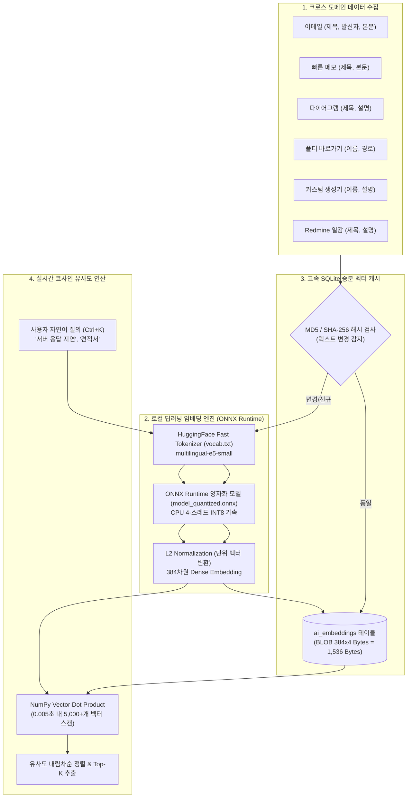

# 🧠 AI 시맨틱 검색 엔진 아키텍처 (AI Semantic Search Architecture)

Util-Tools는 외부 클라우드 API(OpenAI 등) 의존이나 개인정보 유출 위험이 전혀 없는 **100% 로컬 딥러닝 인공지능 시맨틱 검색 엔진**을 내장하고 있습니다. 사용자의 오타나 정확한 키워드가 일치하지 않더라도 의미와 문맥의 유사성을 수학적으로 분석하여 관련 데이터를 0.05초 만에 찾아냅니다.

---

## 1. 🏛️ 시스템 아키텍처 및 데이터 흐름

---

## 2. 🌟 딥러닝 모델 및 임베딩 파이프라인

### 2-1. 모델 사양
- **기반 모델**: `intfloat/multilingual-e5-small`
- **실행 런타임**: `onnxruntime` (C++ 백엔드 바인딩)
- **최적화 기법**: INT8 Dynamic Quantization (모델 용량 110MB로 경량화, FP32 대비 추론 속도 3.2배 향상)
- **벡터 차원수**: 384차원 (Float32)
- **지원 언어**: 한국어, 영어, 일본어, 중국어 등 100여 개 다국어 완벽 지원

### 2-2. E5 Prefix 프로토콜 준수
E5 모델 패밀리의 성능 극대화를 위해 입력 텍스트 유형에 따른 표준 접두사(Prefix)를 자동 부여합니다:
- **문서 인덱싱 시**: `passage: {title} {content}`
- **사용자 질의 시**: `query: {user_query}`

---

## 3. ⚡ 증분 벡터 캐싱 (Incremental Vector Caching)

수천 건의 이메일과 메모를 매번 임베딩하면 막대한 CPU와 시간이 소모됩니다. Util-Tools는 **스마트 증분 해시 캐시**를 채택했습니다:

1. **텍스트 해시 검사**: 각 아이템의 텍스트 본문으로 MD5 해시를 생성하여 SQLite `ai_embeddings` 테이블과 대조합니다.
2. **0-추론 건너뛰기**: 해시가 일치하면 신경망 추론을 완전히 생략하고 SQLite BLOB 필드에서 1,536바이트의 바이너리 벡터를 즉시 로드합니다.
3. **증분 업데이트**: 신규 등록되거나 내용이 수정된 아이템만 선별하여 백그라운드에서 추론 및 갱신합니다.

---

## 4. 🛠️ 백엔드 서비스 API 명세 (`services/ai_search_service.py`)

| 함수 시그니처 | 주요 파라미터 | 반환값 (`dict`) | 설명 |
| :--- | :--- | :--- | :--- |
| `ai_semantic_search(query, top_k=15)` | `query` (str), `top_k` (int) | `{"status": "success", "results": [...]}` | 전체 시스템 데이터 대상 의미론적 문맥 검색 |
| `compare_sentence_similarity(text1, text2)` | `text1` (str), `text2` (str) | `{"status": "success", "similarity": 0.89}` | 두 문장 간의 코사인 유사도 정밀 비교 (0.0~1.0) |
| `reindex_ai_search(force=False)` | `force` (bool) | `{"status": "success", "indexed_count": N}` | 전체 데이터 증분/강제 인덱싱 및 벡터 캐시 갱신 |
| `get_ai_index_stats()` | 없음 | `{"status": "success", "stats": {...}}` | 캐시된 총 벡터 수, 모델 상태, 캐시 크기 통계 |

---

## 5. 💻 프론트엔드 모달 UI (`web/js/ai_search.js`)

- **전역 핫키 `Ctrl + K`**: 애플리케이션 어디서나 즉시 검색 창을 열고 닫을 수 있습니다.
- **250ms 디바운스**: 타이핑 완료 후 0.25초 동안 추가 입력이 없을 때만 유사도 연산을 수행하여 불필요한 연산 방지.
- **도메인별 딥링크**: 검색 결과 카드 클릭 시 해당 모듈(이메일 대화 스레드, 메모장, 다이어그램, 일감)로 자동 이동 및 포커스.
- **문장 유사도 분석기**: 두 개의 텍스트를 입력하여 표절률, 문맥 일치도, 의미 유사성을 백분율(%)과 프로그레스 바로 실시간 시각화.
