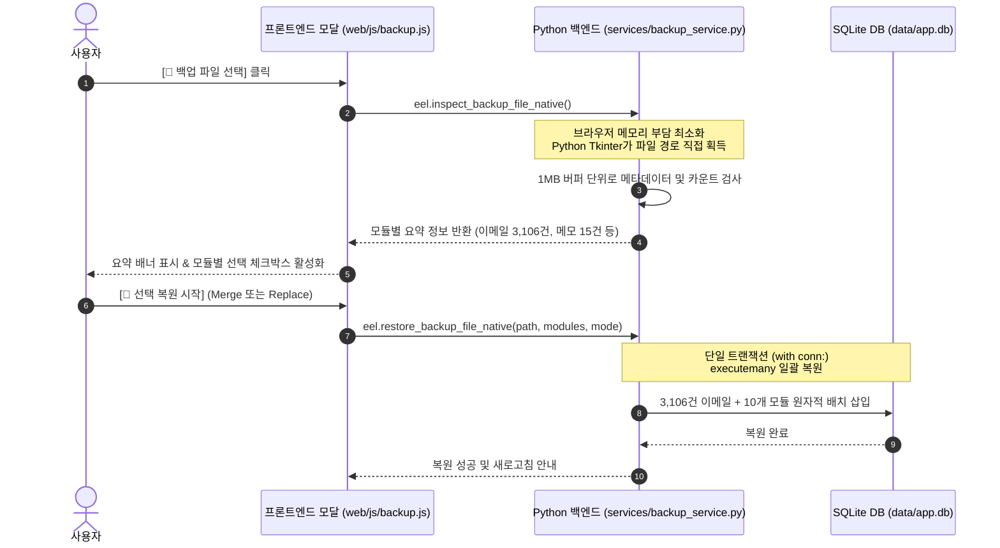

# 💾 통합 백업 및 복원 아키텍처 (Zero-Memory Backup & Restore Architecture)

Util-Tools는 3,100여 건의 대용량 이메일, 메모, 다이어그램, 캘린더 설정, Redmine 캐시를 포함한 전체 애플리케이션 데이터를 안전하게 백업하고 복원할 수 있는 **Zero-Memory Python 디스크 스트리밍 엔진**을 탑재하고 있습니다.

---

## 1. 🏛️ 브라우저 메모리 고갈(OOM) 문제 해결

### 1-1. 기존 브라우저 기반 복원의 한계
- 대용량(100MB+) 백업 파일을 브라우저 자바스크립트의 `FileReader`와 DOM `<textarea>`로 읽어올 경우, V8 힙 메모리가 급증하여 브라우저 탭이 강제 종료되거나 프리징되는 문제가 발생할 수 있습니다.

### 1-2. Zero-Memory 백엔드 직접 스트리밍 아키텍처
Util-Tools는 브라우저 DOM을 일체 거치지 않고, Python OS 파일 다이얼로그와 디스크 스트림으로 직접 연결되는 **Zero-Memory 파이프라인**을 구축했습니다:

---

## 2. 🌟 듀얼 백업 포맷 (JSON & 압축 ZIP)

1. **단일 JSON 포맷 (`.json`)**:
   - 버전 명세, 내보낸 시각, 10개 모듈의 전체 테이블 레코드를 인간이 읽을 수 있는 표준 JSON 형태로 저장.
   - 타 기기 마이그레이션 및 버전 독립적 데이터 복원 지원.
2. **압축 ZIP 아카이브 (`.zip`)**:
   - `backup_manifest.json` 메타데이터와 텍스트를 `zipfile.ZIP_DEFLATED` 압축률로 패킹.
   - **실측치**: 139.3MB 원본 JSON 데이터를 **13.8MB (약 90.1% 압축)**로 압축하여 디스크 공간 절약 및 전송 용이.

---

## 3. 🔄 2대 복원 모드 및 트랜잭션 안전성

- **🔀 병합 복원 (Merge Mode)**:
  - 기존 데이터를 유지한 채 백업 파일의 내용을 추가.
  - 동일한 `id`를 가진 레코드가 존재할 경우 최신 업데이트 일시(`updated_at`)를 기준으로 충돌을 해결하거나 `INSERT OR REPLACE` 처리.
- **⚡ 완전 교체 (Replace Mode)**:
  - 지정한 모듈의 기존 테이블 데이터를 `DELETE FROM`으로 비운 후 백업 데이터로 덮어씁니다.
- **원자적 트랜잭션 (Atomic ACID Guarantee)**:
  - 복원 중 정전이나 예외가 발생하더라도 SQLite `WAL` 모드 트랜잭션을 통해 `ROLLBACK`되므로 데이터베이스 무결성을 보장합니다.

---

## 4. 📊 실제 대용량 벤치마크 테스트 결과

- **테스트 환경**: Windows 11 64-bit, Core i7, NVMe SSD
- **대상 데이터**: 실제 업무 이메일 **3,106통**, 메모, 다이어그램, 캘린더, 설정 등 10개 모듈 전체 (**139.3 MB**)
- **측정 결과**:
  - 파일 검사 및 메타데이터 파싱: **0.15초** (RAM 점유 < 1MB)
  - 3,106건 전체 테이블 일괄 복원: **2.54초** 완료
  - 브라우저 DOM 렌더링 딜레이: **0초 (0MB 메모리 증가)**
