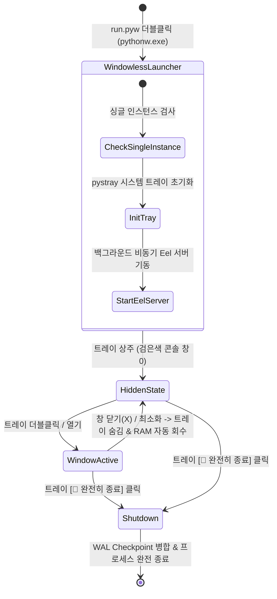

# 🛠️ 코어 시스템 및 유틸리티 아키텍처 (Core System & Utilities Architecture)

Util-Tools는 무창(Windowless) 백그라운드 상주, 시스템 트레이 연동, 메모리 자동 회수, 일정 동기화, 빠른 실행, 그리고 자바스크립트 샌드박스를 통합 지원하는 견고한 데스크톱 런타임 프레임워크를 기반으로 동작합니다.

---

## 1. 🏛️ 애플리케이션 생명주기 및 시스템 트레이

### 1-1. 무창(Windowless) 백그라운드 실행 (`run.pyw`)
- 검은색 CMD 프롬프트 창이 일체 표시되지 않는 `pythonw.exe` 런처를 제공합니다.
- 사용자가 창을 닫더라도 프로세스가 꺼지지 않고 시스템 트레이로 숨겨져 백그라운드 동기화(Redmine, 캘린더 등)를 지속합니다.

### 1-2. 중앙 트레이 관리자 (`core/tray.py`)
- Windows 알림 영역(트레이)에 고해상도 다크 테마 아이콘(`utiltools.ico`) 상주.
- **메뉴 구성**:
  - `🛠️ 도구 모음 열기 (기본값 / 더블클릭)`
  - `🔄 백그라운드 동기화 확인`
  - `🚪 완전히 종료`

---

## 2. ⚡ 메모리 최적화 및 유휴 자원 자동 회수 엔진

백그라운드 상주 프로그램으로서 메모리 누수 방지와 자원 효율성을 유지합니다:

1. **V8 힙 메모리 엄격 제한**:
   - Eel(Chrome/Edge) 프로세스 구동 시 `--js-flags=--max-old-space-size=128` 파라미터를 적용하여 브라우저 엔진의 불필요한 메모리 확장을 제한.
2. **Windows WorkingSet 유휴 메모리 자동 회수**:
   - 창이 최소화되거나 트레이로 숨겨질 때 Windows API `psapi.EmptyWorkingSet(handle)`을 호출하여 사용하지 않는 페이지를 OS로 반환.
3. **유휴 시 CPU 사용 최소화**:
   - 주기적 폴링 타이머 외에는 스레드가 대기 상태를 유지하여 배터리 소모를 줄입니다.

---

## 3. 📅 구글 캘린더 및 iCal(ICS) 웹 일정 동기화

- **비공개 주소 실시간 파싱**: 구글 캘린더의 비공개 iCal 웹 주소(`https://calendar.google.com/calendar/ical/.../basic.ics`)를 등록하면 백엔드 `calendar_service.py`가 주기적으로 일정을 수신하여 분석.
- **다크 테마 월간 캘린더**: 날짜별 일정 뱃지와 당일 일정(Today's Agenda) 상세 뷰 제공.
- **설정 보관**: `calendar_config.json`에 암호화된 형식으로 구독 주소 보관.

---

## 4. ⚡ 빠른 실행(Quick Launch) & 폴더 바로가기 (Quick Access Hub)

- **단일 탭 통합 (`tab-launch`)**: 두 기능 모두 '외부 리소스 및 실행 런처'라는 공통 목적을 공유하므로, 상단 `⚡ 빠른 실행` 단일 탭 내에서 상/하 듀얼 섹션으로 통합 제공됩니다.
- **상단 섹션: 폴더 바로가기 (`shortcuts`)**:
  - 자주 접근하는 프로젝트 디렉토리를 원클릭으로 탐색기에서 열기.
  - 상단 인라인 바를 통해 **선택한 폴더 위치에서 PowerShell, CMD, VS Code 터미널 즉시 실행**.
- **하단 섹션: 프로그램 & 도구 빠른 실행 (`quick_launch`)**:
  - 개발 서버 구동 스크립트(`.bat`), 데스크톱 실행 파일(`.exe`), 웹 관리자 페이지(URL), SSH 접속 명령어를 원클릭으로 실행.
  - 전용 [⚙️ 편집] 모달을 통한 실시간 추가/수정/삭제 및 마우스 드래그 앤 드롭 카드 순서 변경 (`order_index`).
- **선택적 확장 섹션: Antigravity CLI(`agy`) 세션 연동 (`services/agy_service.py`)**:
  - `app_settings.json`의 `enable_agy_integration` 옵션이 활성화되었을 때 노출되는 개발자 도구.
  - 로컬 `conversation_summaries.db`를 안전한 Read-Only 모드로 조회하여 세션 목록 및 진행 스텝 수 제공.
  - `[현재 프로젝트]`/`[전체 세션]` 필터링 및 클릭 시 해당 세션의 원래 작업 디렉토리(`workspace_uris`)에서 즉시 대화형 터미널(`agy --conversation <id>`) 실행.

---

## 5. 🧪 자바스크립트 샌드박스 플레이그라운드 (`web/js/js_runner.js`)

- RunJS / JSFiddle 스타일의 경량 코드 샌드박스.
- `AsyncFunction` 런타임 격리를 통해 최신 비동기 문법(`await fetch()`, `Promise` 등) 지원.
- `console.log`, `console.warn`, `console.error` 출력을 실시간 캡처하여 하단 인터랙티브 콘솔에 포맷팅 렌더링.
- `Ctrl + Enter` 즉시 실행 및 코드 자동 영구 저장.

---

## 6. 🔢 커스텀 데이터 생성기 스튜디오 (`generators`)

- 사용자가 직접 JavaScript 스크립트를 작성하여 새로운 고유 번호, 테스트 코드, 식별자 생성기를 확장 가능.
- **동적 변수 바인딩 (`variables_json`)**: 사용자 입력 폼(텍스트, 숫자, 선택)을 생성기 카드 상단에 동적으로 렌더링하고 스크립트 실행 컨텍스트에 파라미터로 주입.

---

## 7. 🧭 상단 내비게이션 및 도메인 그룹화 아키텍처

상단 내비게이션 바는 화면 공간을 효율적으로 활용하고 도메인별 응집도를 극대화하기 위해 2대 통합 드롭다운 그룹 구조를 채택하고 있습니다:

1. **💼 업무 & 협업 (Workplace & Collaboration)**:
   - 🦊 **Redmine**: 프로젝트 일감 관리, 진행률/상태 원클릭 갱신, 위키 뷰어/에디터
   - 📅 **달력 & 일정**: Google Calendar 및 iCal(ICS) 실시간 구독, 월간 달력 및 오늘 마감/일정
   - 📧 **이메일 아카이브**: 3,100+건 EML 보관, 대화별 스레드 타임라인, 카테고리 분류
2. **📊 뷰어 / 다이어그램 (File Viewers & Visualization Studio)**:
   - 📋 **CSV 뷰어**: 인코딩/구분자 자동 감지, 테이블 열람 및 Markdown/JSON/SQL 변환
   - 📝 **Markdown 뷰어**: GFM 실시간 에디터, GitHub Alerts, 태스크 체크박스 동기화
   - 📊 **다이어그램**: Mermaid 16종 다이어그램 시각화, 줌/팬 및 이미지 내보내기
   - ✂️ **이미지 슬라이서**: Pillow 기반 다중 절단선 분할, 여백 감지 및 ZIP/폴더 일괄 저장
3. **온디맨드 지연 로딩 & 탭 영속화 (`web/js/app.js`)**:
   - 각 기능 화면은 최초 열람 시점에만 초기화(On-demand Initializing)되어 초기 구동 메모리를 절감합니다.
   - 마지막으로 사용자가 작업 중이던 활성 탭은 `app_settings.json`에 영구 기록되어 앱 재시작 시 자동으로 복원됩니다.
