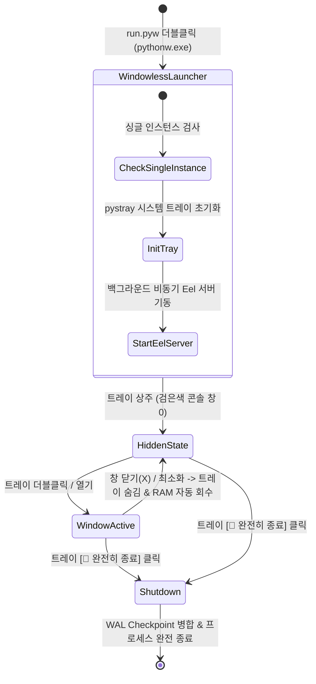
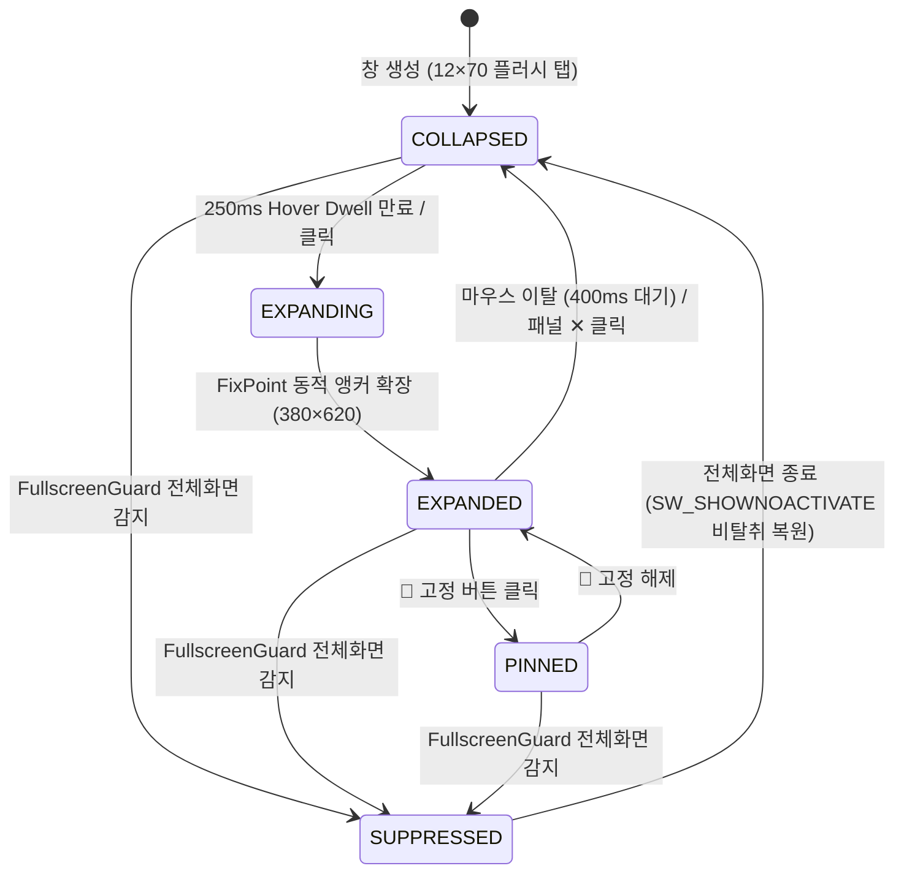

# 🛠️ 코어 시스템 및 유틸리티 아키텍처 (Core System & Utilities Architecture)

Util-Tools는 무창(Windowless) 백그라운드 상주, 시스템 트레이 연동, 메모리 자동 회수, 일정 동기화, 빠른 실행, 그리고 자바스크립트 샌드박스를 통합 지원하는 견고한 데스크톱 런타임 프레임워크를 기반으로 동작합니다.

---

## 1. 🏛️ 애플리케이션 생명주기 및 시스템 트레이

### 1-1. 무창(Windowless) 백그라운드 실행 (`run.pyw`)
- 검은색 CMD 프롬프트 창이 일체 표시되지 않는 `pythonw.exe` 런처를 제공합니다.
- 사용자가 창을 닫더라도 프로세스가 꺼지지 않고 시스템 트레이로 숨겨져 백그라운드 동기화(Redmine, 캘린더 등)를 지속합니다.

### 1-2. 중앙 트레이 관리자 (`core/tray.py`)
- Windows 알림 영역(트레이)에 고해상도 다크 테마 아이콘(`utiltools.ico`) 상주.
- **메뉴 구성**:
  - `🛠️ 도구 모음 열기 (기본값 / 더블클릭)`
  - `🔄 백그라운드 동기화 확인`
  - `🚪 완전히 종료`

### 1-3. 웹 UI 기반 백엔드 프로세스 제어 및 즉시 재시작(Hot Reload) (`services/system_service.py`)
- **도입 배경**: 백엔드 Python 코드(`.py`) 수정 시 프로세스를 재시동하기 위해 "웹 창 닫기 ➔ 트레이 우클릭 ➔ 종료 ➔ 재실행"을 거치던 2레벨 뎁스의 조작 번거로움을 웹 UI 상에서 직접 제어하도록 개선.
- **제어 인터페이스**:
  - **상단 헤더 네비게이션 (`.header-power-controls`)**: 모든 탭에서 즉시 접근 가능한 `[🔄 재시작]` 및 `[🚪 종료]` 버튼 상시 노출.
  - **시스템 & 네트워크 탭 (`#system-power-card`)**: 프로세스 제어 메인 카드 제공.
  - **비차단 인레이어 확인 모달 (`showAppConfirm`)**: 비동기 확인을 거쳐 실수로 인한 프로세스 종료를 방지.
- **안전한 프로세스 종료 및 핸들 인계 파이프라인**:
  1. 클라이언트에 200 OK 응답 우선 반환 (0.3초 지연 비동기 스레드 위임).
  2. **SQLite WAL 동기화**: `PRAGMA wal_checkpoint(TRUNCATE)`를 실행하여 미반영 트랜잭션 로그를 본 DB에 완전히 플러시.
  3. **단일 인스턴스 락 해제**: Windows 명명된 세마포어(`UtilTools_SingleInstance_Semaphore`) 핸들을 명시적으로 닫아 재시작 시 신규 프로세스의 싱글턴 충돌 방지.
  4. **트레이 아이콘 스레드 정지**: `TrayManager.tray_icon.stop()` 호출로 백그라운드 알림 영역 리소스 해제.
  5. **프로세스 분기**:
     - 완전 종료(`shutdown_app`): `os._exit(0)`으로 즉시 프로세스 클린 종료.
     - 즉시 재시작(`restart_app`): `subprocess.Popen([sys.executable, 'run.pyw' 또는 'main.py'])`으로 독립된 자식 프로세스를 분기한 후 부모 프로세스 종료.

### 1-4. 독립 애플리케이션 브라우저 프로파일 격리 (`data/browser_profile`)
- **문제 정의**: Eel 브라우저 구동 시 기본 사용자 데이터 디렉토리 인자가 생략될 경우, Chrome 마스터 프로세스가 사용자의 기본 프로파일(`%LOCALAPPDATA%\Google\Chrome\User Data\Default`)을 점유하고 `--disable-extensions`를 적용하여 사용자의 일상 브라우저 확장프로그램 인증 세션이 만료되는 결함이 발생.
- **엔지니어링 격리 조치**:
  - [`core.paths.BROWSER_PROFILE_DIR`](file:///D:/python/core/paths.py) (`D:\python\data\browser_profile`)를 신설.
  - [`core/tray.py`](file:///D:/python/core/tray.py) 및 [`main.py`](file:///D:/python/main.py)의 Eel 브라우저 런처 옵션에 `--user-data-dir` 및 `--no-first-run` 인자를 주입하여 시스템/개인 Chrome 프로파일과의 상호 간섭을 물리적으로 100% 차단.

### 1-5. 데스크톱 UI 런타임 현대화 로드맵 (내장 Edge WebView2 전환 계획)
- **현행 외부 브라우저(Eel)의 구조적 한계**:
  - Python 백엔드 프로세스와 Chrome 브라우저가 물리적으로 분리되어 있어, 세마포어 중복 실행 감지 시 윈도우 전면 활성화를 위해 Win32 `EnumWindows` 창 역추적 및 `Alt` 키 시뮬레이션 트릭(`SetForegroundWindow` 보안 정책 우회)에 의존.
- **전환 목표 및 기대 효과**:
  - OS 내장 Microsoft Edge WebView2(Chromium 152.x Evergreen 런타임)로 전환하여 Python 프로세스가 단일 네이티브 윈도우(`HWND`)를 직접 소유.
  - 5ms 이내 즉시 창 포커스 전환 및 프로세스 종료 시 자식 렌더러의 동시 소멸(Zero Orphaned Process) 달성.
- **백로그 관리**:
  - 상세한 4단계 무회귀 전환 로드맵 및 DoD는 [GitHub Issue #1](https://github.com/JudeRester/Util-Tools/issues/1)에 공식 백로그로 등록 및 관리 중.

---

## 2. ⚡ 메모리 최적화 및 유휴 자원 자동 회수 엔진

백그라운드 상주 프로그램으로서 메모리 누수 방지와 자원 효율성을 유지합니다:

1. **V8 힙 메모리 엄격 제한**:
   - Eel(Chrome/Edge) 프로세스 구동 시 `--js-flags=--max-old-space-size=128` 파라미터를 적용하여 브라우저 엔진의 불필요한 메모리 확장을 제한.
2. **Windows WorkingSet 유휴 메모리 자동 회수**:
   - 창이 최소화되거나 트레이로 숨겨질 때 Windows API `psapi.EmptyWorkingSet(handle)`을 호출하여 사용하지 않는 페이지를 OS로 반환.
3. **유휴 시 CPU 사용 최소화**:
   - 주기적 폴링 타이머 외에는 스레드가 대기 상태를 유지하여 배터리 소모를 줄입니다.

---

## 3. 📅 구글 캘린더 및 iCal(ICS) 웹 일정 동기화

- **비공개 주소 실시간 파싱**: 구글 캘린더의 비공개 iCal 웹 주소(`https://calendar.google.com/calendar/ical/.../basic.ics`)를 등록하면 백엔드 `calendar_service.py`가 주기적으로 일정을 수신하여 분석.
- **다크 테마 월간 캘린더**: 날짜별 일정 뱃지와 당일 일정(Today's Agenda) 상세 뷰 제공.
- **설정 보관**: `calendar_config.json`에 암호화된 형식으로 구독 주소 보관.

---

## 4. ⚡ 빠른 실행(Quick Launch) & 폴더 바로가기 (Quick Access Hub)

- **단일 탭 통합 (`tab-launch`)**: 두 기능 모두 '외부 리소스 및 실행 런처'라는 공통 목적을 공유하므로, 상단 `⚡ 빠른 실행` 단일 탭 내에서 상/하 듀얼 섹션으로 통합 제공됩니다.
- **상단 섹션: 폴더 바로가기 (`shortcuts`)**:
  - 자주 접근하는 프로젝트 디렉토리를 파일 탐색기에서 즉시 열기.
  - 상단 인라인 바를 통해 **선택한 폴더 위치에서 PowerShell, CMD, VS Code 터미널 즉시 실행**.
- **하단 섹션: 프로그램 & 도구 빠른 실행 (`quick_launch`)**:
  - 개발 서버 구동 스크립트(`.bat`), 데스크톱 실행 파일(`.exe`), 웹 관리자 페이지(URL), SSH 접속 명령어를 바로 실행.
  - 전용 [⚙️ 편집] 모달을 통한 실시간 추가/수정/삭제 및 마우스 드래그 앤 드롭 카드 순서 변경 (`order_index`).
- **통합 AI 코딩 세션 허브 (Unified AI Sessions Hub: Antigravity CLI & OpenCodex)**:
  - `services/agy_service.py` 및 `services/opencodex_service.py` 기반으로 머신 내 Antigravity(`agy`)와 OpenCodex(`ocx`) 세션을 통합 수집 및 제어.
  - **터미널 세션 실행 및 창 전환**: Alt 키 시뮬레이션 기반의 활성 콘솔 창 전면 전환 및 신규 CLI 세션 백그라운드 분기 실행.
  - **5ms 논블로킹 활성 락 감지**: `msvcrt.locking` 파일 락 검사로 현재 실행 중인 세션 실시간 식별.
  - **비차단 영구 삭제 및 모달 연동**: `showAppConfirm` 모달을 통해 비활성 세션을 영구 삭제하며, 실행 중인 세션은 삭제 방어.
  - **실시간 Tail 인스펙터**: Rollout / Transcript 스트리밍으로 턴별 프롬프트, 도구 호출, 결과 확인.
  - **스마트 세션 알림 구독**: 완료(`DONE`) 및 터미널 권한 승인 대기(`BypassSandbox`) 발생 시 Windows 트레이/토스트/차임벨 전송.
  - *(※ 데이터 소스, 스키마, 락 메커니즘 등 상세 아키텍처는 [`docs/AI_CODING_SESSIONS.md`](docs/AI_CODING_SESSIONS.md)를 참조하십시오.)*

---

## 5. 🧪 자바스크립트 샌드박스 플레이그라운드 (`web/js/js_runner.js`)

- RunJS / JSFiddle 스타일의 경량 코드 샌드박스.
- `AsyncFunction` 런타임 격리를 통해 최신 비동기 문법(`await fetch()`, `Promise` 등) 지원.
- `console.log`, `console.warn`, `console.error` 출력을 실시간 캡처하여 하단 인터랙티브 콘솔에 포맷팅 렌더링.
- `Ctrl + Enter` 즉시 실행 및 코드 자동 영구 저장.

---

## 6. 🔢 커스텀 데이터 생성기 스튜디오 (`generators`)

- 사용자가 직접 JavaScript 스크립트를 작성하여 새로운 고유 번호, 테스트 코드, 식별자 생성기를 확장 가능.
- **동적 변수 바인딩 (`variables_json`)**: 사용자 입력 폼(텍스트, 숫자, 선택)을 생성기 카드 상단에 동적으로 렌더링하고 스크립트 실행 컨텍스트에 파라미터로 주입.

---

## 7. 🧭 상단 내비게이션 및 도메인 그룹화 아키텍처

상단 내비게이션 바는 화면 공간을 효율적으로 활용하고 도메인별 응집도를 극대화하기 위해 2대 통합 드롭다운 그룹 구조를 채택하고 있습니다:

1. **💼 업무 & 협업 (Workplace & Collaboration)**:
   - 🦊 **Redmine**: 프로젝트 일감 관리, 진행률/상태 인라인 갱신, 위키 뷰어/에디터
   - 📅 **달력 & 일정**: Google Calendar 및 iCal(ICS) 실시간 구독, 월간 달력 및 오늘 마감/일정
   - 📧 **이메일 아카이브**: 3,100+건 EML 보관, 대화별 스레드 타임라인, 카테고리 분류
2. **📊 뷰어 / 다이어그램 (File Viewers & Visualization Studio)**:
   - 📋 **CSV 뷰어**: 인코딩/구분자 자동 감지, 테이블 열람 및 Markdown/JSON/SQL 변환
   - 📝 **Markdown 뷰어**: GFM 실시간 에디터, GitHub Alerts, 태스크 체크박스 동기화
   - 📊 **다이어그램**: Mermaid 16종 다이어그램 시각화, 줌/팬 및 이미지 내보내기
   - ✂️ **이미지 슬라이서**: Pillow 기반 다중 절단선 분할, 여백 감지 및 ZIP/폴더 일괄 저장
3. **온디맨드 지연 로딩 & 탭 영속화 (`web/js/app.js`)**:
   - 각 기능 화면은 최초 열람 시점에만 초기화(On-demand Initializing)되어 초기 구동 메모리를 절감합니다.
   - 마지막으로 사용자가 작업 중이던 활성 탭은 `app_settings.json`에 영구 기록되어 앱 재시작 시 자동으로 복원됩니다.

---

## 8. 📌 데스크톱 엣지 퀵 위젯 & 전체화면 가드 (Edge Quick Widget & FullscreenGuard)

화면 전환 없이 빠른 메모, 런처 실행, 시스템 모니터링을 지원하는 초경량 데스크톱 상주형 플로팅 위젯 시스템입니다.

### 8-1. pywebview 하이브리드 아키텍처 및 동적 리사이징 (`core/edge_widget.py`)
- **Eel-pywebview 병렬 브리지**: Eel 메인 창과 pywebview 위젯 창이 동일한 백엔드 포트를 공유하며, ``를 통해 20개 기존 서비스의 RPC를 그대로 재사용합니다.
- **단일 HWND 생명주기 관리**: 창을 파괴하고 다시 생성하지 않고, 단일 OS 네이티브 창의 크기를 `resize(width, height, fix_point)`로 전환합니다.
- **수직/수평 FixPoint 동적 앵커**:
  - 수평 앵커: 우측 엣지(`FixPoint.EAST`, 좌측으로 확장) / 좌측 엣지(`FixPoint.WEST`, 우측으로 확장).
  - 수직 앵커: 화면 하단 작업영역 이탈 시 `FixPoint.SOUTH`(위쪽으로 확장), 여유 시 `FixPoint.NORTH`(아래쪽으로 확장).
  - `handle_anchor_y` 복원: 확장 후 축소 시 사용자가 배치한 원래 Y 좌표 위치로 정확히 복귀합니다.

### 8-2. 플러시 엣지 탭 (Flush Edge Tab) & 3단계 크기 프리셋
- **플러시 엣지 탭 디자인**:
  - Windows WinForms WebView2의 데스크톱 투명화 한계를 해결하기 위해 `border-radius: 0`을 적용하여 윈도우 사각 캔버스를 100% 채우는 화면 가장자리 밀착형 직각 도크 탭 구조를 채택했습니다.
  - `background_color="#1e1e2d"` 설정을 통해 윈도우 기본 캔버스와 웹 UI 테마 배경색을 일치시켜 렌더링 간 색상 불일치 및 잔여물 노출을 제거했습니다.
- **3단계 동적 크기 프리셋**:
  | 프리셋 키 | 표시 명칭 | 규격 (폭 × 높이) | 특징 |
  | :--- | :--- | :---: | :--- |
  | `slim` | **슬림 (기본값)** | **12px × 70px** | 화면 가림 최소화 & 마우스 호버 편의성 균형 |
  | `default` | **기본** | **20px × 120px** | 마우스 포인터 조준이 가장 편안한 규격 |
  | `compact` | **컴팩트** | **8px × 50px** | 모니터 베젤 수준의 극소형 규격 |
- **2중 런타임 제어 & 영속화**:
  - 위젯 헤더 우측의 `📏` 팝오버 메뉴 및 시스템 트레이 우클릭 `📏 핸들 크기` 서브메뉴에서 실시간으로 전환 가능합니다.
  - 엣지 방향(`edge`), Y축 위치 비율(`offset_ratio`), 대상 모니터(`device_name`), 선택된 크기(`handle_size`)는 `data/widget_config.json`에 영구 저장됩니다.

### 8-3. 상호작용 제어 및 제스처 중재 (`web/js/widget.js`)
- **250ms Hover Dwell**: 마우스가 핸들에 진입했을 때 250ms 동안 머무를 경우에만 확장을 개시하여 작업 중 스쳐 지나가는 마우스에 의한 의도치 않은 팝업을 방어합니다.
- **네이티브 드래그 위임**: `.pywebview-drag-region`을 통해 Windows OS 네이티브 윈도우 드래그 메커니즘을 사용하며, 드래그 중에는 호버 팝업이 전면 차단됩니다.
- **400ms 제스처 쿨다운**: 핸들 드래그 이동을 마친 직후 400ms 동안 호버 확장을 일시 억제하여 불필요한 자동 팝업을 방지합니다.
- **150ms Settle Debounce**: 윈도우 이동 정지 후 150ms 시점에 현재 모니터 작업영역(`rcWork`) 기준 가장 가까운 화면 가장자리로 자동 스냅(Nearest-Edge Snap)됩니다.

### 8-4. FullscreenGuard 전체화면 감지 및 No-Activate 복원 (`core/fullscreen_guard.py`)
- **Win32 SetWinEventHook 전용 스레드**: 전용 메시지 펌프(`GetMessage`) 루프에서 `EVENT_SYSTEM_FOREGROUND` 이벤트를 실시간 감지합니다.
- **500ms Fallback 폴링**: 이벤트 누락을 대비하여 500ms 주기 저빈도 타이머로 상태 일관성을 교차 검증합니다.
- **다중 모니터 `_fullscreen_hwnd` 추적**: 포그라운드가 다른 모니터로 이동하더라도, 기존 모니터에 전체화면 앱(게임, 동영상)이 유지되고 있으면 위젯을 숨김(`SUPPRESSED`) 상태로 유지합니다.
- **포커스 비탈취 복원 (`SW_SHOWNOACTIVATE`)**: 전체화면이 종료되어 위젯이 복원될 때 `user32.ShowWindow(hwnd, SW_SHOWNOACTIVATE)`를 사용하여 활성 창의 키보드/마우스 포커스를 가로채지 않고 비활성 상태로 조용히 화면에 복귀합니다.
