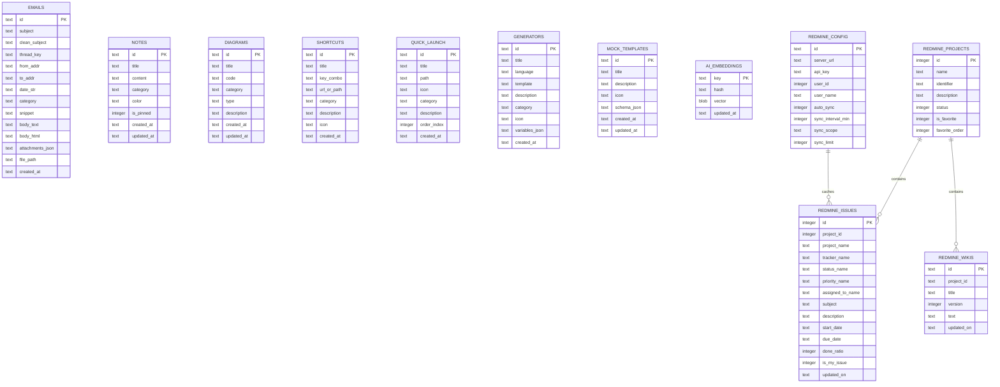

# 🗄️ 중앙 SQLite 데이터베이스 구조 및 ERD 명세 (Database Architecture & Schema)

Util-Tools는 모든 사용자 데이터와 로컬 오프라인 캐시를 단일 중앙 SQLite 데이터베이스([`data/app.db`](file:///D:/python/data/app.db))에서 통합 관리합니다.

---

## 1. ⚙️ 데이터베이스 엔진 및 성능 PRAGMA 설정

- **파일 경로**: `D:\python\data\app.db` (Git 추적 제외)
- **커넥션 매니저**: [`services/db_service.py`](file:///D:/python/services/db_service.py)
- **핵심 PRAGMA 최적화**:
  - `PRAGMA journal_mode=WAL;`: 동시 다중 읽기/쓰기를 지원하여 UI 멈춤 방지
  - `PRAGMA synchronous=NORMAL;`: 디스크 쓰기 I/O를 최적화하면서 크래시 안전성 보장
  - `PRAGMA busy_timeout=5000;`: 동시성 락 충돌 시 최대 5초간 자동 대기
  - `PRAGMA wal_checkpoint(TRUNCATE);`: 앱 종료 시 WAL 로그를 본 DB로 자동 병합 및 용량 최소화

---

## 2. 🏛️ 테이블 관계 및 도메인 다이어그램 (ERD)

---

## 3. 📋 13개 테이블별 상세 스키마 명세 (Schema Specifications)

### ① `emails` (대용량 이메일 아카이브)
| 컬럼명 | 데이터 타입 | 기본값 / 제약조건 | 설명 |
| :--- | :--- | :--- | :--- |
| `id` | `TEXT` | `PRIMARY KEY` | 이메일 고유 해시 식별자 |
| `subject` | `TEXT` | - | 원본 이메일 제목 |
| `clean_subject` | `TEXT` | - | Re:/Fwd: 접두사가 제거된 정규화된 스레드 제목 |
| `thread_key` | `TEXT` | - | 대화 스레드 그룹핑 키 (인덱스 생성) |
| `from_addr` | `TEXT` | - | 발신자 이름 및 이메일 주소 |
| `to_addr` | `TEXT` | - | 수신자 목록 |
| `date_str` | `TEXT` | - | 작성 일시 (RFC2822 / ISO8601) |
| `category` | `TEXT` | `'기타'` | 6대 자동 분류 카테고리 (인덱스 생성) |
| `snippet` | `TEXT` | - | 본문 150자 미리보기 요약문 |
| `body_text` | `TEXT` | - | 일반 텍스트 본문 |
| `body_html` | `TEXT` | - | HTML 서식 본문 |
| `attachments_json`| `TEXT` | `'[]'` | 첨부파일 메타데이터 JSON 배열 |
| `message_id` | `TEXT` | - | 이메일 헤더 `Message-ID` |
| `in_reply_to` | `TEXT` | - | 회신 대상 `In-Reply-To` 헤더 |
| `references_header`| `TEXT`| - | 참조 체인 `References` 헤더 |
| `file_path` | `TEXT` | - | 로컬 `emails/*.eml` 물리 파일 경로 |
| `created_at` | `TEXT` | - | DB 등록 일시 |

> **인덱스**: `idx_emails_category`, `idx_emails_thread_key`, `idx_emails_date`, `idx_emails_created_at`, `idx_emails_sort (created_at DESC, date_str DESC)`

---

### ② `notes` (빠른 메모 / 스크래치패드)
| 컬럼명 | 데이터 타입 | 기본값 / 제약조건 | 설명 |
| :--- | :--- | :--- | :--- |
| `id` | `TEXT` | `PRIMARY KEY` | 메모 고유 식별자 |
| `title` | `TEXT` | - | 메모 제목 |
| `content` | `TEXT` | - | 메모 내용 (텍스트/마크다운) |
| `category` | `TEXT` | `''` | 카테고리 태그 |
| `color` | `TEXT` | `''` | 메모 카드 테마 색상 코드 |
| `is_pinned` | `INTEGER` | `0` | 상단 고정 여부 (1: 고정, 0: 일반) |
| `created_at` | `TEXT` | - | 생성 일시 |
| `updated_at` | `TEXT` | - | 최종 수정 일시 (자동 갱신) |

> **인덱스**: `idx_notes_pinned`, `idx_notes_updated_at`, `idx_notes_created_at`, `idx_notes_sort (is_pinned DESC, updated_at DESC, created_at DESC)`

---

### ③ `diagrams` (Mermaid 다이어그램)
| 컬럼명 | 데이터 타입 | 기본값 / 제약조건 | 설명 |
| :--- | :--- | :--- | :--- |
| `id` | `TEXT` | `PRIMARY KEY` | 다이어그램 고유 식별자 |
| `title` | `TEXT` | - | 다이어그램 제목 |
| `code` | `TEXT` | - | Mermaid 다이어그램 소스 코드 |
| `category` | `TEXT` | - | 분류 카테고리 |
| `type` | `TEXT` | `''` | 다이어그램 종류 (flowchart, sequence, mindmap 등) |
| `description` | `TEXT` | - | 상세 설명 |
| `created_at` | `TEXT` | - | 생성 일시 |
| `updated_at` | `TEXT` | - | 수정 일시 |

> **인덱스**: `idx_diagrams_category`, `idx_diagrams_updated_at`

---

### ④ `shortcuts` (폴더 바로가기)
| 컬럼명 | 데이터 타입 | 기본값 / 제약조건 | 설명 |
| :--- | :--- | :--- | :--- |
| `id` | `TEXT` | `PRIMARY KEY` | 바로가기 ID |
| `title` | `TEXT` | - | 표시 명칭 |
| `key_combo` | `TEXT` | `''` | 단축키 조합 (선택 사항) |
| `url_or_path` | `TEXT` | - | 대상 폴더 경로 또는 URL |
| `category` | `TEXT` | `'folder'` | 카테고리 |
| `description` | `TEXT` | `''` | 툴팁 설명문 |
| `icon` | `TEXT` | `'📁'` | 이모지/아이콘 |
| `created_at` | `TEXT` | - | 생성 일시 |

> **인덱스**: `idx_shortcuts_category`

---

### ⑤ `quick_launch` (빠른 실행)
| 컬럼명 | 데이터 타입 | 기본값 / 제약조건 | 설명 |
| :--- | :--- | :--- | :--- |
| `id` | `TEXT` | `PRIMARY KEY` | 빠른 실행 ID |
| `title` | `TEXT` | - | 실행 항목 이름 |
| `path` | `TEXT` | - | 실행 파일 경로, URL, 또는 CLI 명령어 |
| `icon` | `TEXT` | `'⚡'` | 표시 아이콘 |
| `category` | `TEXT` | `'cmd'` | 실행 타입 (`cmd`, `exe`, `url`, `ssh`) |
| `description` | `TEXT` | `''` | 설명 |
| `order_index` | `INTEGER` | `0` | 드래그 앤 드롭 정렬 순서 인덱스 |
| `created_at` | `TEXT` | - | 생성 일시 |

> **인덱스**: `idx_quick_launch_order`

---

### ⑥ `generators` (커스텀 데이터 생성기)
| 컬럼명 | 데이터 타입 | 기본값 / 제약조건 | 설명 |
| :--- | :--- | :--- | :--- |
| `id` | `TEXT` | `PRIMARY KEY` | 생성기 ID |
| `title` | `TEXT` | - | 생성기 이름 |
| `language` | `TEXT` | `'javascript'` | 스크립트 엔진 |
| `template` | `TEXT` | - | 실행 JavaScript 코드 본문 |
| `description` | `TEXT` | - | 생성기 설명 |
| `category` | `TEXT` | - | 카테고리 |
| `icon` | `TEXT` | `'🔢'` | 아이콘 |
| `variables_json`| `TEXT` | `'[]'` | 사용자 입력 파라미터 정의 JSON |
| `created_at` | `TEXT` | - | 생성 일시 |

> **인덱스**: `idx_generators_category`

---

### ⑦ `mock_templates` (모의 데이터 서식 양식)
| 컬럼명 | 데이터 타입 | 기본값 / 제약조건 | 설명 |
| :--- | :--- | :--- | :--- |
| `id` | `TEXT` | `PRIMARY KEY` | 양식 ID |
| `title` | `TEXT` | `NOT NULL` | 양식 이름 (예: 회원 목록 양식) |
| `description` | `TEXT` | `''` | 양식 설명 |
| `icon` | `TEXT` | `'📋'` | 아이콘 |
| `schema_json` | `TEXT` | `NOT NULL` | 컬럼 정의(컬럼명, 데이터타입, 생성규칙) JSON |
| `created_at` | `TEXT` | - | 생성 일시 |
| `updated_at` | `TEXT` | - | 수정 일시 |

> **인덱스**: `idx_mock_templates_updated`

---

### ⑧ `ai_embeddings` (AI 시맨틱 임베딩 벡터 캐시)
| 컬럼명 | 데이터 타입 | 기본값 / 제약조건 | 설명 |
| :--- | :--- | :--- | :--- |
| `key` | `TEXT` | `PRIMARY KEY` | 데이터 고유 식별 키 (예: `emails:em_102`) |
| `hash` | `TEXT` | `NOT NULL` | 텍스트 변경 감지용 MD5/SHA256 해시 |
| `vector` | `BLOB` | `NOT NULL` | 384차원 float32 임베딩 바이너리 배열 |
| `updated_at` | `TEXT` | - | 임베딩 생성/갱신 일시 |

> **인덱스**: `idx_ai_embeddings_hash`

---

### ⑨ `redmine_config` (Redmine 연결 및 동기화 설정)
| 컬럼명 | 데이터 타입 | 기본값 / 제약조건 | 설명 |
| :--- | :--- | :--- | :--- |
| `id` | `TEXT` | `PRIMARY KEY` | 설정 프로필 ID (`'default'`) |
| `server_url` | `TEXT` | - | Redmine 서버 URL (`https://...`) |
| `api_key` | `TEXT` | - | 사용자 REST API 접근 키 |
| `user_id` | `INTEGER` | - | 로그인된 Redmine 사용자 ID |
| `user_name` | `TEXT` | - | 사용자 실명 |
| `user_login` | `TEXT` | - | 사용자 로그인 계정명 |
| `auto_sync` | `INTEGER` | `1` | 백그라운드 자동 동기화 활성화 여부 |
| `sync_interval_min`| `INTEGER`| `5` | 동기화 주기 (분 단위) |
| `sync_scope` | `TEXT` | `'all_open'` | 동기화 범위 (`my_issues`, `all_open`, `project`) |
| `sync_limit` | `INTEGER` | `300` | 일괄 동기화 최대 일감 수 |
| `sync_project_id` | `INTEGER`| `0` | 특정 프로젝트 ID 지정 동기화 시 사용 |
| `updated_at` | `TEXT` | - | 설정 수정 일시 |

---

### ⑩ `redmine_issues` (Redmine 일감 로컬 오프라인 캐시)
| 컬럼명 | 데이터 타입 | 기본값 / 제약조건 | 설명 |
| :--- | :--- | :--- | :--- |
| `id` | `INTEGER` | `PRIMARY KEY` | Redmine 일감 번호 (#Issue ID) |
| `project_id` | `INTEGER` | - | 소속 프로젝트 ID |
| `project_name` | `TEXT` | - | 소속 프로젝트 명칭 |
| `tracker_name` | `TEXT` | - | 트래커 (결함, 기능, 지원 등) |
| `status_name` | `TEXT` | - | 상태 (신규, 진행, 해결, 완료 등) |
| `priority_name`| `TEXT` | - | 우선순위 (낮음, 보통, 높음, 긴급 등) |
| `author_name` | `TEXT` | - | 등록자 이름 |
| `assigned_to_name`| `TEXT` | - | 담당자 이름 |
| `subject` | `TEXT` | - | 일감 제목 |
| `description` | `TEXT` | - | 일감 설명 본문 |
| `start_date` | `TEXT` | - | 시작일 |
| `due_date` | `TEXT` | - | 완료 기한일 |
| `done_ratio` | `INTEGER` | `0` | 진척도 (0 ~ 100%) |
| `estimated_hours`| `REAL` | - | 추정 시간 |
| `updated_on` | `TEXT` | - | Redmine 서버 기준 최종 수정 일시 |
| `created_on` | `TEXT` | - | 등록 일시 |
| `is_my_issue` | `INTEGER` | `0` | 내 담당 일감 여부 플래그 (1: 내 일감) |
| `raw_json` | `TEXT` | - | Redmine API 원본 전체 응답 JSON |

> **인덱스**: `idx_redmine_issues_project`, `idx_redmine_issues_status`, `idx_redmine_issues_assigned`, `idx_redmine_issues_my`, `idx_redmine_issues_due`, `idx_redmine_issues_updated`, `idx_redmine_issues_sort (updated_on DESC, id DESC)`

---

### ⑪ `redmine_wikis` (Redmine 프로젝트 위키 문서 캐시)
| 컬럼명 | 데이터 타입 | 기본값 / 제약조건 | 설명 |
| :--- | :--- | :--- | :--- |
| `id` | `TEXT` | `PRIMARY KEY` | 위키 복합 키 (`{project_id}:{title}`) |
| `project_id` | `TEXT` | - | 프로젝트 식별자 |
| `project_name` | `TEXT` | - | 프로젝트 명칭 |
| `title` | `TEXT` | - | 위키 페이지 제목 |
| `version` | `INTEGER` | `1` | 위키 문서 버전 |
| `author_name` | `TEXT` | - | 작성자 |
| `comments` | `TEXT` | - | 버전 코멘트 |
| `text` | `TEXT` | - | 위키 본문 (Textile / Markdown) |
| `updated_on` | `TEXT` | - | 최종 수정 일시 |
| `created_on` | `TEXT` | - | 최초 작성 일시 |

> **인덱스**: `idx_redmine_wikis_project`, `idx_redmine_wikis_title`

---

### ⑫ `redmine_projects` (프로젝트 목록 및 즐겨찾기 캐시)
| 컬럼명 | 데이터 타입 | 기본값 / 제약조건 | 설명 |
| :--- | :--- | :--- | :--- |
| `id` | `INTEGER` | `PRIMARY KEY` | 프로젝트 ID |
| `name` | `TEXT` | - | 프로젝트 이름 |
| `identifier` | `TEXT` | - | 프로젝트 영문 식별자 |
| `description` | `TEXT` | - | 프로젝트 설명 |
| `status` | `INTEGER` | `1` | 상태 (1: 활성) |
| `is_favorite` | `INTEGER` | `0` | 주요 관심 프로젝트 여부 (1: 즐겨찾기) |
| `favorite_order`| `INTEGER`| `0` | 즐겨찾기 정렬 순서 |

> **인덱스**: `idx_redmine_projects_fav (is_favorite, favorite_order)`

---

### ⑬ `redmine_meta` (트래커, 상태, 우선순위 메타데이터 캐시)
| 컬럼명 | 데이터 타입 | 기본값 / 제약조건 | 설명 |
| :--- | :--- | :--- | :--- |
| `key` | `TEXT` | `PRIMARY KEY` | 메타데이터 키 (`'statuses'`, `'trackers'`, `'priorities'`) |
| `data_json` | `TEXT` | - | 메타데이터 JSON 배열 |
| `updated_at` | `TEXT` | - | 최종 갱신 일시 |

---

## 4. 📁 파일 기반 설정 파일 (File-based JSON Configurations)

데이터베이스 외에 다음 설정 파일들은 독립된 JSON 파일로 관리되어 외부 연동 및 설정을 지원합니다:
- **`calendar_config.json`**: 구글 캘린더 비공개 주소 및 iCal(ICS) 웹 구독 목록
- **`app_settings.json`**: 윈도우 창 크기, 콘솔 높이, 분할창 크기 등 사용자 인터페이스 영구 설정

---

## 5. 🤖 외부 로컬 AI 데이터베이스 연동 명세 (External Read-Only AI Databases)

Util-Tools의 통합 AI 코딩 세션 허브는 로컬 머신에 설치된 CLI 에이전트의 SQLite 데이터베이스를 안전하게 읽기 전용(`mode=ro`)으로 쿼리하여 대시보드를 구성합니다:

### 1) Antigravity CLI 세션 DB (`conversation_summaries.db`)
- **경로**: `C:\Users\<User>\.gemini\antigravity-cli\databases\conversation_summaries.db`
- **주요 테이블 및 필드**:
  - `conversations`
    - `conversation_id` (`TEXT PK`): 세션 UUID
    - `workspace_uris` (`TEXT`): JSON 배열 형식의 작업 디렉토리 URI 목록
    - `step_count` (`INTEGER`): 세션 내 상호작용 스텝 수
    - `created_at` / `updated_at` (`TEXT`): ISO 8601 타임스탬프
- **접근 방식**: `sqlite3.connect('file:...?mode=ro', uri=True)`를 통해 CLI 엔진 실행 중에도 락 경합 없이 실시간 세션 조회.

### 2) OpenCodex CLI 세션 DB (`codex-dev.db` & `state_5.sqlite`)
- **경로**: `C:\Users\<User>\.codex\sqlite\`
- **주요 테이블 및 필드**:
  - `codex-dev.db`의 `local_thread_catalog`:
    - `thread_id` (`TEXT PK`): 스레드 UUID
    - `cwd` (`TEXT`): 작업 디렉토리 (접두사 `\\?\` 정규화 대상)
    - `title` (`TEXT`): 세션 제목 / 첫 번째 사용자 프롬프트
    - `source_kind` (`TEXT`): 생성 소스 (`'cli'`, `'vscode'`, `'local'`, `'chatgpt'`)
    - `host_id` (`TEXT`): 호스트 식별자 (`'local'` 여부 검증)
    - `updated_at` (`INTEGER`): Epoch 밀리초 타임스탬프
  - `state_5.sqlite`의 `threads`:
    - `id` (`TEXT PK`): 스레드 UUID (조인 키)
    - `model_provider` (`TEXT`): 사용된 모델 (예: `gpt-4o`, `o3-mini`)
    - `tokens_used` (`INTEGER`): 세션 누적 토큰
- **필터링 정책**: `(host_id = 'local' OR source_kind IN ('cli', 'vscode', 'local')) AND cwd IS NOT NULL` 조건을 통해 OpenAI 계정에 동기화된 웹 대화를 제외하고 순수 로컬 워크스페이스 세션만 선별 추출.

