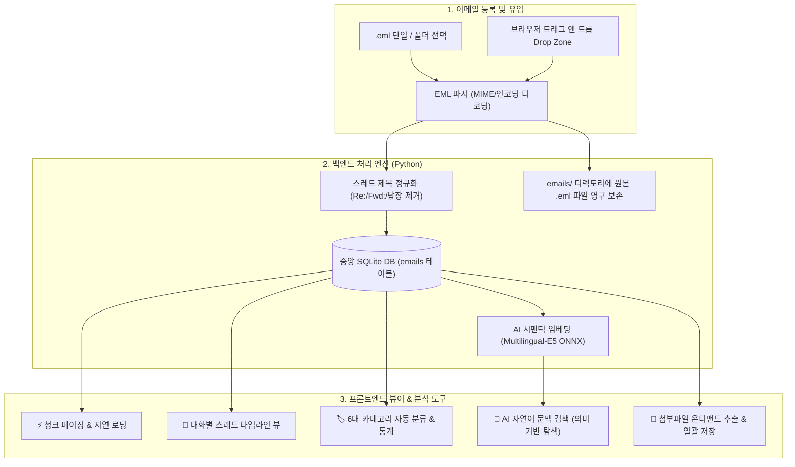
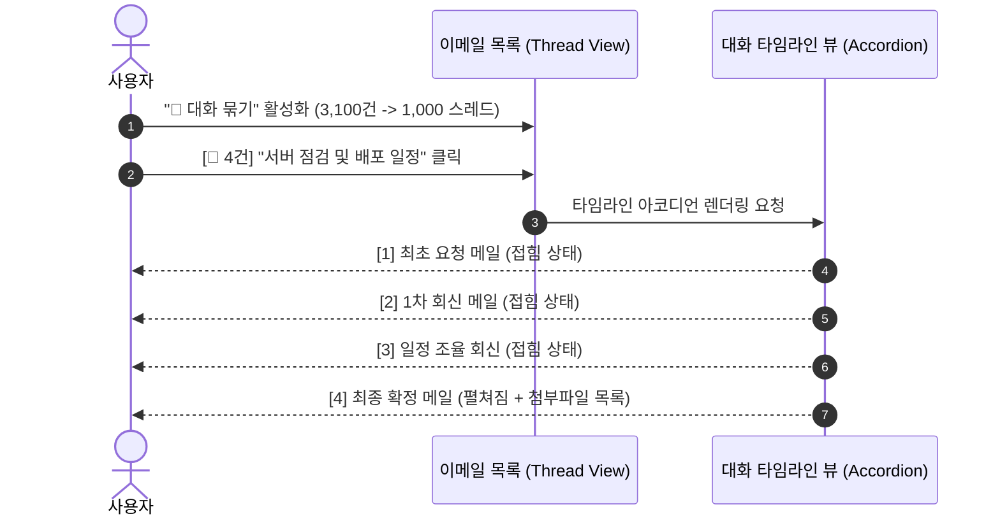

# 📧 이메일 아카이브 시스템 및 스레드 아키텍처 (Email Archive Architecture)

Util-Tools는 수천 통의 `.eml` 및 `.msg` 이메일을 로컬에서 안전하게 보관하고, 대화 스레드 분석 및 AI 시맨틱 검색을 제공하는 이메일 관리 엔진을 내장하고 있습니다.

---

## 1. 🏛️ 시스템 아키텍처 및 데이터 흐름

---

## 2. 💬 대화별 스레드 묶기 (Thread View) & 타임라인 라이프사이클

이메일 제목에서 `Re:`, `Fwd:`, `[회수]`, `답장:`, `전달:` 등 모든 불필요한 접두사를 제거하여 고유의 `thread_key`로 대화를 그룹화합니다.  
`[💬 대화 묶기]` 토글을 활성화하면 3,100여 건의 개별 메일이 약 1,000개의 대화 스레드로 압축되어 메일함 피로도를 대폭 낮춥니다.

---

## 3. 🌟 이메일 핵심 기능 6대 특징

1. **💬 비파괴적 대화별 스레드 묶기 (Thread View)**:
   * 동일한 주제로 오고 간 메일들을 시간순(과거 ➔ 최신) 아코디언 카드 뷰로 렌더링.
   * 각 카드별 HTML/Text 뷰 모드 전환, 개별 본문 복사, 원본 열기 지원.
2. **⚡ 청크 페이징 & 지연 로딩 (Lazy Loading)**:
   * 140MB+ 대용량 이메일도 50~300개 단위의 경량 메타데이터 청크로 로드하여 브라우저 메모리를 40MB 수준으로 유지.
   * 사용자가 클릭한 메일만 SQLite에서 온디맨드로 상세 본문 조회.
3. **🧠 로컬 딥러닝 AI 시맨틱 문맥 검색 (`Ctrl+K`)**:
   * "서버 응답 지연", "비용 견적 요청" 등 자연어로 질문 시 AI가 의미적 유사도를 판단하여 관련 메일을 신속하게 검색.
   * 검색 결과 클릭 시 해당 메일이 속한 대화 스레드로 자동 스크롤 및 선택.
4. **🏷️ 6대 카테고리 자동 분류 및 통계 칩**:
   * 업무/프로젝트, 회의록, 견적/계약, 인사/총무, 시스템/알림, 기타 카테고리 자동 분류 및 실시간 건수 통계.
5. **📎 첨부파일 온디맨드 추출 & 일괄 저장**:
   * 메일 내 첨부파일(PDF, 엑셀, 이미지 등)을 온디맨드로 임시 추출하여 OS 기본 프로그램으로 즉시 실행.
   * `[📦 전체 첨부파일 일괄 저장]`을 통해 원하는 디렉토리에 일괄 다운로드.
6. **📥 간편한 대량 EML 등록 & 드래그 앤 드롭**:
   * 탐색기에서 `.eml` 파일들을 브라우저 위로 드래그 앤 드롭하면 백그라운드에서 고속 파싱 후 SQLite에 영구 보관.

---

## 4. 📦 이메일 백업(Export) 및 원본 파일 저장 구조

| 구분 | **통합 백업 JSON / ZIP (Export 시)** | **로컬 하드디스크 (`emails/` 폴더)** |
| :--- | :--- | :--- |
| **저장 형태** | 단일 `.json` 또는 90% 압축 `.zip` 백업 파일 내 `data.emails` 배열 | 실제 원본 파일 (`emails/*.eml`) |
| **포함 내용** | 발신/수신자, 정규화 제목, 날짜, 카테고리, **전체 텍스트/HTML 본문**, 스레드 키, 첨부파일 메타데이터 | 이메일 원본 전체 (바이너리 MIME 스트림 포함) |
| **주요 용도** | **타 PC 마이그레이션 / 스키마 독립 백업 & 복원** | Outlook 등 **OS 기본 메일 프로그램으로 원본 열기** |
