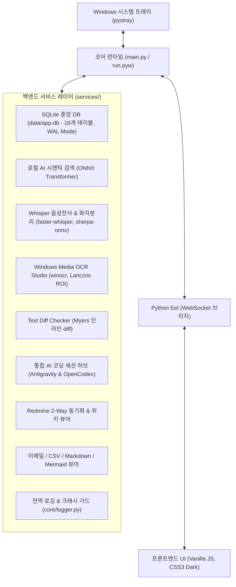
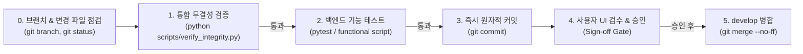

# 🤝 [Handover Guide] Util-Tools 프로젝트 개발 및 운영 인수인계서

본 문서는 **Util-Tools(Utility Toolkit)** 프로젝트를 새로 이어받아 유지보수하거나 신규 기능을 개발하는 엔지니어를 위한 **종합 인수인계 가이드**입니다.  
프로젝트의 아키텍처 원칙, 환경 셋업, 디렉토리 구조, 개발 시 주의사항, 그리고 **작업 완료 전 필수 무결성 검증 체크리스트**를 상세히 기술합니다.

---

## 📌 목차 (Table of Contents)

1. [프로젝트 개요 및 기술 스택](#1-프로젝트-개요-및-기술-스택)
2. [개발 환경 구축 및 초기 실행 (Quick Start)](#2-개발-환경-구축-및-초기-실행-quick-start)
3. [핵심 아키텍처 및 런타임 수명 주기](#3-핵심-아키텍처-및-런타임-수명-주기)
4. [프로젝트 디렉토리 및 핵심 모듈 맵](#4-프로젝트-디렉토리-및-핵심-모듈-맵)
5. [필수 개발 및 변경 규정 (Development Rules)](#5-필수-개발-및-변경-규정-development-rules)
6. [작업 완료 전 필수 체크리스트 (Verification Checklist)](#6-작업-완료-전-필수-체크리스트-verification-checklist)
7. [상세 기술 문서 색인 (Documentation Index)](#7-상세-기술-문서-색인-documentation-index)

---

## 1. 프로젝트 개요 및 기술 스택

Util-Tools는 검은색 콘솔 창 없이 Windows 작업표시줄 시스템 트레이에 상주하며, 개발 및 일상 업무에 필요한 다양한 도구를 제공하는 **모던 데스크톱 유틸리티 애플리케이션**입니다.



### 주요 기술 스택 & 라이선스
- **License**: [MIT License](LICENSE) (상업적 이용, 수정, 배포 완전 자유)
- **Backend**: Python 3.10+, [Eel](https://github.com/python-eel/Eel) (Python-JS 브리지), `pystray` (시스템 트레이), `Pillow` (이미지 처리)
- **Database**: SQLite 3 (WAL 모드, `data/app.db`, 16개 사용자 정의 테이블), `services/db_service.py`를 통한 원자적 트랜잭션 관리
- **Audio / STT**: `faster-whisper` (CUDA/CPU int8 양자화), `sherpa-onnx` (pyannote 3.0 + 3D-Speaker 화자 분리), Active Interval Sweep 정렬, HTTP Range 206 스트리밍
- **OCR Engine**: Windows Media OCR (`winocr`, `winrt`), 적응형 Lanczos 업스케일링 전처리, HTML5 인터랙티브 캔버스 ROI
- **Text Diff Engine**: Python `difflib` (Myers 알고리즘 확장), 토큰/단어 단위 인라인 diff, Side-by-Side 및 Unified 스트림 뷰
- **AI/ML**: `intfloat/multilingual-e5-small` 양자화(Quantized) ONNX 신경망 모델 (로컬 의미론적 문맥 검색)
- **Logging & Crash Defense**: `core/logger.py` 전역 `LogStreamRedirector` (stdout/stderr 가로채기), 순환 링 버퍼, `threading.excepthook` 기반 백그라운드 스레드 크래시 방어
- **Frontend**: Vanilla JavaScript (ES6+), HTML5, CSS3 모던 다크 테마 (No-Framework, 제로 빌드 스텝)
- **Tooling**: Node.js (`node -c` 구문 검증용)

---

## 2. 개발 환경 구축 및 초기 실행 (Quick Start)

### 1) 필수 요구 사양
- **OS**: Windows 10 / 11 (64-bit)
- **Python**: 3.10 이상 (Python 3.11/3.12 권장)
- **Node.js**: LTS 18.x 이상 (프론트엔드 JS 구문 무결성 검증에 사용)
- **브라우저**: Google Chrome 또는 Microsoft Edge (App 모드로 UI 구동)
- **선택 사양 (GPU 가속)**: NVIDIA CUDA 12.x 호환 GPU (Whisper 음성 전사 가속 시)

### 2) 가상환경 구성 및 패키지 설치
```powershell
# 1. 저장소 클론 및 작업 디렉토리 이동
cd <Util-Tools_루트_디렉토리>

# 2. 필수 의존성 라이브러리 설치
pip install -r requirements.txt
```

### 3) 환경 설정 파일 초기화
저장소의 기본 템플릿(`.example.json`)을 복사하여 로컬 설정 파일을 생성합니다 (자동으로 초기화되나 수동 확인 가능):
- `app_settings.json`: AI 세션 연동 토글, 알림 옵션 등
- `calendar_config.json`: 구글 캘린더 iCal 비공개 URL 연동 설정

### 4) 애플리케이션 실행 모드
- **[개발/디버깅 모드]** (콘솔 로그 실시간 확인):
  ```powershell
  python main.py
  ```
- **[실제 운영/트레이 상주 모드]** (검은색 콘솔 창 없이 백그라운드 구동):
  ```powershell
  pythonw run.pyw
  # 또는 탐색기에서 run.pyw 더블클릭
  ```

---

## 3. 핵심 아키텍처 및 런타임 수명 주기

### 1) 단일 인스턴스 보장 (`core/single_instance.py`)
- Windows의 **명명된 세마포어(Named Semaphore)**인 `Local\UtilTools_SingleInstance_Semaphore`를 사용합니다.
- 프로그램이 이미 실행 중인 상태에서 사용자가 다시 `run.pyw`를 실행하면, 새 프로세스는 즉시 종료되고 **기존 실행 중인 창이 화면 맨 앞으로 자동 활성화**됩니다.

### 2) 중앙 경로 관리 원칙 (`core/paths.py`)
- 모든 파일 및 디렉토리 참조는 반드시 [`core.paths`](core/paths.py)에 정의된 표준 상수를 사용해야 합니다.
- **절대 개별 모듈에서 `os.path.dirname(__file__)`이나 상대 경로를 하드코딩해서는 안 됩니다.**
  - `APP_DIR`: 프로젝트 루트 디렉토리
  - `DATA_DIR`: 영속 데이터 보관 디렉토리 (`data`)
  - `DB_PATH`: 중앙 SQLite 데이터베이스 파일 (`data/app.db`)
  - `WEB_DIR`: 프론트엔드 정적 웹 리소스 (`web`)
  - `MODELS_DIR`: AI 임베딩 및 음성 모델 보관소 (`models`)
  - `EMAILS_DIR`: EML 원본 파일 보관소 (`emails`)

### 3) 독립 브라우저 프로파일 격리 (`data/browser_profile`)
- Eel 구동 시 사용자의 일반 Chrome 브라우저 프로파일과 충돌하지 않도록, `data/browser_profile`에 독립된 사용자 데이터 디렉토리를 격리 생성하여 실행합니다.

### 4) 웹 UI 기반 백엔드 전원 제어 (Hot Reload & Shutdown)
- 파이썬 코드 수정 시 트레이 우클릭을 거치지 않고 웹 화면 상단의 **`[🔄 재시작]`** 버튼을 누르면 0.5초 내에 현재 프로세스를 정상 종료하고 신규 프로세스를 띄웁니다.
- **`[🚪 종료]`** 버튼 클릭 시 트레이 아이콘 및 백엔드 프로세스가 완전히 종료됩니다.

### 5) 데스크톱 엣지 퀵 위젯 & FullscreenGuard (pywebview 하이브리드)
- **Eel-pywebview 병렬 브리지**: Eel 메인 창과 pywebview 위젯 창(`core/edge_widget.py`)이 동일한 백엔드 포트를 공유하여 23개 기존 서비스의 RPC를 그대로 재사용합니다.
- **플러시 엣지 도크 탭 (Flush Edge Tab)**: 윈도우 사각 캔버스를 100% 채우는 밀착형 직각 탭(`border-radius: 0`)과 `background_color="#1e1e2d"` 동기화로 모서리 잔여물 없이 깔끔하게 렌더링됩니다.
- **3단계 크기 프리셋**: `slim`(12×70, 기본값), `default`(20×120), `compact`(8×50) 지원 및 헤더 📏 메뉴 / 트레이 메뉴를 통한 런타임 실시간 리사이징.
- **FullscreenGuard**: Win32 `SetWinEventHook` 전용 스레드로 게임/동영상 전체화면 시 위젯을 자동 숨김 처리하고, 전체화면 종료 시 `SW_SHOWNOACTIVATE`로 포커스 탈취 없이 복원합니다.
- **시스템 탭 전원 제어 & 비차단 모달**: 위젯 `[📊 시스템]` 탭 내 `btn-widget-restart`, `btn-widget-shutdown` 버튼을 제공하며, `showWidgetConfirm` 인레이어 확인 모달 실행 중에는 `isModalOpen` 가드를 통해 마우스 아웃 시 위젯이 접히지 않도록 보호합니다.

### 6) 음성 전사 & 화자 분리 파이프라인 (`services/whisper_service.py`)
- **faster-whisper + sherpa-onnx 듀얼 파이프라인**: `faster-whisper`(CUDA/CPU int8)를 통한 고속 음성 전사와 `sherpa-onnx`(pyannote 3.0 VAD + 3D-Speaker 임베딩)를 통한 오프라인 화자 분리(Diarization)를 결합합니다.
- **Active Interval Sweep 정렬**: 전사 세그먼트와 화자 발화 구간 사이의 시간적 오버랩을 수학적으로 스위핑하여 각 단어/문장에 화자 ID(예: `Speaker 01`)를 정확하게 맵핑합니다.
- **HTTP Range 206 스트리밍 & OOM 방어**: 대용량 오디오(100MB+)의 부분 버퍼링을 위한 HTTP Range 206 스트리밍을 제공하며, GPU CUDA OOM 감지 시 CPU 백오프로 자동 전환합니다.

### 7) Windows Media OCR 파이프라인 (`services/ocr_service.py`)
- **네이티브 Windows Media OCR 통합**: 외부 대용량 가중치 없이 Windows 10/11 OS 내장 `winocr`(`winrt`) 엔진을 직접 호출하여 0.05초~0.1초 내 초고속 텍스트 인식을 수행합니다.
- **적응형 Lanczos 리스케일링**: 저해상도 또는 특정 종횡비 이미지의 글자 인식률을 극대화하기 위해 Pillow Lanczos 필터를 거쳐 인식 엔진으로 전달합니다.
- **대화형 HTML5 캔버스 ROI**: 마우스 드래그를 통한 관심 영역(ROI) 지정 인식, 다국어(한국어, 영어, 일본어, 중국어) 지원, SQLite 히스토리(`ocr_history`) 영구 보관을 지원합니다.

### 8) Text Diff Checker 파이프라인 (`services/diff_service.py`)
- **Myers 알고리즘 확장 토큰 단위 Diff**: Python `difflib.SequenceMatcher`를 기반으로 행 단위(Line-level) 차이뿐 아니라 행 내부 단어/토큰 단위(Word-level) 변경 사항을 `+`, `-`, `~` 인라인 하이라이트로 산출합니다.
- **Side-by-Side & Unified 듀얼 뷰**: 좌우 분할 나란히 보기와 단일 통합 스트림 보기를 지원하며, 공백 무시(`ignore_whitespace`) 및 대소문자 무시(`ignore_case`) 옵션을 제공합니다.
- **동기화 스크롤 엔진**: 좌우 에디터 및 Diff 결과 창 간의 비례 스크롤(`syncScroll`)을 지원합니다.

### 9) 전역 시스템 로깅 및 백그라운드 예외 크래시 가드 (`core/logger.py`)
- **표준 입출력 가로채기 (`LogStreamRedirector`)**: `sys.stdout` 및 `sys.stderr`를 실시간 가로채어 타임스탬프와 태그(`[INFO]`, `[ERROR]`, `[WARN]`, `[DEBUG]`)를 자동 분석하고 파일(`logs/app.log`) 및 콘솔로 동시 라우팅합니다.
- **순환 링 버퍼 (Ring Buffer)**: 최근 1,000건의 로그를 메모리 내에 보관하여 프론트엔드 콘솔 및 퀵 위젯에 즉시 제공합니다.
- **스레드 크래시 방어 (`threading.excepthook`)**: 백그라운드 워커 스레드에서 예외가 발생하더라도 프로세스가 비정상 종료(Crash)되지 않도록 예외를 포착하여 안전하게 기록합니다.

---

## 4. 프로젝트 디렉토리 및 핵심 모듈 맵

```text
Util-Tools/
│
├── main.py                     # [진입점] 단일 인스턴스 검증, Eel 초기화 및 서비스 등록
├── run.pyw                     # [런처] Windows 무창(Windowless) 백그라운드 실행기
├── requirements.txt            # 필수 Python 패키지 목록
├── UtilTools.spec              # [패키징] PyInstaller 배포 빌드 정의서
├── build.bat                   # [빌드] PyInstaller 실행 파일 일괄 빌드 배치파일
├── utiltools.ico               # 시스템 트레이 및 윈도우 창 아이콘
├── GEMINI.md                   # AI 에이전트 및 개발자 작업 규정 가이드
│
├── core/                       # [코어 시스템]
│   ├── paths.py                # 🌟 경로 참조의 단일 진실 공급원 (SSOT)
│   ├── single_instance.py      # Windows Named Semaphore 기반 단일 인스턴스 락
│   ├── edge_widget.py          # pywebview 단일 창 엣지 핸들 ↔ 380x620 퀵 위젯 생명주기 관리자
│   ├── fullscreen_guard.py     # Win32 SetWinEventHook 기반 전체화면 감지 및 No-activate 복원
│   ├── tray.py                 # pystray 시스템 트레이, 알림 및 브라우저 창 생명주기 관리
│   └── logger.py               # 전역 로거, stdout/stderr 가로채기, 스레드 크래시 방어 및 링 버퍼
│
├── data/                       # [사용자 영속 데이터]
│   ├── app.db                  # 중앙 SQLite DB (16개 테이블, WAL 모드)
│   ├── browser_profile/        # 독립 브라우저 프로파일 디렉토리
│   └── widget_config.json      # 엣지 위젯 위치(edge, offset_ratio) 및 크기(handle_size) 설정
│
├── services/                   # [백엔드 서비스 레이어] (@eel.expose 바인딩 모듈 23종)
│   ├── db_service.py           # 중앙 SQLite 커넥션 풀, WAL 모드, 테이블 초기화 (16개 테이블)
│   ├── agy_service.py          # Google Antigravity CLI 세션 파싱, 감시 및 터미널 런처
│   ├── opencodex_service.py    # OpenAI OpenCodex 세션, 5ms 파일 락, Live Tail 파서
│   ├── whisper_service.py      # faster-whisper 음성 전사, sherpa-onnx 화자 분리, Range 206 스트리밍
│   ├── diff_service.py         # Myers 알고리즘 단어 단위 인라인 diff 엔진
│   ├── ocr_service.py          # Windows Media OCR 네이티브 래퍼, Lanczos 리스케일링 및 히스토리
│   ├── ai_search_service.py    # Multilingual-E5 ONNX 시맨틱 검색 & 증분 벡터 캐시
│   ├── redmine_service.py      # Redmine API 2-Way 연동, 일감/위키 캐시, 백그라운드 감시
│   ├── email_service.py        # 3,100+건 대용량 EML 아카이브, 비파괴 스레딩 파서
│   ├── mock_data_service.py    # 3-Pass 복합 가상 데이터 생성기 & 엑셀/CSV 스트리밍
│   ├── csv_service.py          # CSV/TSV 자동 감지 파서 & 포맷 변환기
│   ├── markdown_service.py     # Markdown 파서 및 파일 저장/로드
│   ├── diagram_service.py      # Mermaid 다이어그램 스키마 CRUD
│   ├── backup_service.py       # Zero-Memory Python 디스크 직접 백업/복원 엔진
│   ├── calendar_service.py     # Google Calendar / iCal (ICS) 실시간 파서
│   ├── system_service.py       # HW 사양, 네트워크 IP, 프로세스 재기동/종료 제어
│   ├── shortcuts_service.py    # 폴더 바로가기 & 터미널 분기 실행
│   ├── quick_launch_service.py # 앱/명령어/SSH 빠른 실행
│   ├── generator_service.py    # 커스텀 JS 데이터 생성기 템플릿
│   ├── notes_service.py        # 빠른 메모장 CRUD
│   └── settings_service.py     # 사용자 설정 파일 입출력
│
├── web/                        # [프론트엔드 정적 리소스]
│   ├── index.html              # 단일 페이지 애플리케이션 (SPA) 메인 레이아웃
│   ├── style.css               # 전역 다크 테마 디자인 시스템 및 컴포넌트 스타일
│   ├── widget.html             # 엣지 핸들 및 확장 퀵 위젯 전용 마크업 (시스템 탭 전원 제어)
│   ├── widget.css              # 플러시 엣지 탭 및 다크 프레임리스 위젯 전용 스타일
│   └── js/                     # 기능별 프론트엔드 모듈 (26개 파일)
│       ├── app.js              # 탭 전환, 토스트, 공통 인레이어 모달 엔진
│       ├── widget.js           # 엣지 위젯 클라이언트 로직 (호버 Dwell, 드래그 쿨다운, 크기 메뉴, 시스템 제어)
│       ├── whisper.js          # 오디오 드래그앤드롭 업로드, Range 206 플레이어, 세그먼트 재생, SRT/VTT/TXT
│       ├── diff.js             # 텍스트 비교 UI, 좌우 분할/단일 뷰, 공백/대소문자 토글, 동기화 스크롤
│       ├── ocr.js              # 대화형 캔버스 ROI 영역 선택, 다국어 OCR, 텍스트 복사 및 히스토리
│       ├── agy_sessions.js     # AI 세션 허브 대시보드, 필터, Live Tail 모달
│       ├── redmine.js          # Redmine 일감/위키 대시보드 및 인라인 편집기
│       ├── email_viewer.js     # 이메일 스레드 타임라인 뷰어 & 첨부파일 추출기
│       ├── ai_search.js        # Ctrl+K 시맨틱 검색 팝업 & 문장 유사도 측정기
│       ├── mock_data_studio.js # 가상 데이터 스튜디오 인터랙티브 UI
│       ├── mermaid_diagram.js  # Mermaid 렌더링, 줌/팬 뷰포트
│       └── ...
│
├── scripts/                    # [검증 및 자동화 하네스]
│   ├── verify_integrity.py     # 🌟 5단계 동적 무결성 검증 하네스 (Zero-Maintenance)
│   └── test_logging_crash_guard_functional.py # 로깅 및 스레드 크래시 가드 기능 테스트
│
├── .agents/                    # [AI 에이전트 스킬 및 규칙]
│   ├── rules/
│   │   ├── git_flow.md         # GitFlow 브랜치 전략, main 브랜치 보호 및 승인 게이트
│   │   └── code_integrity.md   # 코드 무결성 및 영향도 분석 의무 규정
│   └── skills/verify-integrity/# Antigravity 무결성 검증 표준 스킬
│
└── docs/                       # [심층 기술 아키텍처 문서]
```

---

## 5. 필수 개발 및 변경 규정 (Development Rules)

새로 코드를 작성하거나 수정할 때는 아래의 **6대 필수 규정**을 엄격히 준수해야 합니다.

### 규정 1: GitFlow 브랜치 전략 및 main 브랜치 보호 규정 (Protected main Branch)
- **`main` 브랜치 직접 변경 전면 금지**: `main` 브랜치에서 직접적인 파일 수정, 코드 편집, 커밋(`git commit`), 푸시(`git push`)를 엄격히 금지합니다.
- **작업 브랜치 생성 및 전환 의무화**: 모든 기능 개발, 버그 수정, 리팩토링은 작업 착수 전 목적에 맞는 브랜치(`feature/*`, `bugfix/*`, `hotfix/*`, `release/*`)를 생성하고 전환하여 작업합니다.
- **작업 전 브랜치 검증**: 코드 수정 전 반드시 `git branch --show-current`를 확인하여 현재 브랜치가 `main`이 아님을 검증합니다.

### 규정 2: 중앙 경로 참조 표준화 원칙 (`core.paths`)
- **금지**: `base_dir = os.path.dirname(__file__)` 또는 하드코딩된 절대/상대 경로 선언을 엄격히 금지합니다.
- **준수**: 반드시 [`core.paths`](core/paths.py)에 정의된 표준 상수(`APP_DIR`, `DATA_DIR`, `DB_PATH`, `WEB_DIR`, `MODELS_DIR`, `EMAILS_DIR`)를 임포트하여 사용합니다.

### 규정 3: 전역 변수 / 함수 변경 시 영향도 전수 조사
- 전역 변수, 상수, 함수 파라미터가 수정되면 `main.py`, `run.pyw`, `core/*.py`, `services/*.py`, `web/js/*.js`, `web/style.css` 전체에서 해당 참조를 검색하여 일괄 갱신합니다.

### 규정 4: 원스톱 무결성 검증 & 매 작업 단위 즉각적 원자적 단위 커밋 (Immediate Atomic Commit)
- **통합 원스톱 무결성 검증**: 작업 완료 전 `python scripts/verify_integrity.py`를 실행하여 5단계(Python 컴파일, 백엔드 서비스 & DB, JS 문법, CSS 짝 일치, 트레이 인스턴스화) 전수 검사를 100% 통과해야 합니다.
- **원자적 단위 커밋 의무 실행**: 모든 작업 단위(기능, 버그 수정, 리팩토링)가 완료되고 무결성 검증을 통과한 직후, 코드를 미커밋(Dirty/Uncommitted) 상태로 방치하지 않고 즉시 Conventional Commits 규격으로 커밋을 실행합니다. 배치 커밋(몰아서 커밋)은 금지됩니다.

### 규정 5: 하이브리드 기능 검증 게이트 및 사용자 승인 후 병합 원칙 (User Sign-off Gate)
- **백엔드 자동화 기능 검증**: 백엔드 로직/API 변경 시 단순 구문 검사를 넘어 실제 런타임 동작을 검증하는 단위/기능 테스트(Unit/Functional Test)를 필수 실행합니다.
- **프론트엔드 UI/인터랙션 수동 검수 요청**: 프론트엔드 변경 사항은 작업 브랜치 상태를 유지한 채 사용자에게 실화면 검수를 요청합니다.
- **🚨 임의 병합 전면 금지**: 사용자의 명시적인 승인("확인 완료, 병합 진행" 등) 없이 AI가 독단적으로 `develop`에 임의 병합하는 행위를 전면 금지합니다.

### 규정 6: 비차단 인레이어 UI 원칙 및 객관적 기술 용어 표준화
- **비차단 인레이어 UI**: 브라우저 이벤트 루프를 차단하는 네이티브 대화상자(`alert()`, `confirm()`, `prompt()`) 사용을 전면 금지하며, 비동기 Promise 기반 인레이어 모달(`showAppConfirm`, `showAppPrompt`, `showAppAlert`, `showToast`)을 사용합니다.
- **객관적 기술 용어 사용**: 마케팅 버즈워드(`초고속`, `원클릭`, `마법 같은`, `완벽한`)를 배제하고 실제 엔지니어링 메커니즘과 정량 수치(예: "5ms 논블로킹 파일 락 검사", "인라인 즉시 갱신")를 담백하게 기술합니다.

---

## 6. 작업 완료 전 필수 체크리스트 (Verification Checklist)

코드 수정, 버그 수정, 또는 신규 기능 추가 작업을 마친 후에는 **반드시 아래 체크리스트를 순서대로 실행하고 통과**해야 합니다.



### 📋 0단계: 브랜치 점검 및 수정한 파일 전수 목록화
```powershell
git branch --show-current
git status --short
```
- 현재 브랜치가 `main`이 아닌 작업 브랜치(`feature/*`, `bugfix/*`)인지 확인하고 변경 대상 파일을 점검합니다.

### 📋 1단계: 원스톱 통합 무결성 검증 (필수 실행)
신규 Python 또는 JS 파일이 몇 개가 추가되더라도 스크립트 수정 없이 자동으로 발견하여 검증합니다:
```powershell
python scripts/verify_integrity.py
```
- **검증 항목**:
  1. `Step 1`: Python 전수 동적 컴파일 (`py_compile` - 42+개 파일 바이트코드 검증)
  2. `Step 2`: 백엔드 서비스 전수 동적 임포트 & SQLite DB 무결성 검증 (`services/*.py`, `init_db` - 16개 테이블)
  3. `Step 3`: 프론트엔드 JavaScript 전수 문법 검사 (`node -c` - 26+개 모듈 AST 검증)
  4. `Step 4`: 스타일시트 중괄호(`{ == }`) 짝 일치 검증 (`web/style.css`)
  5. `Step 5`: 코어 진입점 및 시스템 트레이 아이콘 인스턴스화 검증 (`TrayManager`)
- **성공 기준**: `ALL VERIFICATION CHECKS PASSED (5/5)` 및 `Exit Code 0`.

### 📋 2단계: 백엔드 기능 테스트 및 단위 검증
```powershell
# 예시: 로깅 및 크래시 가드 기능 테스트
python scripts/test_logging_crash_guard_functional.py
```

### 📋 3단계: 매 작업 단위 즉각적 원자적 단위 커밋
```powershell
git add <수정된_파일들>
git commit -m "feat(module): 작업 내용 기술 (#이슈번호)"
```

### 📋 4단계 & 5단계: 사용자 실화면 검수 승인 후 기준 브랜치 병합
- 프론트엔드 변경 사항에 대해 사용자에게 검수를 요청하고, 명시적 승인을 득한 후 `develop`으로 `--no-ff` 병합을 수행합니다.

---

## 7. 상세 기술 문서 색인 (Documentation Index)

더 깊이 있는 아키텍처 원리나 도메인별 세부 구현 방식은 [`docs/`](docs/) 내의 개별 전문 문서를 참고하십시오:

| 도메인 | 문서 경로 | 핵심 내용 |
| :--- | :--- | :--- |
| **통합 AI 세션 허브** | [`docs/AI_CODING_SESSIONS.md`](docs/AI_CODING_SESSIONS.md) | Antigravity & OpenCodex 듀얼 세션 파싱, 5ms 파일 락, Live Tail, 터미널 전환 |
| **중앙 데이터베이스** | [`docs/DATABASE_SCHEMA.md`](docs/DATABASE_SCHEMA.md) | SQLite 16개 테이블 ERD, WAL 모드, 인덱스 커버리지, 백업 복원 규격 |
| **OCR 엔진 아키텍처** | [`docs/OCR_ENGINE_ARCHITECTURE.md`](docs/OCR_ENGINE_ARCHITECTURE.md) | Windows Media OCR vs RapidOCR 벤치마크, Lanczos 스케일링, ROI 대화형 인식 |
| **Redmine 협업** | [`docs/REDMINE_INTEGRATION.md`](docs/REDMINE_INTEGRATION.md) | Redmine REST API 2-Way 동기화, 일감/위키 캐싱, 관심 프로젝트 필터 |
| **이메일 아카이브** | [`docs/EMAIL_ARCHIVE.md`](docs/EMAIL_ARCHIVE.md) | 3,100+건 EML 아카이브, 대화별 비파괴 스레딩 타임라인, 첨부파일 추출 |
| **AI 시맨틱 검색** | [`docs/AI_SEMANTIC_SEARCH.md`](docs/AI_SEMANTIC_SEARCH.md) | Multilingual-E5 ONNX 로컬 신경망, 384차원 벡터 캐시, 유사도 비교 |
| **가상 데이터 생성** | [`docs/MOCK_DATA_STUDIO.md`](docs/MOCK_DATA_STUDIO.md) | 3-Pass 복합 데이터 생성 파이프라인, 로마자 변환, 엑셀/CSV 스트리밍 |
| **이미지 슬라이서** | [`docs/IMAGE_SLICER.md`](docs/IMAGE_SLICER.md) | Pillow 이미지 분할 알고리즘, 다중 절단선, HTML5 인터랙티브 캔버스 |
| **데이터/문서 뷰어** | [`docs/DATA_VIEWERS.md`](docs/DATA_VIEWERS.md) | CSV/TSV 테이블 변환기, Markdown Studio (GFM), Mermaid 16종 다이어그램 |
| **백업 및 복원** | [`docs/BACKUP_AND_RESTORE.md`](docs/BACKUP_AND_RESTORE.md) | Zero-Memory 디스크 스트리밍 백업, 90% 압축 ZIP 포맷, 원자적 복원 |
| **코어 및 런타임** | [`docs/CORE_AND_UTILITIES.md`](docs/CORE_AND_UTILITIES.md) | 서버 핫 리로드, 퀵 위젯 시스템 제어, 전역 로깅 & 스레드 크래시 방어, 트레이 제어 |

