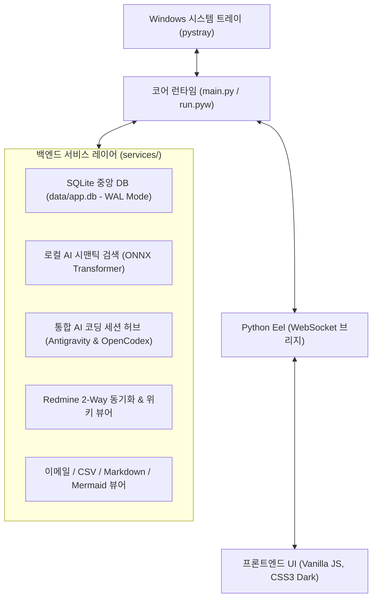

# 🤝 [Handover Guide] Util-Tools 프로젝트 개발 및 운영 인수인계서

본 문서는 **Util-Tools(Utility Toolkit)** 프로젝트를 새로 이어받아 유지보수하거나 신규 기능을 개발하는 엔지니어를 위한 **종합 인수인계 가이드**입니다.  
프로젝트의 아키텍처 원칙, 환경 셋업, 디렉토리 구조, 개발 시 주의사항, 그리고 **작업 완료 전 필수 무결성 검증 체크리스트**를 상세히 기술합니다.

---

## 📌 목차 (Table of Contents)

1. [프로젝트 개요 및 기술 스택](#1-프로젝트-개요-및-기술-스택)
2. [개발 환경 구축 및 초기 실행 (Quick Start)](#2-개발-환경-구축-및-초기-실행-quick-start)
3. [핵심 아키텍처 및 런타임 수명 주기](#3-핵심-아키텍처-및-런타임-수명-주기)
4. [프로젝트 디렉토리 및 핵심 모듈 맵](#4-프로젝트-디렉토리-및-핵심-모듈-맵)
5. [필수 개발 및 변경 규정 (Development Rules)](#5-필수-개발-및-변경-규정-development-rules)
6. [작업 완료 전 필수 체크리스트 (Verification Checklist)](#6-작업-완료-전-필수-체크리스트-verification-checklist)
7. [상세 기술 문서 색인 (Documentation Index)](#7-상세-기술-문서-색인-documentation-index)

---

## 1. 프로젝트 개요 및 기술 스택

Util-Tools는 검은색 콘솔 창 없이 Windows 작업표시줄 시스템 트레이에 상주하며, 개발 및 일상 업무에 필요한 다양한 도구를 제공하는 **모던 데스크톱 유틸리티 애플리케이션**입니다.



### 주요 기술 스택 & 라이선스
- **License**: [MIT License](file:///D:/python/LICENSE) (상업적 이용, 수정, 배포 완전 자유)
- **Backend**: Python 3.10+, [Eel](https://github.com/python-eel/Eel) (Python-JS 브리지), `pystray` (시스템 트레이), `Pillow` (이미지 처리)
- **Database**: SQLite 3 (WAL 모드, `data/app.db`), `services/db_service.py`를 통한 원자적 트랜잭션 관리
- **AI/ML**: `intfloat/multilingual-e5-small` 양자화(Quantized) ONNX 신경망 모델 (로컬 의미론적 문맥 검색)
- **Frontend**: Vanilla JavaScript (ES6+), HTML5, CSS3 모던 다크 테마 (No-Framework, 제로 빌드 스텝)
- **Tooling**: Node.js (`node -c` 구문 검증용)

---

## 2. 개발 환경 구축 및 초기 실행 (Quick Start)

### 1) 필수 요구 사양
- **OS**: Windows 10 / 11 (64-bit)
- **Python**: 3.10 이상 (Python 3.11/3.12 권장)
- **Node.js**: LTS 18.x 이상 (프론트엔드 JS 구문 무결성 검증에 사용)
- **브라우저**: Google Chrome 또는 Microsoft Edge (App 모드로 UI 구동)

### 2) 가상환경 구성 및 패키지 설치
```powershell
# 1. 저장소 클론 및 작업 디렉토리 이동
cd D:\python

# 2. 필수 의존성 라이브러리 설치
pip install -r requirements.txt
```

### 3) 환경 설정 파일 초기화
저장소의 기본 템플릿(`.example.json`)을 복사하여 로컬 설정 파일을 생성합니다 (자동으로 초기화되나 수동 확인 가능):
- `app_settings.json`: AI 세션 연동 토글, 알림 옵션 등
- `calendar_config.json`: 구글 캘린더 iCal 비공개 URL 연동 설정

### 4) 애플리케이션 실행 모드
- **[개발/디버깅 모드]** (콘솔 로그 실시간 확인):
  ```powershell
  python main.py
  ```
- **[실제 운영/트레이 상주 모드]** (검은색 콘솔 창 없이 백그라운드 구동):
  ```powershell
  pythonw run.pyw
  # 또는 탐색기에서 run.pyw 더블클릭
  ```

---

## 3. 핵심 아키텍처 및 런타임 수명 주기

### 1) 단일 인스턴스 보장 (`core/single_instance.py`)
- Windows의 **명명된 세마포어(Named Semaphore)**인 `Local\UtilTools_SingleInstance_Semaphore`를 사용합니다.
- 프로그램이 이미 실행 중인 상태에서 사용자가 다시 `run.pyw`를 실행하면, 새 프로세스는 즉시 종료되고 **기존 실행 중인 창이 화면 맨 앞으로 자동 활성화**됩니다.

### 2) 중앙 경로 관리 원칙 (`core/paths.py`)
- 모든 파일 및 디렉토리 참조는 반드시 [`core.paths`](file:///D:/python/core/paths.py)에 정의된 표준 상수를 사용해야 합니다.
- **절대 개별 모듈에서 `os.path.dirname(__file__)`이나 상대 경로를 하드코딩해서는 안 됩니다.**
  - `BASE_DIR`: 프로젝트 루트 디렉토리 (`D:\python`)
  - `DATA_DIR`: 영속 데이터 보관 디렉토리 (`D:\python\data`)
  - `DB_PATH`: 중앙 SQLite 데이터베이스 파일 (`D:\python\data\app.db`)
  - `WEB_DIR`: 프론트엔드 정적 웹 리소스 (`D:\python\web`)
  - `MODELS_DIR`: AI 임베딩 모델 보관소 (`D:\python\models`)

### 3) 독립 브라우저 프로파일 격리 (`data/browser_profile`)
- Eel 구동 시 사용자의 일반 Chrome 브라우저 프로파일과 충돌하지 않도록, `data/browser_profile`에 독립된 사용자 데이터 디렉토리를 격리 생성하여 실행합니다.

### 4) 웹 UI 기반 백엔드 전원 제어 (Hot Reload & Shutdown)
- 파이썬 코드 수정 시 트레이 우클릭을 거치지 않고 웹 화면 상단의 **`[🔄 재시작]`** 버튼을 누르면 0.5초 내에 현재 프로세스를 정상 종료하고 신규 프로세스를 띄웁니다.
- **`[🚪 종료]`** 버튼 클릭 시 트레이 아이콘 및 백엔드 프로세스가 완전히 종료됩니다.

---

## 4. 프로젝트 디렉토리 및 핵심 모듈 맵

```text
D:\python
│
├── main.py                     # [진입점] 단일 인스턴스 검증, Eel 초기화 및 서비스 등록
├── run.pyw                     # [런처] Windows 무창(Windowless) 백그라운드 실행기
├── requirements.txt            # 필수 Python 패키지 목록
├── UtilTools.spec              # [패키징] PyInstaller 배포 빌드 정의서
├── build.bat                   # [빌드] PyInstaller 실행 파일 일괄 빌드 배치파일
├── utiltools.ico               # 시스템 트레이 및 윈도우 창 아이콘
├── GEMINI.md                   # AI 에이전트 및 개발자 작업 규정 가이드
│
├── core/                       # [코어 시스템]
│   ├── paths.py                # 🌟 경로 참조의 단일 진실 공급원 (SSOT)
│   ├── single_instance.py      # Windows Named Semaphore 기반 단일 인스턴스 락
│   ├── tray.py                 # pystray 시스템 트레이, 알림 및 브라우저 창 생명주기 관리
│   └── logger.py               # 콘솔 및 파일 로깅 관리자
│
├── services/                   # [백엔드 서비스 레이어] (@eel.expose 바인딩 모듈)
│   ├── db_service.py           # 중앙 SQLite 커넥션 풀, WAL 모드, 테이블 초기화
│   ├── agy_service.py          # Google Antigravity CLI 세션 파싱, 감시 및 터미널 런처
│   ├── opencodex_service.py    # OpenAI OpenCodex 세션, 5ms 파일 락, Live Tail 파서
│   ├── ai_search_service.py    # Multilingual-E5 ONNX 시맨틱 검색 & 증분 벡터 캐시
│   ├── redmine_service.py      # Redmine API 2-Way 연동, 일감/위키 캐시, 백그라운드 감시
│   ├── email_service.py        # 3,100+건 대용량 EML 아카이브, 비파괴 스레딩 파서
│   ├── mock_data_service.py    # 3-Pass 복합 가상 데이터 생성기 & 엑셀/CSV 스트리밍
│   ├── csv_service.py          # CSV/TSV 자동 감지 파서 & 포맷 변환기
│   ├── markdown_service.py     # Markdown 파서 및 파일 저장/로드
│   ├── diagram_service.py      # Mermaid 다이어그램 스키마 CRUD
│   ├── backup_service.py       # Zero-Memory Python 디스크 직접 백업/복원 엔진
│   ├── calendar_service.py     # Google Calendar / iCal (ICS) 실시간 파서
│   ├── system_service.py       # HW 사양, 네트워크 IP, 프로세스 재기동/종료 제어
│   ├── shortcuts_service.py    # 폴더 바로가기 & 터미널 분기 실행
│   ├── quick_launch_service.py # 앱/명령어/SSH 빠른 실행
│   ├── generator_service.py    # 커스텀 JS 데이터 생성기 템플릿
│   ├── notes_service.py        # 빠른 메모장 CRUD
│   └── settings_service.py     # 사용자 설정 파일 입출력
│
├── web/                        # [프론트엔드 정적 리소스]
│   ├── index.html              # 단일 페이지 애플리케이션 (SPA) 메인 레이아웃
│   ├── style.css               # 전역 다크 테마 디자인 시스템 및 컴포넌트 스타일
│   └── js/                     # 기능별 프론트엔드 모듈 (22개 파일)
│       ├── app.js              # 탭 전환, 토스트, 공통 인레이어 모달 엔진
│       ├── agy_sessions.js     # AI 세션 허브 대시보드, 필터, Live Tail 모달
│       ├── redmine.js          # Redmine 일감/위키 대시보드 및 인라인 편집기
│       ├── email_viewer.js     # 이메일 스레드 타임라인 뷰어 & 첨부파일 추출기
│       ├── ai_search.js        # Ctrl+K 시맨틱 검색 팝업 & 문장 유사도 측정기
│       ├── mock_data_studio.js # 가상 데이터 스튜디오 인터랙티브 UI
│       ├── mermaid_diagram.js  # Mermaid 렌더링, 줌/팬 뷰포트
│       └── ...
│
├── scripts/                    # [검증 및 자동화 하네스]
│   └── verify_integrity.py     # 🌟 5단계 동적 무결성 검증 하네스 (Zero-Maintenance)
│
├── .agents/                    # [AI 에이전트 스킬 및 규칙]
│   ├── rules/code_integrity.md # 코드 무결성 및 영향도 분석 의무 규정
│   └── skills/verify-integrity/# Antigravity 무결성 검증 표준 스킬
│
└── docs/                       # [심층 기술 아키텍처 문서 10종]
```

---

## 5. 필수 개발 및 변경 규정 (Development Rules)

새로 코드를 작성하거나 수정할 때는 아래의 **3대 원칙**을 엄격히 준수해야 합니다.

### 원칙 1: 경로 참조 표준화
- **금지**: `base_dir = os.path.dirname(__file__)` 또는 하드코딩된 절대/상대 경로 선언
- **준수**: 반드시 `from core.paths import BASE_DIR, DATA_DIR, DB_PATH, WEB_DIR`를 임포트하여 사용

### 원칙 2: 비차단 인레이어 UI 원칙 (Non-blocking In-layer UI)
- **전면 금지**: 브라우저 스레드를 블로킹하는 네이티브 대화상자 (`alert()`, `confirm()`, `prompt()`)
- **표준 사용**: 비동기 Promise 기반 인레이어 UI 함수 사용
  - 확인 창: `await showAppConfirm(message, options)`
  - 입력 창: `await showAppPrompt(message, defaultValue, options)`
  - 단순 알림: `await showAppAlert(message, title, icon)` 또는 `showToast(title, message, icon)`

### 원칙 3: 객관적 기술 용어 사용 (Objective Technical Phrasing)
- 코드 주석, 문서, 커밋 메시지 작성 시 과장된 마케팅 버즈워드(`초고속`, `원클릭`, `마법 같은`, `완벽한`) 배제
- 실제 엔지니어링 메커니즘과 정량 지표 기반으로 기술 (예: "5ms 파일 락 검사", "인라인 즉시 갱신")

---

## 6. 작업 완료 전 필수 체크리스트 (Verification Checklist)

코드 수정, 버그 수정, 또는 신규 기능 추가 작업을 마친 후에는 **반드시 아래 체크리스트를 순서대로 실행하고 통과**해야 합니다.

```mermaid
flowchart LR
    A["0. 변경 파일 목록화<br>(git status --short)"] --> B["1. 통합 무결성 검증<br>(python scripts/verify_integrity.py)"]
    B -->|통과 (Exit 0)| C["2. Git 커밋 & 푸시<br>(git push)"]
    B -->|오류 (Exit 1)| D["3. 오류 디버깅 및 수정<br>(라인 번호 및 트레이스 확인)"]
    D --> B
```

### 📋 0단계: 수정한 파일 전수 목록화
```powershell
git status --short
```
- 의도치 않은 임시 파일이나 개인 데이터가 스테이징 대상에 포함되어 있지 않은지 확인합니다.

### 📋 1단계: 원스톱 통합 무결성 검증 (필수 실행)
신규 Python 또는 JS 파일이 몇 개가 추가되더라도 스크립트 수정 없이 자동으로 발견하여 검증합니다:
```powershell
python scripts/verify_integrity.py
```
- **검증 항목**:
  1. `Step 1`: Python 전수 동적 컴파일 (`py_compile` - 29+개 파일 문법 검증)
  2. `Step 2`: 백엔드 서비스 전수 동적 임포트 & SQLite DB 무결성 검증 (`services/*.py`, `init_db`)
  3. `Step 3`: 프론트엔드 JavaScript 전수 문법 검사 (`node -c` - 22+개 모듈 AST 검증)
  4. `Step 4`: 스타일시트 중괄호(`{ == }`) 짝 일치 검증 (`web/style.css`)
  5. `Step 5`: 코어 진입점 및 시스템 트레이 아이콘 인스턴스화 검증 (`TrayManager`)
- **소요 시간**: 약 2~3초 이내 완료.
- **성공 기준**: `ALL VERIFICATION CHECKS PASSED (5/5)` 및 `Exit Code 0`.

#### [디버깅 팁 (오류 발생 시)]
```powershell
# 검증 중인 모든 파일 경로를 실시간 확인
python scripts/verify_integrity.py -v

# 특정 단계만 좁혀서 검증
python scripts/verify_integrity.py --step 1   # Python 문법만
python scripts/verify_integrity.py --step 2   # 백엔드 서비스 & DB만
python scripts/verify_integrity.py --step 3   # 프론트엔드 JS만
```

---

## 7. 상세 기술 문서 색인 (Documentation Index)

더 깊이 있는 아키텍처 원리나 도메인별 세부 구현 방식은 [`docs/`](file:///D:/python/docs) 내의 개별 전문 문서를 참고하십시오:

| 도메인 | 문서 경로 | 핵심 내용 |
| :--- | :--- | :--- |
| **통합 AI 세션 허브** | [`docs/AI_CODING_SESSIONS.md`](file:///D:/python/docs/AI_CODING_SESSIONS.md) | Antigravity & OpenCodex 듀얼 세션 파싱, 5ms 파일 락, Live Tail, 터미널 전환 |
| **중앙 데이터베이스** | [`docs/DATABASE_SCHEMA.md`](file:///D:/python/docs/DATABASE_SCHEMA.md) | SQLite 13개 테이블 ERD, WAL 모드, 인덱스 커버리지, 백업 복원 규격 |
| **Redmine 협업** | [`docs/REDMINE_INTEGRATION.md`](file:///D:/python/docs/REDMINE_INTEGRATION.md) | Redmine REST API 2-Way 동기화, 일감/위키 캐싱, 관심 프로젝트 필터 |
| **이메일 아카이브** | [`docs/EMAIL_ARCHIVE.md`](file:///D:/python/docs/EMAIL_ARCHIVE.md) | 3,100+건 EML 아카이브, 대화별 비파괴 스레딩 타임라인, 첨부파일 추출 |
| **AI 시맨틱 검색** | [`docs/AI_SEMANTIC_SEARCH.md`](file:///D:/python/docs/AI_SEMANTIC_SEARCH.md) | Multilingual-E5 ONNX 로컬 신경망, 384차원 벡터 캐시, 유사도 비교 |
| **가상 데이터 생성** | [`docs/MOCK_DATA_STUDIO.md`](file:///D:/python/docs/MOCK_DATA_STUDIO.md) | 3-Pass 복합 데이터 생성 파이프라인, 로마자 변환, 엑셀/CSV 스트리밍 |
| **이미지 슬라이서** | [`docs/IMAGE_SLICER.md`](file:///D:/python/docs/IMAGE_SLICER.md) | Pillow 이미지 분할 알고리즘, 다중 절단선, HTML5 인터랙티브 캔버스 |
| **데이터/문서 뷰어** | [`docs/DATA_VIEWERS.md`](file:///D:/python/docs/DATA_VIEWERS.md) | CSV/TSV 테이블 변환기, Markdown Studio (GFM), Mermaid 16종 다이어그램 |
| **백업 및 복원** | [`docs/BACKUP_AND_RESTORE.md`](file:///D:/python/docs/BACKUP_AND_RESTORE.md) | Zero-Memory 디스크 스트리밍 백업, 90% 압축 ZIP 포맷, 원자적 복원 |
| **코어 및 런타임** | [`docs/CORE_AND_UTILITIES.md`](file:///D:/python/docs/CORE_AND_UTILITIES.md) | 서버 핫 리로드, 브라우저 프로파일 격리, 단일 인스턴스 락, 트레이 제어 |
