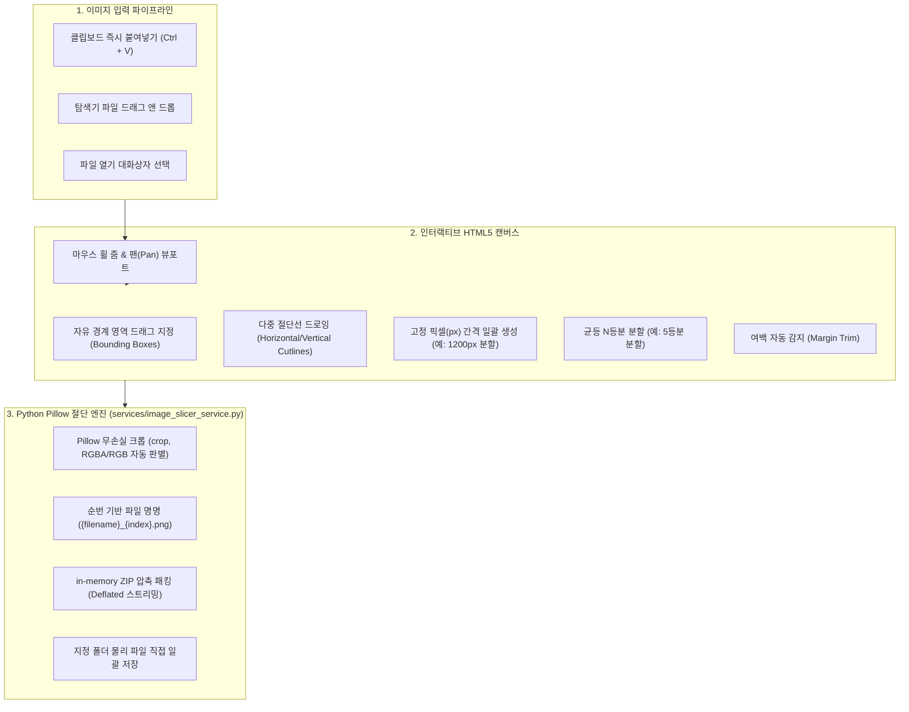

# ✂️ 이미지 슬라이서 스튜디오 아키텍처 (Image Slicer Studio Architecture)

Util-Tools의 **이미지 슬라이서 스튜디오(Image Slicer Studio)**는 웹툰, 긴 웹페이지 캡처, 디자인 시안, 카드 뉴스 등의 이미지를 **자유 경계선**, **다중 절단선**, **균등 N등분**, **고정 픽셀 간격**, **여백 자동 감지** 방식으로 분할하고 ZIP 압축 또는 폴더로 일괄 내보내는 그래픽 유틸리티입니다.

---

## 1. 🏛️ 시스템 아키텍처 및 작업 파이프라인

---

## 2. 🌟 5대 분할 모드 상세 사양

1. **✂️ 다중 절단선(Multi-Cutline) 분할**:
   - 가로선(Horizontal) 또는 세로선(Vertical)을 원하는 위치에 여러 개 클릭하여 배치.
   - 선을 드래그하여 위치 미세 조정 및 `[✕]` 버튼으로 개별 삭제 지원.
2. **📐 자유 경계 박스(Bounding Box) 분할**:
   - 마우스 드래그로 원하는 관심 영역(ROI)을 사각형으로 직접 지정.
   - 분할 대상 영역의 실시간 좌표(`x, y, w, h`) 및 순번 오버레이 렌더링.
3. **📏 고정 픽셀(Fixed Pixel) 일괄 생성**:
   - 예: 높이 `1,000px` 입력 시 상단부터 1,000px 단위로 절단선을 자동 계산하여 한 번에 생성.
   - 상세페이지나 웹툰 컷 분할 시 작업 편의 제공.
4. **🔢 균등 N등분(Equal Parts) 분할**:
   - 3등분, 4등분, 9등분 등 지정한 개수로 균등 분할.
5. **🎯 여백 자동 감지 (Auto Margin Trim)**:
   - 이미지 외곽의 단색(흰색, 검은색, 투명 배경)을 역치(Threshold) 알고리즘으로 스캔하여 불필요한 공백을 자동으로 잘라내고 본문 영역만 검출.

---

## 3. ⚡ 클립보드 연동 및 뷰포트 인터랙션

- **`Ctrl + V` 즉시 붙여넣기**: 캡처 도구로 캡처한 이미지를 파일로 저장할 필요 없이 슬라이서 화면에서 `Ctrl + V`를 누르면 캔버스에 즉시 로드됩니다.
- **줌 & 팬 뷰포트**: 대용량 고해상도 이미지도 마우스 휠 줌(Zoom 10% ~ 500%)과 스페이스바/우클릭 드래그 패닝(Pan)으로 탐색 가능.

---

## 4. 🛠️ 백엔드 서비스 API 명세 (`services/image_slicer_service.py`)

| 함수 시그니처 | 주요 파라미터 | 반환값 (`dict`) | 설명 |
| :--- | :--- | :--- | :--- |
| `slice_image_boxes(image_data, boxes, format='png')` | `image_data` (Base64/path), `boxes` (list of `{x,y,w,h}`) | `{"status": "success", "slices": [...]}` | 좌표 목록에 따른 이미지 무손실 분할 |
| `export_slices_zip(image_data, boxes, filename_prefix)` | `image_data`, `boxes`, `filename_prefix` | `{"status": "success", "zip_bytes": ...}` | 분할된 이미지들을 ZIP 압축 파일로 일괄 반환 |
| `export_slices_to_folder(image_data, boxes, target_folder)` | `image_data`, `boxes`, `target_folder` | `{"status": "success", "saved_files": [...]}` | 로컬 하드디스크 폴더에 분할 파일 직접 일괄 저장 |
| `detect_smart_margins(image_data, tolerance=10)` | `image_data`, `tolerance` (int) | `{"status": "success", "bbox": [x, y, w, h]}` | 외곽 공백 자동 감지 후 최적 경계선 반환 |
