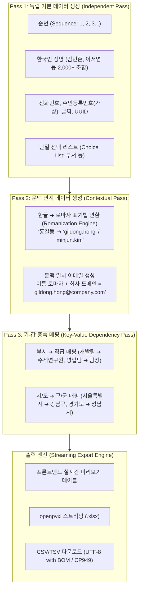

# 🎲 모의 데이터 스튜디오 아키텍처 (Mock Data Studio Architecture)

Util-Tools의 **모의 데이터 스튜디오(Mock Data Studio)**는 테스트 및 개발 환경에서 필요한 현실적인 대량 가상 데이터를 클릭 몇 번으로 조합하여 생성하고, 엑셀(`.xlsx`) 및 `.csv` 포맷으로 내보내기할 수 있는 데이터 빌더입니다.

---

## 1. 🏛️ 시스템 아키텍처 및 3-Pass 생성 파이프라인

단순 무작위(Random) 데이터 생성의 한계인 **"이름과 이메일의 불일치"**, **"부서와 직급의 모순"**을 해결하기 위해 **3-Pass 복합 파이프라인**을 적용했습니다:

---

## 2. 🌟 3-Pass 생성 알고리즘 상세 명세

### 2-1. Pass 1: 독립 필드 생성
- 다른 컬럼의 값에 의존하지 않는 기본 속성들을 선행 생성합니다.
- **지원 타입**:
  - `sequence`: 시작값, 증감값 지원
  - `korean_name`: 성씨(100대 성) + 남/여 선호 이름 조합
  - `phone`: `010-XXXX-XXXX` (실제 번호와 겹치지 않는 안심 대역)
  - `date`: 지정 기간 내 무작위 일자 (`YYYY-MM-DD`)
  - `number`: 정수/실수 범위 난수
  - `uuid`: 고유 UUID v4
  - `choice`: 쉼표로 구분된 사용자 정의 목록 중 무작위 선택

### 2-2. Pass 2: 한글 ➔ 영문 로마자 표기법 변환 및 이메일 연계
- 한국어 음절 분해(초성, 중성, 종성) 및 국어의 로마자 표기법 알고리즘 탑재.
- 생성된 한글 성명(`홍길동`)을 즉시 분석하여 `gildong.hong` 또는 `gdhong` 형태의 현실적인 영문 표기를 도출.
- 회사 도메인(`@company.kr`, `@test.com` 등)과 결합하여 일치하는 업무용 이메일 자동 도출.

### 2-3. Pass 3: 키-값(Key-Value) 종속 매핑
- 선행 생성된 컬럼의 값을 키(Key)로 참조하여 종속된 하위 값을 매핑.
- 예: `소속부서`가 '개발본부'이면 `직무`는 '백엔드 개발자', '인프라 엔지니어' 중에서만 선택되도록 보장.

---

## 3. ⚡ 대용량 스트리밍 및 메모리 최적화

- **대용량 데이터 생성 시 브라우저 부하 방지**: 웹 브라우저 DOM에는 상위 100개 샘플 행만 렌더링하고, 전체 대량 생성 및 엑셀 변환은 Python 백엔드 프로세스에서 메모리 스트리밍 방식으로 처리합니다.
- **openpyxl Write-Only 모드**: 수만 건의 엑셀 생성 시 메모리 점유율을 50MB 이하로 유지하여 신속하게 파일 생성을 완료합니다.

---

## 4. 🛠️ 백엔드 서비스 API 명세 (`services/mock_data_service.py`)

| 함수 시그니처 | 주요 파라미터 | 반환값 (`dict`) | 설명 |
| :--- | :--- | :--- | :--- |
| `generate_mock_preview(schema, count=20)` | `schema` (list of col defs), `count` (int) | `{"status": "success", "rows": [...]}` | UI 표시용 샘플 데이터 생성 |
| `export_mock_data_file(schema, count, file_type, file_path)` | `schema`, `count`, `file_type` ('xlsx'/'csv'), `file_path` | `{"status": "success", "file_path": str}` | 지정된 경로로 엑셀/CSV 생성 및 저장 |
| `get_mock_templates()` | 없음 | `{"status": "success", "templates": [...]}` | SQLite `mock_templates`에 저장된 양식 목록 조회 |
| `save_mock_template(title, description, schema_json)` | `title`, `description`, `schema_json` | `{"status": "success", "id": str}` | 사용자 정의 모의 데이터 양식 신규/수정 저장 |
| `delete_mock_template(template_id)` | `template_id` (str) | `{"status": "success"}` | 모의 데이터 양식 삭제 |

---

## 5. 🗄️ SQLite 영구 양식 저장 구조 (`mock_templates`)

- `id` (PK): UUID v4 문자열
- `title`: 양식 이름 (예: '임직원 마스터 양식', '쇼핑몰 주문 데이터')
- `description`: 양식 부가 설명
- `icon`: 카드 표시 이모지
- `schema_json`: 컬럼명, 타입, 파라미터가 정의된 JSON 문자열
- `created_at`, `updated_at`: 생성/수정 일시
