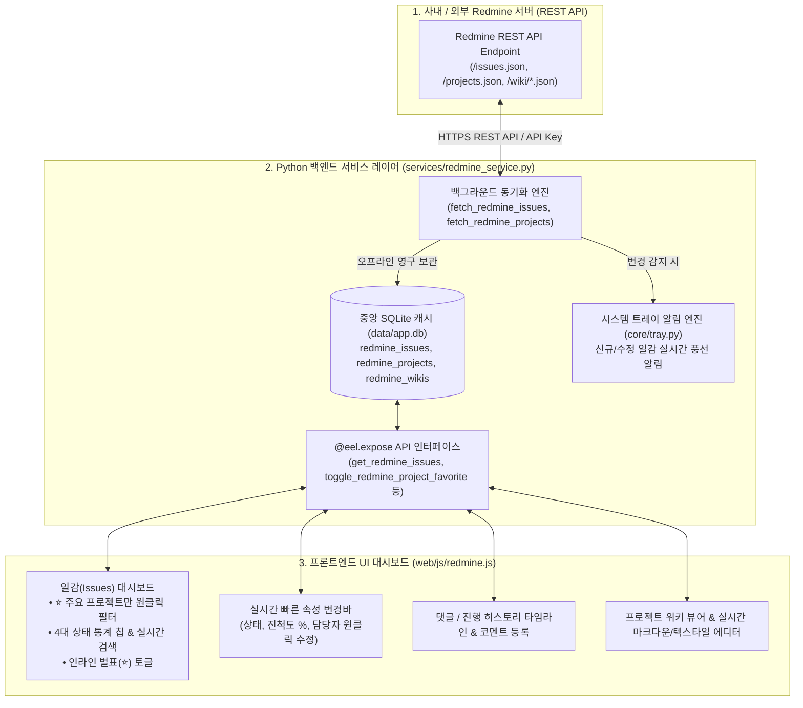

# 🦊 Redmine 연동 시스템 및 일감/위키 관리 아키텍처 (Redmine Integration Architecture)

Util-Tools는 로컬 환경에서 사내 또는 외부 Redmine 서버와 연동하여 **내 일감(Issues) 실시간 모니터링**, **프로젝트 위키(Wiki) 뷰어 및 에디터**, **원클릭 일감 속성 변경**, **주요 관심 프로젝트(⭐ 즐겨찾기) 우선순위 필터링**을 제공하는 강력한 생산성 통합 모듈을 탑재하고 있습니다.

---

## 1. 🏛️ 시스템 아키텍처 및 데이터 흐름

---

## 2. 🌟 핵심 기능 및 기술적 특징

### 2-1. ⭐ 주요 관심 프로젝트 (즐겨찾기) 우선순위 필터링
- **문제점 해결**: 수십~수백 개의 프로젝트가 존재하는 사내 환경에서 주로 담당하는 1~5개 프로젝트를 매번 검색하거나 목록에서 찾는 번거로움을 완전히 해결했습니다.
- **`<optgroup>` 최상단 고정**: 일감 필터, 위키 프로젝트, 새 일감 등록 모달 드롭다운 최상단에 `⭐ 주요 관심 프로젝트` 그룹이 우선 노출됩니다.
- **원클릭 `[⭐ 주요 프로젝트만]` 필터**: 클릭 한 번으로 등록된 주요 관심 프로젝트의 일감만 즉시 조회 및 통계 계산.
- **인라인 원클릭 별표 토글**: 일감 카드 및 상세 뷰어에서 별표(`⭐`/`☆`)를 클릭하면 모달을 열지 않고도 즉시 주요 프로젝트로 등록/해제.

### 2-2. ⚡ 0.01초 오프라인 캐싱 & 델타 동기화
- 네트워크 지연 없이 즉각적인 UI 응답성을 보장하기 위해 모든 일감, 위키, 프로젝트 메타데이터를 SQLite DB(`redmine_*`)에 캐싱합니다.
- 백그라운드 주기적 동기화(1~60분)를 통해 서버의 변경 사항을 자동으로 감지하여 동기화합니다.

### 2-3. 🔔 백그라운드 트레이 알림 시스템
- 백그라운드 폴링 중 내게 새롭게 할당된 일감이나 상태가 변경된 일감이 감지되면 Windows 시스템 트레이를 통해 즉시 알림을 띄웁니다.

### 2-4. 💬 진행 히스토리(Journals) 및 인라인 코멘트 등록
- 일감의 상태 변경 이력, 담당자 변경, 필드 수정 내역을 타임라인 칩으로 시각화.
- 모달을 통해 진행 코멘트(Notes)를 등록하면 서버에 전송됨과 동시에 로컬 캐시가 즉시 갱신됩니다.

### 2-5. 📝 프로젝트 위키(Wiki) 실시간 뷰어 & 에디터
- 프로젝트별 위키 목차를 사이드바 트리로 렌더링.
- Textile 및 Markdown 서식을 자동으로 변환하여 미려한 다크 테마로 렌더링.
- 위키 내용을 애플리케이션 내에서 즉시 수정하고 서버로 직접 저장할 수 있는 통합 에디터 제공.

---

## 3. 🛠️ 백엔드 서비스 API 명세 (`services/redmine_service.py`)

모든 함수는 `@eel.expose`로 데스크톱 프론트엔드와 비동기 바인딩됩니다:

| 함수 시그니처 | 주요 파라미터 | 반환값 (`dict`) | 설명 |
| :--- | :--- | :--- | :--- |
| `save_redmine_config(...)` | `server_url`, `api_key`, `auto_sync`, `interval_min`, `scope`, `limit`, `project_id` | `{"status": "success", "user": {...}}` | Redmine 서버 연결 설정 검증 및 저장 |
| `get_redmine_config()` | 없음 | `{"status": "success", "config": {...}}` | 저장된 Redmine 연동 환경설정 반환 |
| `fetch_redmine_projects()` | 없음 | `{"status": "success", "projects": [...]}` | 서버로부터 전체 프로젝트 목록 동기화 (즐겨찾기 유지) |
| `get_redmine_projects()` | 없음 | `{"status": "success", "projects": [...]}` | SQLite 캐시에서 `is_favorite DESC` 순으로 프로젝트 조회 |
| `toggle_redmine_project_favorite(project_id, is_fav=None)` | `project_id` (int), `is_favorite` (bool) | `{"status": "success", "is_favorite": 1/0}` | 특정 프로젝트의 주요 프로젝트(⭐) 상태 토글 |
| `set_redmine_favorite_projects(project_ids)` | `project_ids` (list of int) | `{"status": "success", "favorite_ids": [...]}` | 주요 프로젝트 즐겨찾기 목록 일괄 저장 |
| `fetch_redmine_issues(force_all=False)` | `force_all` (bool) | `{"status": "success", "synced_count": N}` | 서버에서 최신 일감 가져오기 및 트레이 알림 |
| `get_redmine_issues(...)` | `my_only`, `project_id`, `status_id`, `tracker_id`, `priority_id`, `search_query`, `assignee`, `due_today`, `fav_projects_only` | `{"status": "success", "issues": [...], "stats": {...}}` | 다중 필터 및 통계 실시간 고속 SQLite 쿼리 |
| `update_redmine_issue_property(issue_id, field, value)` | `issue_id` (int), `field` (str), `value` | `{"status": "success", "issue": {...}}` | 상태, 진척도, 우선순위, 담당자 실시간 단일 필드 갱신 |
| `add_redmine_issue_comment(issue_id, notes)` | `issue_id` (int), `notes` (str) | `{"status": "success"}` | 일감 코멘트(댓글) 등록 |
| `create_redmine_issue(issue_data)` | `issue_data` (dict) | `{"status": "success", "issue": {...}}` | 신규 일감 등록 |
| `fetch_redmine_wikis(project_identifier)` | `project_identifier` (str) | `{"status": "success", "wikis": [...]}` | 프로젝트 위키 전체 색인 동기화 |
| `save_redmine_wiki_page(project_id, title, text, comment)` | `project_id`, `title`, `text`, `comment` | `{"status": "success"}` | 위키 페이지 수정 및 서버 저장 |

---

## 4. 🗄️ SQLite 데이터 모델 및 캐싱 구조

1. **`redmine_config`**: 사용자 API 키, 서버 주소, 백그라운드 동기화 주기 설정 (단일 프로필).
2. **`redmine_projects`**: 프로젝트 식별자, 이름 및 **`is_favorite` / `favorite_order`** 즐겨찾기 컬럼.
3. **`redmine_issues`**: 일감 번호, 트래커, 상태, 담당자, 진척도, 마감일, 내 일감 플래그(`is_my_issue`) 및 전체 JSON.
4. **`redmine_wikis`**: `{project_id}:{title}` 복합 키 기반 위키 문서 본문 및 버전 캐시.
5. **`redmine_meta`**: 상태(Statuses), 트래커(Trackers), 우선순위(Priorities) 메타데이터 캐시.

---

## 5. 💻 프론트엔드 상태 머신 (`web/js/redmine.js`)

`redmineState` 전역 객체로 일감과 위키의 라이프사이클을 단일 방향으로 통제합니다:
- `redmineState.filterFavoriteProjectsOnly`: 주요 프로젝트(⭐) 우선 필터 플래그.
- `onRedmineFilterChange()`: 250ms 디바운스를 적용하여 검색어 타이핑 시 불필요한 중복 쿼리를 방지하고 부드러운 렌더링 유지.
- `toggleProjectFavoriteInline(projectId, event)`: DOM 리렌더링 없이 현재 화면의 카드 및 상세 뷰어 별표를 즉각적으로 갱신.
