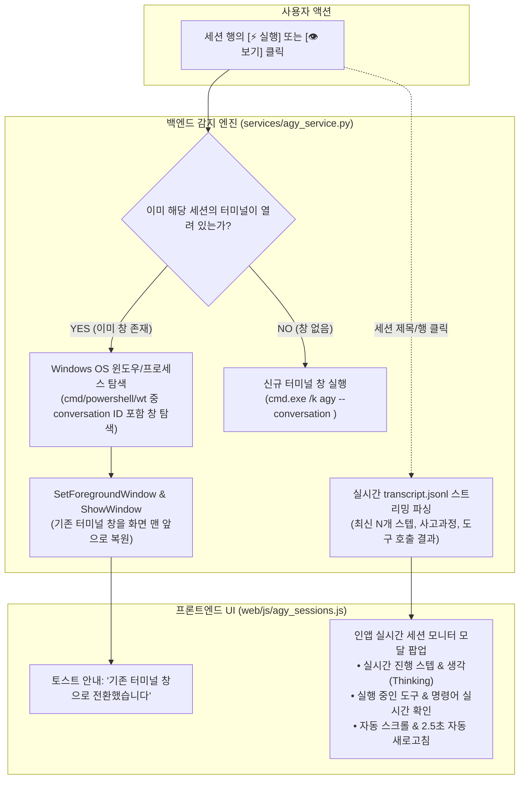

# 🚀 [Plan] 실행 중인 Antigravity CLI 세션 및 터미널 접근/모니터링 연동 계획서

## 1. 개요 및 목적 (Goal Description)

사용자가 터미널이나 백그라운드에서 실행 중인 `agy` 세션에 접근하고자 할 때, 현재는 단순히 새 터미널(`cmd.exe /k "agy --conversation <id>"`)을 새로 띄우는 방식만 제공되어 다음과 같은 불편함이 존재합니다:
1. 이미 다른 창에서 해당 세션으로 작업 중인데 또 새 터미널이 열려 중복 프로세스가 생성됨.
2. 현재 터미널 창이 수많은 창 뒤에 가려져 있을 때 어디에 떠 있는지 찾기 어려움.
3. 터미널 창을 일일이 열지 않고도, Util-Tools 내부에서 해당 세션이 지금 **무슨 도구를 실행 중이고, 무슨 출력이 나오고 있는지** 실시간으로 확인하고 싶음.

본 계획은 **① 이미 열려 있는 해당 세션의 터미널 창을 찾아 화면 맨 앞으로 활성화(Bring to Front)**하고, **② 터미널을 열지 않고도 Util-Tools 내부에서 실시간 진행 상황을 한눈에 볼 수 있는 '라이브 세션 인스펙터(Live Session Inspector)'**를 구현하는 것을 목표로 합니다.

---

## 2. 기술적 분석 및 가능성 검토 (Technical Feasibility)



### 2-1. 독립 OS 콘솔 프로세스에 대한 'Attach(키보드 입력 가로채기)'의 한계와 대안
- **OS 레벨의 한계**:
  - Windows의 콘솔 서브시스템(`conhost.exe` / `pseudo-console`)은 보안 및 격리 원칙상, **이미 다른 독립 터미널 프로세스에 귀속된 `stdin/stdout` 핸들을 제3의 프로세스(Util-Tools)가 런타임에 동적으로 가로채서(Attach/Hijack) 입력을 대신 넣는 API를 제공하지 않습니다.**
  - Linux의 `screen -r`이나 `tmux attach` 같은 터미널 멀티플렉서 구조가 Windows 기본 콘솔에는 기본 내장되어 있지 않으며, `agy` CLI 또한 현재 백그라운드 소켓 데몬 기반의 원격 attach 프로토콜을 내장하고 있지 않습니다.
- **최선의 현실적 솔루션 (2-Track)**:
  - **Track A (터미널 제어)**: 이미 열려 있는 해당 세션의 터미널 창을 OS API로 즉시 찾아 **화면 맨 앞으로 복원/포커스**하여 사용자가 즉시 키보드를 칠 수 있게 함.
  - **Track B (앱 내 실시간 뷰어)**: Util-Tools 내부에서 모달 창을 열어 실시간 `transcript.jsonl`을 감시하고, 에이전트의 최근 대화, 사고 과정(Thinking), 도구 실행 결과, 권한 대기 상태를 **터미널 없이도 실시간으로 열람**.

---

## 3. 사용자 검토 및 피드백 필요 (User Review Required)

> [!IMPORTANT]
> **설계 방향 확인**:
> 1. **기존 터미널 창 활성화(Bring to Front)**: `[⚡ 실행]` 버튼 클릭 시, 이미 해당 세션으로 열린 터미널 창이 있다면 새 창을 열지 않고 그 창을 화면 맨 앞으로 띄워주는 동작을 기본으로 적용합니다. (만약 창이 없으면 기존처럼 새 터미널을 실행합니다.)
> 2. **인앱 실시간 세션 인스펙터(Live Inspector)**: 세션 제목을 클릭하거나 전용 `[👁️]` 버튼을 누르면, 터미널을 띄우지 않고도 앱 내에서 실시간 대화/사고 과정/도구 호출을 모니터링할 수 있는 다크 테마 콘솔 뷰어를 제공합니다.

---

## 4. 세부 구현 계획 (Proposed Changes)

### Component 1: 백엔드 프로세스 & 윈도우 탐색 엔진 (`services/agy_service.py`)

1. **`activate_session_terminal_window(conversation_id: str) -> bool` 구현**:
   - `ctypes.windll.user32` 및 `Win32_Process` WMI 조회를 통해:
     - 커맨드라인에 `agy` 및 해당 `conversation_id`가 포함된 프로세스(`cmd.exe`, `powershell.exe`, `WindowsTerminal.exe`, `conhost.exe`)를 탐색.
     - 해당 프로세스의 HWND를 찾아 `user32.ShowWindow(hwnd, 9)` (SW_RESTORE) 및 `user32.SetForegroundWindow(hwnd)` 실행.
     - 성공 시 `True` 반환, 발견되지 않으면 `False` 반환.
2. **`launch_agy_session(conversation_id, workspace_path)` 개선**:
   - 먼저 `activate_session_terminal_window(conversation_id)`를 시도.
   - 이미 켜져 있는 창이 활성화되면 `"기존에 실행 중인 터미널 창을 화면 맨 앞으로 활성화했습니다."` 반환.
   - 열린 창이 없으면 정상적으로 신규 `cmd.exe /k "agy --conversation <id>"` 실행.
3. **`get_agy_session_live_tail(conversation_id: str, max_steps: int = 10)` API 추가**:
   - 해당 세션의 `transcript.jsonl`에서 최신 N개 스텝을 역순으로 읽어 정형화된 JSON 리스트로 반환:
     - 스텝 번호, 발신자(USER / MODEL), 상태(DONE / RUNNING), 생각(Thinking), 도구 호출(Tool Name, Args, Summary), 텍스트 응답.

---

### Component 2: 프론트엔드 실시간 세션 인스펙터 UI (`web/js/agy_sessions.js`, `web/style.css`, `web/index.html`)

1. **테이블 행에 인스펙터 런처 추가**:
   - 세션 제목 클릭 시 또는 신규 `[👁️]` 버튼 클릭 시 `openAgyLiveInspector(conversationId)` 호출.
2. **실시간 모니터 모달 (`#agy-live-inspector-modal`)**:
   - 상단: 세션 제목, 세션 ID `#cfb67627`, 현재 총 스텝 수, 실행 상태 뱃지 (`🟢 실행 중` / `🔐 권한 대기 중` / `⚪ 대기 중`), 닫기 버튼.
   - 중앙: 터미널 스타일의 어두운 로그 콘솔:
     - 에이전트의 사고 과정 (`💭 Thinking...` 접이식 블록)
     - 실행된 도구 호출 (`🔧 run_command: git status`)
     - 시스템 도구 결과 및 최종 응답
   - 하단: `[⚡ 터미널 창 열기/전환]` 바로가기 버튼, `[🔄 새로고침]` 버튼, 자동 갱신(2.5초 주기) 토글.

---

## 5. 검증 계획 (Verification Plan)

### 자동 검증 (Automated Syntax & Integrity)
```powershell
# 1. 파이썬 구문 및 진입점 무결성
python -m py_compile services/agy_service.py core/paths.py main.py
python -c "import services.db_service as d, services.agy_service as a; d.init_db(); print('Backend OK')"

# 2. 자바스크립트 및 CSS 문법
node -c web/js/agy_sessions.js
python -c "import re; t=open('web/style.css', encoding='utf-8').read(); c=re.sub(r'/\*.*?\*/','',t,flags=re.DOTALL); assert c.count('{')==c.count('}'), 'CSS mismatch!'; print('CSS OK')"
```

### 수동 기능 검증 (Manual Verification)
1. **기존 창 활성화 테스트**:
   - `cfb67627` 세션 터미널 창을 최소화하거나 다른 창 뒤로 숨겨둠.
   - Util-Tools 세션 테이블에서 `[⚡ 실행]` 클릭.
   - 새 터미널이 중복으로 뜨지 않고, **숨겨져 있던 기존 터미널 창이 화면 맨 앞으로 번쩍 복원/활성화**되는지 확인.
2. **인앱 라이브 인스펙터 테스트**:
   - 세션 제목 또는 `[👁️]` 클릭 시 라이브 인스펙터 모달이 뜨며, 터미널을 열지 않고도 에이전트의 최신 스텝 및 작업 내용이 깔끔하게 표시되는지 확인.
