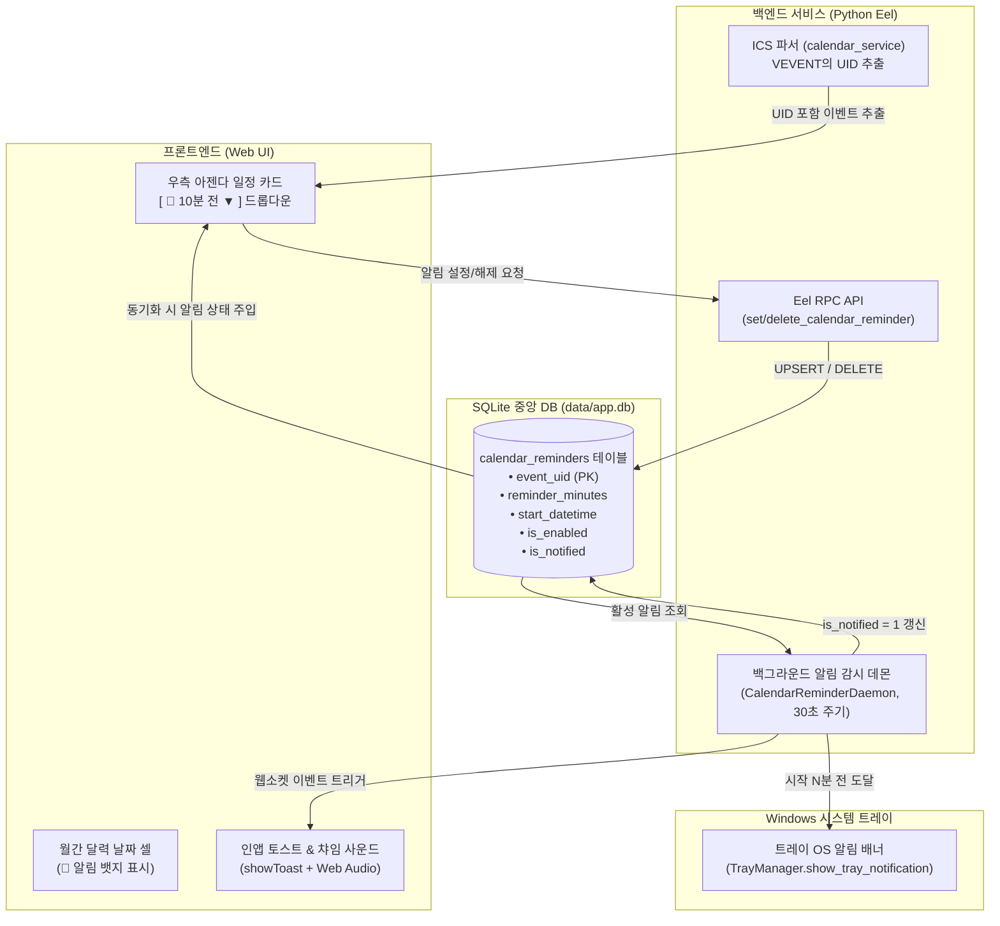

# 📅 [Plan] 캘린더 개별 일정 10분 전 알림 기능 구현 계획서

## 1. 개요 및 배경 (Overview & Background)

현재 Util-Tools의 캘린더 모듈은 Google Calendar 및 iCal(`.ics`) URL을 구독하여 일정을 동기화하고 월간 그리드 및 일별 아젠다(Agenda) 패널에 표시하고 있습니다.
하지만 다음과 같은 기능적 한계가 존재합니다:
1. **일정 사전 알림 부재**:
   - 다가오는 회의나 중요한 일정에 대해 사전에 인지할 수 있는 시스템 알림 기능이 없어 사용자가 직접 달력을 열어 확인해야 합니다.
2. **모든 일정 일괄 알림의 비효율성(알림 피로)**:
   - 구독 캘린더의 모든 일정에 일괄 알림을 적용할 경우 불필요한 알림 노이즈가 발생하므로, **사용자가 챙겨야 할 중요 일정만 골라서 개별적으로 알림을 설정**할 수 있어야 합니다.

본 계획은 **① iCal 표준 고유 식별자(`UID`)와 SQLite 중앙 DB를 연동하여 개별 일정 단위로 알림을 설정/보존**하고, **② 백엔드 백그라운드 데몬을 통해 일정 시작 N분 전(기본 10분 전) Windows OS 트레이 알림 및 인앱 UI 토스트/챠임음을 발송**하는 종단간(End-to-End) 알림 시스템 구축을 목표로 합니다.

---

## 2. 시스템 아키텍처 및 데이터 흐름 (Architecture & Data Flow)



---

## 3. 세부 설계 명세 (Detailed Specifications)

### 1) iCal 고유 식별자(`UID`) 파싱 및 해시 폴백
- 원격 iCal 파일의 `BEGIN:VEVENT` 블록에서 `UID:` 필드를 추출하여 `current_event["uid"]`에 저장합니다.
- 만약 UID 필드가 누락된 비표준 캘린더인 경우, `SHA256(f"{cal_name}_{title}_{startDate}_{startTime}")[:16]` 기반의 결정론적(Deterministic) 고유 키를 자동 생성하여 대체합니다.

### 2) SQLite 데이터베이스 스키마 (`calendar_reminders`)
[`services/db_service.py`](file:///D:/python/services/db_service.py)에 알림 영구 저장 테이블을 정의합니다:
```sql
CREATE TABLE IF NOT EXISTS calendar_reminders (
    event_uid TEXT PRIMARY KEY,
    calendar_name TEXT,
    title TEXT NOT NULL,
    start_datetime TEXT NOT NULL,       -- 'YYYY-MM-DD HH:MM'
    reminder_minutes INTEGER DEFAULT 10, -- 5, 10, 15, 30, 60
    is_enabled INTEGER DEFAULT 1,        -- 1: 활성, 0: 비활성
    is_notified INTEGER DEFAULT 0,       -- 1: 알림 발송 완료
    created_at TEXT,
    updated_at TEXT
);
CREATE INDEX IF NOT EXISTS idx_calendar_reminders_active 
ON calendar_reminders(is_enabled, is_notified, start_datetime);
```

### 3) 백엔드 알림 감시 데몬 (`CalendarReminderDaemon`)
- [`services/calendar_service.py`](file:///D:/python/services/calendar_service.py) 로드 시 데몬 스레드(`threading.Thread(daemon=True)`) 자동 가동.
- **검사 주기**: 30초
- **판정 알고리즘**:
  - `is_enabled = 1 AND is_notified = 0`인 항목 조회.
  - 현재 시각(`now`)이 `start_datetime - timedelta(minutes=reminder_minutes)` 이상이고, `start_datetime + timedelta(hours=1)` 미만인 경우 알림 대상 판정.
- **알림 채널 전송**:
  1. **Windows 트레이 OS 알림**: `TrayManager.show_tray_notification(f"📅 일정 알림 ({reminder_minutes}분 전)", f"[{cal_name}] {title}\n시작 시간: {startTime}")` 호출 ➔ 창 최소화 시에도 화면 우측 하단 네이티브 팝업.
  2. **Eel 웹 클라이언트 통지**: `eel.on_calendar_reminder_triggered(data)` 호출 ➔ 창 활성화 시 인레이어 토스트 및 챠임 벨소리 출력.
- **상태 업데이트**: 발송 즉시 `is_notified = 1`로 갱신하여 1회만 발송(중복 발송 방지).

### 4) 프론트엔드 UI/UX 인터랙션
- **모든 일정의 기본 상태**: **`알림 없음 (Off)`** (사용자가 직접 선택하지 않은 일정은 알림이 전혀 울리지 않는 Opt-in 방식)
- **우측 일정 카드(Agenda Card)**:
  - 시간이 지정된 일정(`!e.allDay && e.startTime`)에 대해 우측 상단에 알림 버튼 배치.
  - 기본 상태 (알림 미설정 시): `[ 🔕 알림 없음 ▼ ]` (연한 회색 테두리/텍스트)
  - 사용자가 알림 설정 시: `[ 🔔 10분 전 ▼ ]` (브랜드 강조색 테마 배지)
  - 버튼 클릭 시 비차단 인레이어 드롭다운 팝오버 노출:
    - `🔕 알림 없음 (해제)`
    - `🔔 5분 전 알림`
    - `🔔 10분 전 알림`
    - `🔔 15분 전 알림`
    - `🔔 30분 전 알림`
    - `🔔 1시간 전 알림`
- **월간 달력 날짜 셀 그리드**:
  - 사용자가 명시적으로 알림을 켠 일정에 대해서만 뱃지 제목 앞에 작은 `🔔` 아이콘 접두사를 렌더링.
- **알림 수신 효과음 (Web Audio API)**:
  - 외부 오디오 에셋 의존 없이 브라우저 내장 `AudioContext`로 두 음(Two-tone Chime: 523.25Hz C5 -> 659.25Hz E5)을 합성하여 부드럽고 직관적인 알림음 재생.

---

## 4. 파일별 변경 계획 및 구현 범위

| 구분 | 대상 파일 | 주요 변경 내용 |
| :--- | :--- | :--- |
| **DB** | [`services/db_service.py`](file:///D:/python/services/db_service.py) | `calendar_reminders` 테이블 생성 및 인덱스 추가, CRUD 함수 (`get_calendar_reminders`, `set_calendar_reminder`, `delete_calendar_reminder`, `mark_calendar_reminder_notified`) 구현 |
| **Backend** | [`services/calendar_service.py`](file:///D:/python/services/calendar_service.py) | • `parse_ics_content`: VEVENT `UID` 파싱 및 결정론적 해시 폴백 생성<br>• `fetch_calendar_events`: DB 알림 정보 병합 (`reminderMinutes`, `hasReminder`) 반환<br>• `CalendarReminderDaemon`: 30초 주기 백그라운드 감시 데몬 및 트레이/웹 통지 연동<br>• `@eel.expose`: `set_event_reminder`, `delete_event_reminder`, `get_event_reminders` |
| **Frontend JS** | [`web/js/calendar.js`](file:///D:/python/web/js/calendar.js) | • 우측 아젠다 카드 알림 팝오버 드롭다운 렌더링 및 변경 이벤트 핸들링<br>• 월간 날짜 셀 뱃지에 🔔 마크 표시<br>• `eel.expose(onCalendarReminderTriggered)` 수신 핸들러 및 Web Audio 챠임 재생 |
| **Frontend Style** | [`web/style.css`](file:///D:/python/web/style.css) | 아젠다 카드 알림 버튼, 드롭다운 팝오버, 알림 활성 뱃지 스타일 정의 |

---

## 5. 검증 및 테스트 계획 (Verification Plan)

1. **자동화 검증 (`python scripts/verify_integrity.py`)**:
   - Python 바이트코드 전수 컴파일 및 신규 DB 테이블 마이그레이션 정상 초기화 검증.
   - 프론트엔드 JS 문법(`node -c`) 및 CSS 괄호 짝 일치 검증.
2. **백엔드 기능 검증 단위 테스트**:
   - 알림 등록(UPSERT) / 조회 / 삭제 / 발송완료 처리 DB 동작 확인.
   - iCal UID 파싱 및 결정론적 해시 생성 무결성 검증.
   - 데몬의 시각 판정 알고리즘(현재 시각과 시작 시각 오차 비교) 유닛 테스트.
3. **사용자 인터랙션 및 화면 수동 검수 (User Sign-off Gate)**:
   - 아젠다 카드에서 10분 전 알림 등록 및 해제 즉시 반영 확인.
   - 알림 시간 도달 시 Windows OS 트레이 알림 배너 및 인앱 토스트/챠임음 동시 발생 확인.
   - 달력 그리드에 🔔 뱃지 표시 확인.

---

## 6. GitFlow 및 버전 관리

- **작업 브랜치**: `feature/calendar-event-reminder` (분기 완료)
- **커밋 원칙**: 기능 단위별 원자적 단위 커밋 (`feat(calendar): ...`, `code_integrity.md` 준수)
- **병합 게이트**: 무결성 검사 PASS + 백엔드 기능 테스트 통과 + 사용자 실화면 검수 완료 후, 버전 업데이트 수요를 확인받고 `develop`으로 병합.
