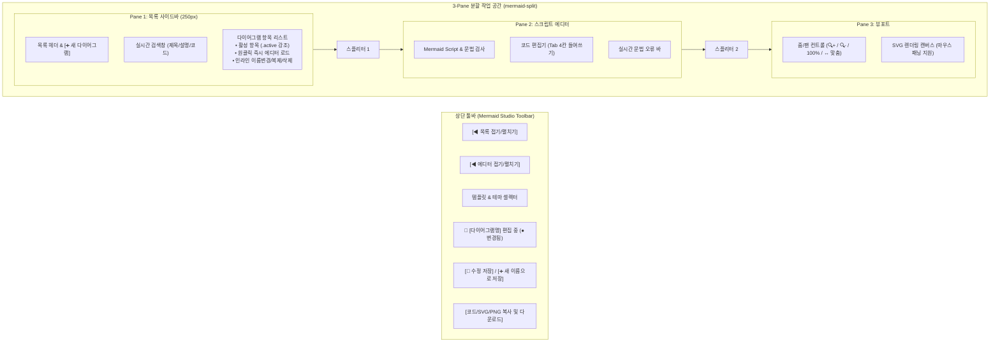

# 📊 [Plan] Mermaid 다이어그램 3-Pane 분할 레이아웃 및 인라인 수정 기능 구현 계획서

## 1. 개요 및 배경 (Overview & Background)

현재 다이어그램 스튜디오는 좌측(에디터)과 우측(뷰포트)의 **2-Pane 분할 구조**로 되어 있으며, 저장된 다이어그램 목록은 별도의 팝업 모달(`diagram-list-modal`)을 통해서만 조회 및 불러오기가 가능합니다.
이로 인해 다음과 같은 사용자 경험(UX) 및 기능적 제약이 발생합니다:
1. **다이어그램 스크립트 수정 기능의 부재**:
   - 목록에서 다이어그램을 불러온 후 코드를 수정하더라도, 상단의 `[💾 저장]` 버튼을 누르면 무조건 신규 저장 모달이 열려 새 다이어그램으로 중복 등록됩니다.
   - 기존 다이어그램의 스크립트 내용을 덮어쓰거나 갱신(Update)하는 워크플로우가 존재하지 않습니다.
2. **목록 접근의 번거로움**:
   - 다이어그램 목록을 확인하거나 다른 다이어그램으로 전환할 때마다 모달을 열고 닫아야 하는 불편함이 있습니다.

본 계획은 **① 다이어그램 화면을 3-Pane(목록 사이드바 - 에디터 - 뷰포트)으로 분할**하고, **② 다이어그램 목록 패널 또한 에디터처럼 원터치로 접거나 펼칠 수 있도록(Collapsible)** 구현하며, **③ 저장된 다이어그램에 대한 즉시 수정 저장(In-place Update & Ctrl+S) 및 상태 추적 기능**을 추가하는 것을 목표로 합니다.

---

## 2. 화면 구조 및 3-Pane 레이아웃 설계 (Layout Architecture)



### 1) 3개 Pane 구성 및 역할
* **Pane 1: 다이어그램 목록 사이드바 (`mermaid-sidebar-pane`)**
  - **위치**: 화면 맨 좌측 (기본 폭 약 250px)
  - **기능**:
    - 저장된 다이어그램 목록 열람, 실시간 검색 필터링
    - `[➕ 새 다이어그램]` 버튼을 통한 빈 에디터 시작
    - 목록 항목 클릭 시 에디터에 즉시 로드 및 `.active` 하이라이트
    - 항목별 빠른 관리 메뉴(이름/설명 수정, 복제, 삭제)
  - **접기/펼치기(Collapsible)**:
    - 툴바의 `[◀ 목록 접기 / ▶ 목록 펼치기]` 버튼으로 여닫기 지원
    - 사이드바가 접히면 폭 `0px`로 숨겨지고 스플리터도 함께 숨김 처리
    - 접힘 상태는 `localStorage`(`mermaid_sidebar_collapsed`)에 자동 영속화
* **Pane 2: 스크립트 에디터 (`mermaid-editor-pane`)**
  - **위치**: 중앙
  - **기능**:
    - 기존 에디터 접기/펼치기(`mermaid-editor-toggle-btn`) 기능 유지
    - 상단에 현재 편집 중인 다이어그램 제목 및 미저장 변경 감지(Dirty Indicator: `●`) 표시
* **Pane 3: 다이어그램 렌더링 뷰포트 (`mermaid-viewport-pane`)**
  - **위치**: 우측
  - **기능**: SVG 실시간 렌더링, 줌/팬 인터랙션, 맞춤 뷰 유지

---

## 3. 수정(Update) 기능 및 상태 관리 워크플로우 (State & Workflow)

### 1) 활성 편집 상태 관리
* `currentDiagramId`:
  - `null`: 새로 작성 중인 미저장 다이어그램
  - `string (UUID/Timestamp)`: 저장된 다이어그램을 불러와 편집 중인 상태
* `isDiagramDirty`: 에디터의 코드가 기존 저장된 원본과 달라졌을 때 변경 감지 표시

### 2) 저장 버튼 동작 분리
* **`[💾 수정 내용 저장]` 버튼**:
  - `currentDiagramId`가 존재하는 경우:
    - 별도 입력 모달 없이 **현재 편집 중인 다이어그램의 스크립트(`code`) 및 `updated_at`을 SQLite DB에 즉각 덮어쓰기 저장**
    - 사이드바 목록의 타임스탬프 및 코드 스니펫 즉시 갱신
    - 하단/상단 토스트로 *"다이어그램이 성공적으로 수정되었습니다"* 피드백 제공
  - `currentDiagramId`가 `null`인 경우:
    - 자동으로 "새 다이어그램 저장 모달"을 띄워 제목 입력 유도
* **`[📋 다른 이름으로 저장...]` 버튼**:
  - 기존 다이어그램을 기반으로 새로운 다이어그램을 파생 복제하여 저장할 수 있도록 지원
* **단축키 지원**:
  - 에디터 내에서 `Ctrl + S` 입력 시 즉시 `[수정 내용 저장]` 로직 실행

---

## 4. 세부 모듈별 구현 계획 (Detailed Changes)

### 1) 백엔드 서비스 ([`services/diagram_service.py`](file:///D:/python/services/diagram_service.py))
* **신규 API 추가**:
  - `@eel.expose def update_diagram(diagram_id: str, code: str, title: str = None, category: str = None, description: str = None) -> dict`:
    - SQLite `diagrams` 테이블의 특정 레코드만 단일 트랜잭션으로 즉시 `UPDATE`
  - `@eel.expose def delete_diagram_item(diagram_id: str) -> dict`:
    - 단일 다이어그램 즉시 삭제 API
* **기존 API 유지**:
  - `get_diagrams()`: 기존 조회 로직 완벽 호환
  - `save_diagrams()`: 일괄 동기화 호환성 유지

### 2) 웹 UI 마크업 ([`web/index.html`](file:///D:/python/web/index.html))
* 다이어그램 탭(`tab-mermaid`) 구조를 3-Pane 구조로 개편:
  ```html
  <div class="mermaid-split" id="mermaid-split">
      <!-- Pane 1: 저장된 다이어그램 사이드바 -->
      <aside class="mermaid-sidebar-pane" id="mermaid-sidebar-pane"> ... </aside>
      <!-- 스플리터 1 -->
      <div id="mermaid-sidebar-resizer" class="calendar-v-resizer"> ... </div>
      <!-- Pane 2: 코드 에디터 -->
      <div class="mermaid-editor-pane" id="mermaid-editor-pane"> ... </div>
      <!-- 스플리터 2 -->
      <div id="mermaid-resizer" class="calendar-v-resizer"> ... </div>
      <!-- Pane 3: 뷰포트 -->
      <div class="mermaid-viewport-pane" id="mermaid-viewport-pane"> ... </div>
  </div>
  ```
* 툴바 컨트롤 보강:
  - `[◀ 목록 접기]` 버튼 추가
  - `[💾 수정 저장]` 및 `[➕ 새 다이어그램]` 버튼 배치
  - 현재 다이어그램 명칭 및 수정 상태 인디케이터 엘리먼트 추가

### 3) 스타일시트 ([`web/style.css`](file:///D:/python/web/style.css))
* `.mermaid-sidebar-pane`: 폭 250px, 다크 테마 카드 스타일, 스크롤바, 리스트 항목 스타일
* `.mermaid-sidebar-pane.collapsed`: `flex: 0 0 0px`, `opacity: 0`, 비차단 숨김
* `.mermaid-sidebar-item`: 호버 효과, `.active` 선택 테두리 및 배경 하이라이트
* 드래그 리사이저(`calendar-v-resizer`)의 다중 Pane 호환 및 마우스 인터랙션 지원

### 4) 클라이언트 로직 ([`web/js/mermaid_diagram.js`](file:///D:/python/web/js/mermaid_diagram.js))
* 사이드바 접기/펼치기 제어 (`toggleMermaidSidebar()`, 상태 로컬스토리지 저장)
* 다중 리사이저 이벤트 핸들러 확장 (사이드바 리사이저 + 에디터 리사이저)
* 활성 다이어그램 선택/로드 (`selectDiagramItem(id)`)
* 단일 다이어그램 즉시 수정 저장 (`saveCurrentDiagramEdits()`) 및 `Ctrl+S` 단축키 바인딩
* 실시간 Dirty 상태 표시 (`onMermaidCodeChange` 시 원본과 비교하여 `●` 표시)
* 비차단 인레이어 UI 원칙 준수 (`showAppAlert`, `showAppConfirm`, `showToast`)

---

## 5. 검증 및 테스트 계획 (Verification Plan)

1. **원스톱 무결성 검증 ([`scripts/verify_integrity.py`](file:///D:/python/scripts/verify_integrity.py))**:
   - Step 1~5 (Python 문법, 서비스 인트로스펙션, JS 구문 검사, CSS 괄호 검사, 시스템 트레이) 100% 통과 확인
2. **기능 런타임 하이브리드 검증**:
   - 3개 Pane 정상 렌더링 및 각각의 리사이저 드래그 동작 확인
   - `[목록 접기]` 클릭 시 사이드바가 매끄럽게 숨겨지고, `[목록 펼치기]` 시 복원되는지 확인
   - 저장된 다이어그램을 클릭하여 로드한 뒤 코드 수정 -> `[💾 수정 저장]` 클릭 시 DB에 즉시 반영 및 토스트 표시 확인
   - 새로고침 또는 앱 재시작 후 수정한 코드가 유지되는지 확인
   - `[➕ 새 다이어그램]` 클릭 시 신규 모드로 초기화되고, `[다른 이름으로 저장]` 시 새 다이어그램으로 등록되는지 확인
3. **사용자 실화면 검수 (Sign-off Gate)**:
   - 작업 브랜치(`feature/diagram-three-pane-editor`)에서 실화면 검수 요청 후 승인 시 `develop` 병합

---

## 6. 개발 브랜치 정보
* **브랜치명**: `feature/diagram-three-pane-editor`
* **기준 브랜치**: `develop` (최신 v0.17.1 반영 상태)
