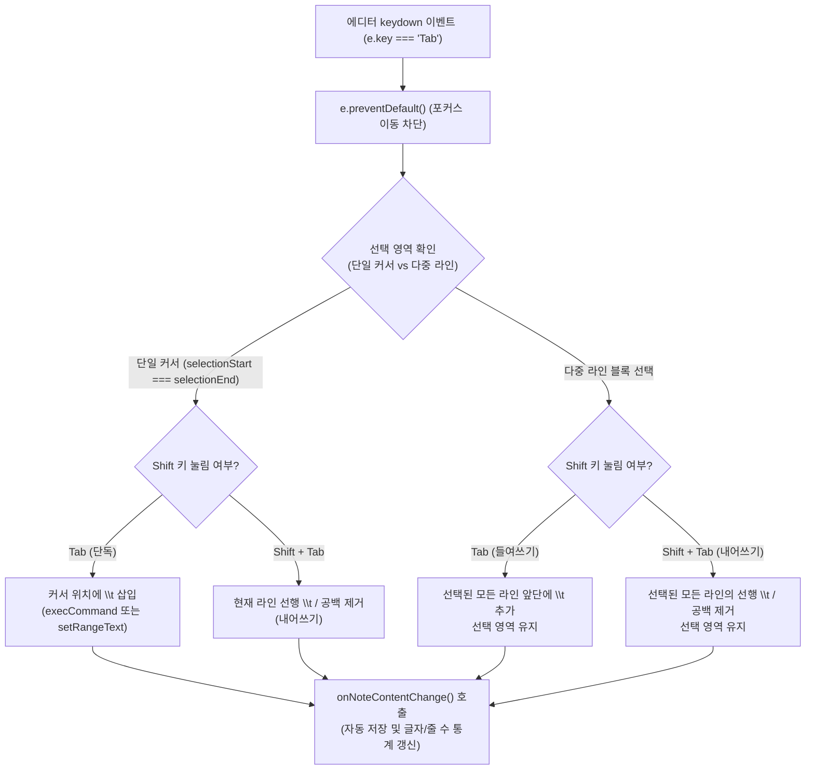

# 📝 [Plan] 빠른메모(Notes) Tab / Shift+Tab 들여쓰기 및 내어쓰기 구현 계획서

## 1. 개요 및 배경 (Overview & Background)

현재 빠른메모(Notes & Scratchpad)의 텍스트 에디터(`note-content-editor`)는 표준 `<textarea>` 요소로 구성되어 있습니다.
이로 인해 다음과 같은 사용자 경험(UX) 제약이 발생합니다:
1. **Tab 키 포커스 이탈**:
   - 메모 작성 중 코드 스니펫, 마크다운 목록, 구조화된 텍스트 작성을 위해 `Tab` 키를 누르면 다음 UI 요소로 포커스가 넘어가 입력 흐름이 끊깁니다.
2. **블록 들여쓰기/내어쓰기(Indent/Outdent) 부재**:
   - 여러 줄을 선택하고 들여쓰기(`Tab`)하거나 내어쓰기(`Shift + Tab`)하는 기능이 없어 텍스트 구조 편집이 번거롭습니다.

본 계획은 **① 단일 커서 위치에서의 자연스러운 `\t` 삽입 및 실행 취소(`Ctrl+Z`) 보존**, **② 다중 라인 블록 선택 시 `Tab`(일괄 들여쓰기) 및 `Shift + Tab`(일괄 내어쓰기)**, **③ CSS `tab-size: 4` 스타일 최적화**를 통해 에디터 작성 편의성을 향상시키는 것을 목표로 합니다.

---

## 2. 세부 동작 설계 (Interaction Specifications)

### 1) 단일 커서(No selection) 모드
- **`Tab` 입력 시**:
  - 현재 커서 위치에 순수 탭 문자(`\t`)를 삽입합니다.
  - 브라우저 기본 Undo 스택 유지를 위해 `document.execCommand('insertText', false, '\t')`를 1순위로 시도하고, 미지원 브라우저 환경에서는 `setRangeText` 폴백을 적용합니다.
- **`Shift + Tab` 입력 시**:
  - 현재 커서가 위치한 라인의 맨 앞(선행 공백)에서 `\t` 문자 1개(또는 최대 4칸 공백)를 제거합니다.

### 2) 다중 라인 블록 선택(Multi-line selection) 모드
- 시작 위치부터 끝 위치까지 걸쳐 있는 **모든 라인의 시작/끝 인덱스**를 계산합니다.
- **`Tab` (들여쓰기, Indent)**:
  - 선택된 모든 라인의 맨 앞에 `\t`를 1개씩 추가합니다.
  - 텍스트 변경 후 선택 영역(Selection Range)이 추가된 탭 길이에 맞춰 자동으로 확장 유지되도록 selectionStart/selectionEnd를 보정합니다.
- **`Shift + Tab` (내어쓰기, Outdent)**:
  - 선택된 라인 중 맨 앞에 `\t`가 있는 경우 이를 제거하고, `\t`가 없다면 최대 4칸의 선행 공백을 제거합니다.
  - 텍스트 변경 후 줄어든 길이에 맞춰 선택 영역을 보정합니다.

### 3) 에디터 탭 너비 시각화 스타일 (`tab-size: 4`)
- 브라우저 기본 `tab-size`는 8글자 너비로 설정되어 있어 들여쓰기 폭이 과도하게 넓어 보일 수 있습니다.
- `web/style.css`의 `.notes-textarea`에 `tab-size: 4; -moz-tab-size: 4;`를 적용하여 4글자 표준 너비로 단정하게 렌더링되도록 합니다.

---

## 3. 파일별 변경 계획 및 구현 범위

| 대상 파일 | 변경 내용 |
| :--- | :--- |
| [`web/js/notes.js`](file:///D:/python/web/js/notes.js) | • `initNotesTabKeyHandler()` 함수 구현 및 `loadNotes()` 초기화 체인에 등록 • `Tab` 및 `Shift + Tab` 이벤트 리스너(단일/다중 라인 인덴트 & 아웃덴트) 구현 • 텍스트 변경 즉시 `onNoteContentChange(editor.value)` 연동 |
| [`web/style.css`](file:///D:/python/web/style.css) | `.notes-textarea`에 `tab-size: 4; -moz-tab-size: 4;` 스타일 선언 추가 |

---

## 4. 검증 및 테스트 계획 (Verification Plan)

1. **원스톱 무결성 검증 (`python scripts/verify_integrity.py`)**:
   - 프론트엔드 JavaScript 문법 검사 (`node -c web/js/notes.js`) 통과
   - CSS 스타일시트 괄호 짝 일치 검증 통과
2. **동작 검수 시나리오**:
   - **단일 커서 Tab**: 커서 위치에 `\t` 삽입 및 `Ctrl+Z` 실행 취소 정상 동작 확인
   - **다중 라인 Tab**: 3줄 이상 드래그 후 Tab 누를 시 모든 줄 일괄 들여쓰기 확인
   - **다중 라인 Shift+Tab**: 일괄 내어쓰기 및 비어 있는 라인/공백 처리 확인
   - **자동 저장 연동**: Tab 입력 후 하단 통계(글자/줄 수) 즉시 갱신 및 우측 상단 `💾 자동 저장됨` 연동 확인
